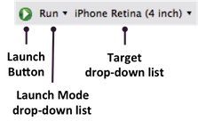

# Alloy Tasks in Studio

## Introduction

You can use Studio 3.0.0 or later to create and manage Alloy projects.

### Creating an Alloy Project

To create a new Alloy project, start Studio, then

1. From the menu, select **File > New > Mobile Project**. The **New Mobile Project** wizard appears.

2. Select **Alloy** in the **Available Templates** box, then click the **Next** button.

3. Complete all of the fields, then click the **Finish** button.

A new skeleton Alloy project will be generated. Note that the `Resources` folder is hidden from the App and Project Explorer.

### Creating a Controller

To create a new controller with a view and style,

1. Right-click on your project in the App or Project Explorer.

2. Select **New > Alloy Controller**. The **New Controller** dialog box appears.

3. In the **Controller name** textbox, enter the name of the controller. A warning appears if a duplicate exists.

4. Click the **OK** button.

This creates `app/controllers/<name>.js`, `app/styles/<name>.tss`, and `app/views/<name>.xml`.

### Creating a Model

To create a new model,

1. Right-click on your project in the App or Project Explorer.

2. Select **New > Alloy Model**. The **New Model** dialog box appears.

3. In the **Model name** textbox, enter the name of the model. A warning appears if a duplicate exists.

4. In the **Adapter**drop-down box, select the type of storage.

    1. For sql, in the **Schema** table, enter the names and data types of the database schema.

5. Click the **OK** button.

This creates `app/models/<name>.js`.

### Creating a Migration

To generate a standalone migration for a specific model,

1. Right-click on your project in the App or Project Explorer.

2. Select **New > Alloy Migration**. The **New Migration** dialog box appears.

3. In the **Migration name** textbox, enter the name of the model that needs a database migration file.

4. Click the **OK** button.

This creates a timestamp-ordered migration file for the model specified, that is, `app/migrations/DATETIME_<name>.js`

### Creating a Widget

To create a basic widget,

1. Right-click on your project in the App or Project Explorer.

2. Select **New > Alloy Widget**. The **New Widget** dialog box appears.

3. In the **Widget name** textbox, enter the name of the migration. A warning appears if a duplicate exists.

4. Click the **OK** button.

This creates a default widget in the projects's `app/widgets` path, generating a configuration file, controller, style and view: `app/widgets/<name>/widget.json`, `app/widgets/<name>/controllers/widget.js`, `app/widgets/<name>/styles/widget.tss`, and `app/widgets/<name>/views/widget.xml`. Additionally, the widget is automatically added as a dependency in the Alloy project's configuration file `config.json`.

Starting with Studio 4.1.0, after you create a Widget, you can create additional controllers, styles and views for your widget. Right-click on the widget folder (not the `./app/widgets/` folder but its subfolders) and select **New**, then choose either **Widget Controller**, **Widget Style** or **Widget View**.

### Navigating easily among Alloy element files

When developing an Alloy project you will frequently need to switch between the related controller, view, and style files (`foo.js`, `foo.xml`, and `foo.tss`, for example). Studio provides keyboard shortcuts and menu commands for switching quickly among those files.

**To navigate Alloy elements using menu commands**:

1. Open an Alloy element file (`foo.js`, for example).

2. Right-click in the editor window and select **Open Alloy Elements.**

3. From the context menu, select the related Alloy element file that you want to open: **Controller File**, **View File**, or **Style File**.

Which menu options appear depends on the type of file you're currently editing. For example, if you're editing an Alloy view (.xml) file the context menu will contain **Controller File** and **Style File** options; if you're viewing an Alloy style (.tss) file the menu will contain **Controller File** and **View File** options.


You can also use the following equivalent keyboard shortcuts:

| Keyboard shortcut | Opens |
| --- | --- |
| **Cmd+Shift+C** (Mac), **Ctrl+Shift+C** (Window) | Controller file |
| **Cmd+Shift+S** (Mac), **Ctrl+Shift+S** (Window) | Style file |
| **Cmd+Shift+V** (Mac), **Ctrl+Shift+V** (Window) | View file |

### Building and Running an Application



To launch an Alloy project in run mode, first select the project in the **Project Explorer** view, then in the global tool bar, select **Run** from the **Launch Mode** drop-down list and a device from the **Target** drop-down list. If the **Launch Automatically** option is enabled under the **Target** drop-down list, the application will be automatically launched after the target is selected. If not, you need to click the **Launch** button to start the build process.

### Using Content Assistance

Studio 3.1.0 and later supports content assistance with Alloy files. Currently, code completion is available for the XML tags and attributes (Titanium properties and events with "on") with the Alloy View XML files; element, class and ID attributes for TSS files, and for the JavaScript code with Alloy Controllers. Just start typing a name for an ID, element, class or attribute and a pop-up should appear with suggestions.

For Alloy Controllers, if you type in an element referenced by an id attribute in the associated view file, a pop-up should appear providing assistance for that object. For example, if you have the following defined in markup:

```xml
<Alloy>
    <Window id="win" class="container">
        <Label id="label">Foo</Label>
    </Window>
</Alloy>
```

In the associated controller file, if you type `$.win.` (with the trailing period), properties and methods for a Ti.UI.Window class pop-up, and if you type `$.label.`, properties and methods for a Ti.UI.Label class pop-up. You need to type the entire name to receive assistance.

For TSS files, if you type in an element referenced by an id or class attribute in the associated view file, a pop-up should appear providing assistance for that object. For example, using the previous markup example, in the associated TSS file, if you type `".container":{` , properties for a Ti.UI.Window class pop-up, and if you type `"#label":{`, properties for a Ti.UI.Label class pop-up. You can also type the element name. You need to type the entire name of the element, class or ID to receive assistance.

### Debugging Alloy Code

Refer to the [Alloy Debugging and Troubleshooting](/guide/Alloy_Framework/Alloy_How-tos/Alloy_Debugging_and_Troubleshooting/) guide.
