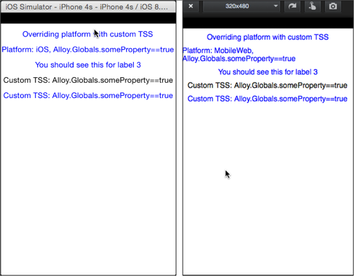

# Custom TSS Queries

Demonstrates how to use custom TSS queries to style Alloy elements.

::: tip App folder location
_alloy_/test/apps/**advanced/custom\_tss\_queries**
:::

You can define custom boolean values for use in your your TSS queries. These are useful for setting styles when running on a specific phone model (for example, on an iPhone 5). Custom TSS conditionals must be defined in the alloy.js file as properties of the Alloy.Globals object, so that they are available to the XML and TSS parsers.



The sample defines the following boolean properties in alloy.js:

**app/alloy.js**

```javascript
Alloy.Globals.someProperty = true;
Alloy.Globals.isIOS7 = (OS_IOS && parseInt(Ti.Platform.version, 10) >= 7);
Alloy.Globals.isTalliPhone = (OS_IOS && Ti.Platform.displayCaps.platformHeight == 568);
```

The app/styles/index.tss file uses the `Alloy.Globals.someProperty` boolean to conditionally apply styles to various elements.

**app/styles/index.tss**

```javascript
"Window": {
    layout:"vertical",
    backgroundColor:'white',
    top:20
}
/* Class selector applied to labels of class="label" */
".label": {
    color: 'blue'
}
/* Component selector applied to all labels, though will be overridden */
"Label": {
    top:10,
    text: "Default label text",
    font: {
        fontSize: '14dp'
    }
}
/* Platform selector applied to all labels, but a lower priority than the custom TSS conditional */
"Label[platform=ios]": {
    text: "Alloy.Globals.someProperty!=true"
}
/* Custom TSS overrides component and class selectors if someProperty is true */
"Label[if=Alloy.Globals.someProperty]": {
    text: "Custom TSS: Alloy.Globals.someProperty==true"
}
/* ID selector overrides other selectors if platform is iOS */
"#title1[platform=ios]": {
    text: "Platform: this is iOS"
}
"#title1[if=Alloy.Globals.someProperty]": {
    text: "Overriding platform with custom TSS"
}
/* Selector overrides only if platform is Android and someProperty is true */
"#title2[platform=android if=Alloy.Globals.someProperty]": {
    text: "Platform: Android, Alloy.Globals.someProperty==true"
}
"#title2[platform=ios if=Alloy.Globals.someProperty]": {
    text: "Platform: iOS, Alloy.Globals.someProperty==true"
}
"#title2[platform=mobileweb if=Alloy.Globals.someProperty]": {
    text: "Platform: MobileWeb, Alloy.Globals.someProperty==true"
}
/* ID selector overrides other selectors if platform is iOS */
"#title3": {
    text: "You should see this for label 3"
}
```

You can test for multiple values by separating them with a comma, which are treated as logical `OR` expressions. For example, the following is evaluated as `if(Alloy.Globals.isIOS7 || Alloy.Globals.someOtherVar)`:

`<View id="view" if="Alloy.Globals.isIOS7,Alloy.Globals.someOtherVar"/>`

To use `AND` conditions, or for more complex logic, process the conditions in alloy.js assigning a single Boolean value in the end:

**app/alloy.js**

```javascript
Alloy.Globals.customVar = ( (OS_IOS && parseInt(Ti.Platform.version, 10) >= 7) || (OS_ANDROID && parseFloat(Ti.Platform.version,10) >= 4.0.3) );
```
