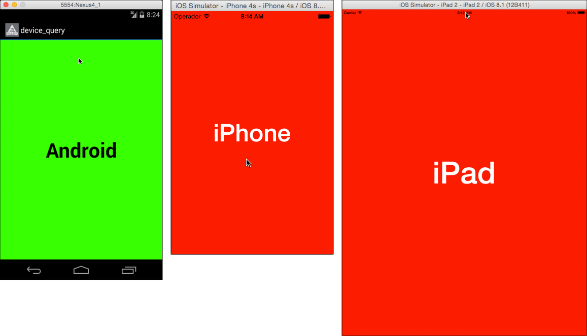

# Device Queries

Demonstrates how to combine `platform` and `formFactor` attribute selectors to apply different styles and properties on different platforms and device types.

::: tip App folder location
_alloy_/test/apps/**advanced/device\_query**
:::


The main index.xml view simply defines a Window and a Label, assigned IDs of "win" and "osLabel", respectively.

```xml
<Alloy>
    <Window id="win">
        <Label id="osLabel"/>
    </Window>
</Alloy>
```

The Window is assigned a different color depending on the platform (red for iOS, green for Android, and so forth):

```
"#win": {
    backgroundColor: "#000"
}
"#win[platform=ios]": {
    backgroundColor: "#f00"
}
"#win[platform=android]": {
    backgroundColor: "#0f0"
}
"#win[platform=mobileweb]": {
    backgroundColor: "#00f"
}
```

A general style applied to all Label element's applies a different font size to tablets and non-tablet devices but, by default, share the same color.

```
"Label": {
    color: "#fff",
    font: {
        fontSize: 48,
        fontWeight: "bold"
    }
}
"Label[formFactor=tablet]": {
    font: {
        fontSize: 96,
        fontWeight: "bold"
    }
}
```

The Label element's [text](#!/api/Titanium.UI.Label-property-text) property is assigned a different value, based on the target platform and device form factor.

```
"#osLabel[platform=ios]": {
    text: "iOS device\n(size unknown)"
}
"#osLabel[platform=ios formFactor=tablet]": {
    text: "iPad"
}
"#osLabel[platform=ios formFactor=handheld]": {
    text: "iPhone"
}
"#osLabel[platform=android]": {
    text: "Android",
    color: "#000"
}
"#osLabel[platform=android formFactor=tablet]": {
    text: "Android\nTablet",
    color: "#000"
}
"#osLabel[platform=mobileweb]": {
    text: "Mobileweb"
}
```

## See Also

* [Alloy Styles and Themes](/guide/Alloy_Framework/Alloy_Guide/Alloy_Views/Alloy_Styles_and_Themes/)
