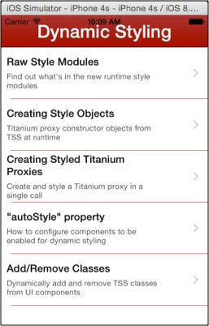

# Dynamic Styling

Demonstrates different approaches to [changing styles at runtime](/guide/Alloy_Framework/Alloy_Guide/Alloy_Views/Dynamic_Styles/) in Alloy. The sample application displays a menu of options that discuss or demonstrate the different approaches and techniques for dynamic styling. See each section below for a discussion of each approach.

::: tip App folder location
_alloy_/test/apps/**advanced/dynamic\_styling**
:::



## Raw style modules

Although not often needed, you can access the raw style data used in the Alloy project, you can `require()` the styles, as shown below:

**app/controllers/features/rawStyle.js**

```javascript
var rawStyles = JSON.stringify(require('alloy/styles/features/rawStyle');
console.log(rawStyles);
// output
[
  {
    "isApi": true,
    "priority": 1000.0001,
    "key": "Window",
    "style": {
      "backgroundColor": "#efefef",
      "fullscreen": false,
      "navBarHidden": true
    }
  },
  {
    "isApi": true,
    "priority": 1000.0002,
    "key": "Label",
    "style": {
      "color": "#181818",
      "height": "SIZE",
      "textAlign": "left"
    }
  },
  {
    "isApi": true,
    "priority": 1000.0028,
    "key": "WebView",
    "style": {
      "width": "100%",
      "top": "10dp"
    }
  },
  {
    "isClass": true,
    "priority": 10000.0003,
    "key": "container",
    "style": {
      "top": "50dp",
      "bottom": 0,
      "right": "10dp",
      "left": "10dp"
    }
  },
  {
    "isClass": true,
    "priority": 10000.0004,
    "key": "blue",
    "style": {
      "color": "#00f"
    }
  },
  {
    "isClass": true,
    "priority": 10000.0005,
    "key": "shadow",
    "style": {
      "shadowColor": "#88f",
      "shadowOffset": {
        "x": 1,
        "y": 3
      }
    }
  },
  {
    "isClass": true,
    "priority": 10000.0006,
    "key": "dark",
    "style": {
      "backgroundColor": "#888",
      "color": "#003"
    }
  },
  {
    "isClass": true,
    "priority": 10000.0007,
    "key": "large",
    "style": {
      "font": {
        "fontSize": "32dp",
        "fontWeight": "bold"
      }
    }
  },
  {
    "isClass": true,
    "priority": 10000.0008,
    "key": "huge",
    "style": {
      "font": {
        "fontSize": "64dp",
        "fontWeight": "bold"
      }
    }
  },
  {
    "isClass": true,
    "priority": 10000.0029,
    "key": "content",
    "style": {
      "font": {
        "fontSize": "16dp",
        "fontWeight": "normal"
      },
      "height": "SIZE",
      "top": "10dp"
    }
  },
  {
    "isClass": true,
    "priority": 10000.003,
    "key": "container",
    "style": {
      "layout": "vertical"
    }
  }
]
```

## Creating and using style objects

This section uses an Alloy view-controller's [createStyle()](#!/api/Alloy.Controller-method-createStyle) method to create a new style object, which is then passed as a parameter to the [Ti.UI.createLabel()](#!/api/Titanium.UI-method-createLabel) method. The following code is representative of that used in the sample app.

**app/controllers/features/createStyle.js**

```javascript
var styleArgs = {
    apiName: 'Ti.UI.Label',
    classes: ['blue','shadow','large'],
    id: 'tester',
    borderWidth: 2,
    borderRadius: 16,
    borderColor: '#000'
};
var styleObject = $.createStyle(styleArgs);
testLabel = Ti.UI.createLabel(styleObject);
testLabel.addEventListener('click', changeStyle);
$.container.add(testLabel);
```

The "blue", "shadow", and "large" styles are defined in the project's global TSS file.

**app/app.tss**

```javascript
'.blue': {
    color: '#00f'
}
'.shadow': {
    shadowColor: '#88f',
    shadowOffset: {x:1,y:3}
}
'.large': {
    font: {
        fontSize: '32dp',
        fontWeight: 'bold'
    }
}
```

In the sample view, click the label to cycle through a variety of styles applied in this manner.


## Creating styled Titanium proxies

This sample view is functionally identical to the previous "Creating Style Objects" sample (click the label to cycle it through a series of different styles). The difference is that it uses the [Alloy.Controller.UI.create()](#!/api/Alloy.Controller.UI-method-create) method to create and style the Label object in a single method call, rather than making [createStyle()](#!/api/Alloy.Controller-method-createStyle) and [Ti.UI.createLabel()](#!/api/Titanium.UI-method-createLabel) calls. The [create()](#!/api/Alloy.Controller.UI-method-create) method takes as its first parameter the API name of the object to create, which can either be the full class name ("Titanium.UI.Button") or the Alloy XML element name ("Button"). It's second parameter is a object hash whose fields specify the styles to apply to the new object.

**app/controller/createStyle.js**

```javascript
var styleArgs = {
    classes: ['blue','shadow','large'],
    id: 'tester',
    borderWidth: 2,
    borderRadius: 16,
    borderColor: '#000'
};
testLabel = $.UI.create('Label', styleArgs);
testLabel.addEventListener('click', changeStyle);
$.container.add(testLabel);
```

## Adding and removing TSS classes

The "Add/Remove Classes" sample app section demonstrates using [addClass()](#!/api/Alloy.Controller-method-addClass), [removeClass()](#!/api/Alloy.Controller-method-removeClass) and [resetClass()](#!/api/Alloy.Controller-method-resetClass) methods to style objects that have already been created, either from an XML view, or by calling [Alloy.Controller.UI.create()](#!/api/Alloy.Controller.UI-method-create) or one of the Ti.UI.create\* methods, such as as [Titanium.UI.createLabel()](#!/api/Titanium.UI-method-createLabel). This sample also demonstrates Alloy's "auto-styling" feature, which is also demonstrated in the [Autostyle Property](#AutostyleProperty) section below.

This affects the result of adding and removing TSS classes at runtime, as shown below. The two Label elements are both styled with same classes ("medium shadow") but the top Label element has `autoStyle` set to `true`, while the bottom Label element does not.

**app/views/classes.xml**

```xml
<Label id="label1" class="medium shadow">autoStyle="true"</Label>
<Label id="label2" class="medium shadow" autoStyle="false">autoStyle="false"</Label>
```

The blue button acts as a toggle that calls `addClass()` and `removeClass()` on both Labels to add and remove the "redbg bigger" classes from each Label. Initially, they both look identical, and also when the "Add classes" toggle is pressed. However, when those styles are removed, the auto-styled Label returns to its original state ("medium shadow" styles applied); the Label which is not auto-styled is set to its default styled state.


## Autostyle property

A XML view component whose `autostyle` attribute is set to `true` has its assigned classes stored to it's runtime proxy object, making them available This can observed by viewing the console output when you run the Autostyle sample, in which only "label2" has auto-styling enabled. The sample prints the `id`, `classes`, and `apiName` of all UI components created from XML to the console.

As shown below, only the output for `label2` includes a `classes` field, since it's the only element with auto-styling enabled.

**Console output**

```
[INFO]  ******** label1 ********
[INFO]  {
[INFO]    "apiName": "Ti.UI.Label",
[INFO]    "id": "label1"
[INFO]  }
[INFO]
[INFO]  ******** label2 ********
[INFO]  {
[INFO]    "apiName": "Ti.UI.Label",
[INFO]    "classes": [
[INFO]      "blue",
[INFO]      "huge",
[INFO]      "shadow"
[INFO]    ]
[INFO]    "id": "label2"
[INFO]  }
```

Autostyle is necessary to take full advantage of the [addClass()](#!/api/Alloy.Controller-method-addClass), [removeClass()](#!/api/Alloy.Controller-method-removeClass), and [resetClass()](#!/api/Alloy.Controller-method-resetClass) methods to properly update the view as classes are removed and added. For a better demonstration of the benefits of enabling auto-styling, see the discussion above for [Adding and Removing TSS Classes](#adding-and-removing-tss-classes).

::: warning ⚠️ Warning
There is a small performance overhead associated with enabling auto-styling on components, which is why `autoStyle` is not disabled for all components by default. You should use `autoStyle` only on elements that will actually use the ability to add/remove classes at runtime.
:::

## See also

* [Dynamic Styles](/guide/Alloy_Framework/Alloy_Guide/Alloy_Views/Dynamic_Styles/)
