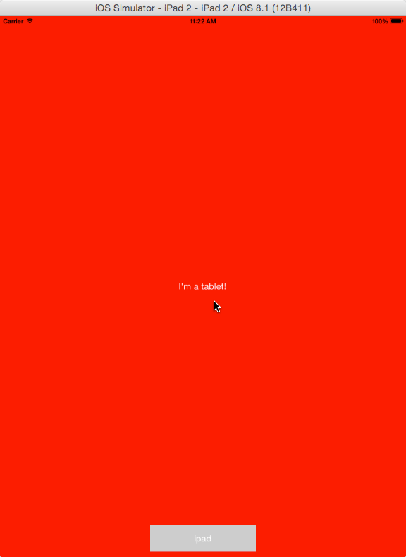
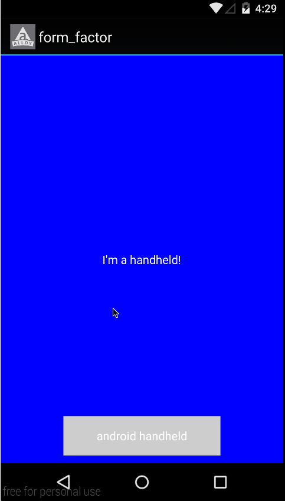

# Form factor

Demonstrates how to conditionally apply TSS styles or include XML markup based on the form factor of the target device. Each XML element, or TSS style, can be assigned a `formFactor` attribute that can take a value of either **"handheld"** or **"tablet"**.

::: tip 💡 App folder location
_alloy_/test/apps/**advanced/form\_factor**
:::

|  |  |  |
| --- | --- | --- |

On handhelds, the `main` Label text is set to "I'm a handheld!" and to "I'm a tablet!" on tablets. The `platformLabel` Label displays the platform as well as form factor.

**app/views/index.xml**

```xml
<Alloy>
    <Window>
        <View id="main" formFactor="handheld">
            <Label id="label">I'm a handheld!</Label>
        </View>
        <View id="main" formFactor="tablet">
            <Label id="label">I'm a tablet!</Label>
        </View>
        <View id="container" height="50" width="200" bottom="10" backgroundColor="#cdcdcd">
            <Label id="platformLabel" platform="android" formFactor="tablet">android tablet</Label>
            <Label id="platformLabel" platform="android" formFactor="handheld">android handheld</Label>
            <Label id="platformLabel" platform="ios" formFactor="tablet">ipad</Label>
            <Label id="platformLabel" platform="ios" formFactor="handheld">iphone</Label>
            <Label id="platformLabel" platform="mobileweb" formFactor="tablet">mobileweb tablet</Label>
            <Label id="platformLabel" platform="mobileweb" formFactor="handheld">mobileweb handheld</Label>
        </View>
    </Window>
</Alloy>
```

The `backgroundColor` attribute of all View objects on handhelds is set to blue, and to red on all tablets.

**app/styles/index.tss**

```javascript
"View[formFactor=handheld]": {
    backgroundColor:"blue"
}
"View[formFactor=tablet]": {
    backgroundColor:"red"
}
```

## See also

* [Alloy XML:Conditional Code](/guide/Alloy_Framework/Alloy_Guide/Alloy_Views/Alloy_XML_Markup/#conditional-code)
