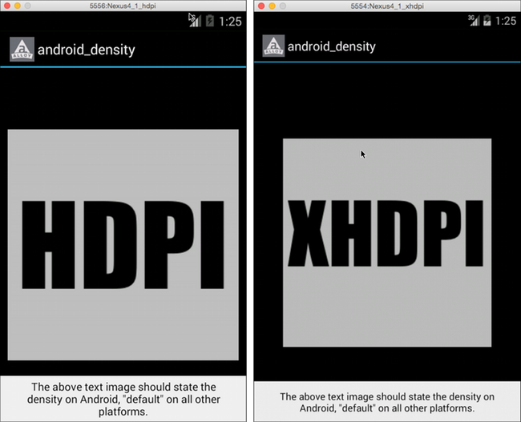

# Handling Different Screen Densities on Android

Demonstrates how to package and use images for different screen densities on Android.

::: tip 💡 App folder location
_alloy_/test/apps/**advanced/android\_density**
:::

In the sample app, is depending on the screen density of the device or emulator, a different image is displayed. For instance, the following screenshots show the sample running on HDPI and XHDPI Android emulators.



To use density-specific images, simply place the desired image in a properly named folder, as explained in [Using density-specific resources on Android](/guide/Titanium_SDK/Titanium_SDK_How-tos/User_Interface_Deep_Dives/Android_UI_Components_and_Conventions/Using_density-specific_resources_on_Android/). At runtime, the appropriate image is displayed. The sample app contains the following folder structure and images:

**App folder structure**

```
app
├── assets
│   ├── android
│   │   ├── appicon.png
│   │   ├── default.png
│   │   └── images
│   │       ├── res-hdpi
│   │       │   └── theImage.png
│   │       ├── res-ldpi
│   │       │   └── theImage.png
│   │       ├── res-mdpi
│   │       │   └── theImage.png
│   │       └── res-xhdpi
│   │           └── theImage.png
│   └── images
│       └── theImage.png
├── config.json
├── controllers
├── styles
└── views
```

## See Also

* [Using density-specific resources on Android](/guide/Titanium_SDK/Titanium_SDK_How-tos/User_Interface_Deep_Dives/Android_UI_Components_and_Conventions/Using_density-specific_resources_on_Android/)

* [Supporting Multiple Screens](http://developer.android.com/guide/practices/screens_support.html) (Android Developer Center)
