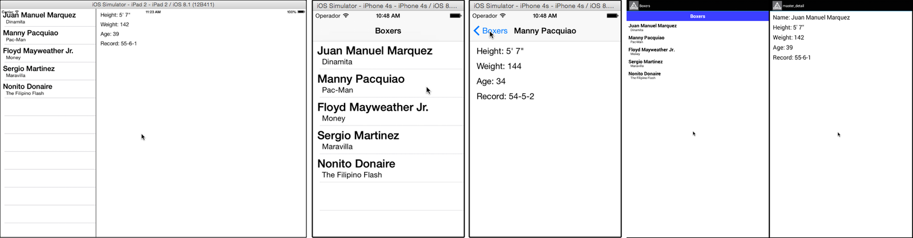

# Master-Detail

Demonstrates how to create a master-detail application that presents a list of items from which the user can select to view details about that item.

::: tip 💡 App folder location
_alloy_/test/apps/**advanced/master\_detail**
:::

The sample is designed to support handheld and tablet (iPad) form factors. On iPhone, a [NavigationWindow](#!/api/Titanium.UI.iOS.NavigationWindow) control is used to display the master and detail windows; on iPad, a [SplitWindow](#!/api/Titanium.UI.iPad.SplitWindow) is used; and on Android, a standard [Window](#!/api/Titanium.UI.Window) control is used for both the master and detail views, as shown below.



The main `index.xml` view defines this view structure using `platform` and `formFactor` condition attributes on each top-level window control, as shown below.

**app/views/index.xml**

```xml
<Alloy>
    <!-- iPad -->
    <SplitWindow id="index" platform="ios" formFactor="tablet">
        <Require src="master" id="master"/>
        <Require src="detail" id="detail"/>
    </SplitWindow>
    <!-- iPhone -->
  <NavigationWindow id="index" platform="ios" formFactor="handheld">
        <Require src="master" id="master"/>
  </NavigationWindow>
    <!-- Android -->
  <Require id="master" src="master" platform="android"/>
</Alloy>
```

The `master.xml` view is used for all for all platforms and includes a [TableView](#!/api/Titanium.UI.TableView) element to display the master list of items. An `onClick` handler named **openDetail** is assigned to the TableView, which is invoked when an item in the table is selected. For Android builds, a [headerView](#!/api/Titanium.UI.TableViewSection-property-headerView) is conditionally added to the TableView to display the table name.

**app/views/master.xml**

```xml
<Alloy>
    <Window title="Boxers">
        <TableView id="table" onClick="openDetail">
            <HeaderView platform="android">
                <Label id="header">Boxers</Label>
            </HeaderView>
        </TableView>
    </Window>
</Alloy>
```

The `index.js` controller is responsible for opening the right top-level window depending on which platform the application is running. It also defines a Backbone-based event handler for the "detail" event that is triggered when the user selects an item from the TableView. This event is triggered in the master.js view-controller, shown next.

The controller uses the [Alloy.isHandheld](#!/api/Alloy-property-isHandheld), [Alloy.isTablet](#!/api/Alloy-property-isHandheld) and [OS\_IOS](/guide/Alloy_Framework/Alloy_Guide/Alloy_Controllers/#conditional-code) conditionals in the "detail" event handler to determine whether it needs to create a controller to display the details for the selected item (on iPhone) or simply use the existing view in the SplitWindow.

**app/controllers/index.js**

```javascript
if (OS_IOS && Alloy.isHandheld) {
    Alloy.Globals.navgroup = $.index;
}
$.master.on('detail', function(e) {
    // get the detail controller and window references
    var controller = OS_IOS && Alloy.isTablet ? $.detail : Alloy.createController('detail');
    var win = controller.getView();
    // get boxer stats by name
    controller.setBoxerStats(e.row.fighterName);
    // open the detail windows
    if (OS_IOS && Alloy.isHandheld) {
        Alloy.Globals.navgroup.openWindow(win);
    } else if (OS_ANDROID) {
        win.open();
    }
});
if (OS_ANDROID) {
    $.master.getView().open();
} else {
    $.index.open();
}
```

The `master.js` view-controller, shown below, populates the TableView with [TableViewRow](#!/api/Titanium.UI.TableViewRow) objects. It uses the included Underscore library's [each()](http://underscorejs.org/#each) function to iterate over each member of `Alloy.Globals.data` collection (defined in `app/alloy.js`) and creates a new TableViewRow from the `app/views/row.xml` view. The first argument passed to the [Alloy.createController()](#!/api/Alloy-method-createController) is the view-controller's base name ("row") followed by the specific data for that row to display. Each new view-controller is pushed onto a local array named `data`, which is finally passed to the TableView object's [setData()](#!/api/Titanium.UI.TableView-method-setData) method.

**app/controllers/master.js**

```javascript
function openDetail(e) {
    $.trigger('detail', e);
}
var data = [];
_.each(Alloy.Globals.data, function(stats, name) {
    data.push(Alloy.createController('row', {
        name: name,
        nickname: stats.nickname
    }).getView());
});
$.table.setData(data);
```

The `row.xml` view defines the layout and content of each `TableViewRow`.

**app/views/row.xml**

```xml
<Alloy>
    <TableViewRow>
        <Label id="name"/>
        <Label id="nickname"/>
    </TableViewRow>
</Alloy>
```

The `row.js` view-controller reads the values of the arguments passed to it by the `createController()` method, and assigns the proper values to the `name` and `nickname` Label elements.

```javascript
var args = arguments[0] || {};
$.row.fighterName = $.name.text = args.name;
$.nickname.text = args.nickname;
```

## See also

* [NavigationWindow](#!/api/Titanium.UI.iOS.NavigationWindow)

* [SplitWindow](#!/api/Titanium.UI.iPad.SplitWindo)
