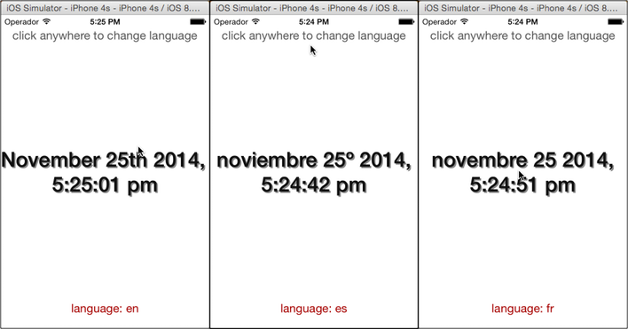

# MomentJS

Demonstrates how to use the built-in [Moment.js](http://momentjs.com/) library in your Alloy application to format a date for different locales. Moment.js is a full featured date library for parsing, validating, manipulating, and formatting dates.

::: tip 💡 App folder location
_alloy_/test/apps/**advanced/momentjs**
:::



By default, the English locale library is included with the main Moment.js library. Other locale libraries can be included implicitly either according to the languages specified by your Titanium project's i18n folder, or by explicitly requiring them in your code. These approaches are both demonstrated by the sample app, and discussed below.

To properly run the sample, in addition to importing the provided sample code, you will also need to create a localized strings.xml file, in this case for Spanish (language code "es").

**To create the localized strings:**

1. In the root application folder, create a folder named **i18n** and a subfolder named **es**.

2. Create a file named strings.xml and save it to the i18n/es, as shown below. This folder must be in the root of the Titanium project folder, not the Alloy project's app/ folder. For the purposes of this demonstration, the strings.xml file can be left empty, but it must exist.

    ```
    momentjs
    ├── Resources
    ├── app
    ├── i18n
    │   └── es
    │       └── strings.xml
    └── tiapp.xml
    ```

3. Build and run the application for device or emulator/simulator. Click anywhere in the application window to change the format of the displayed time and date.

The only view in the application just contains three Label elements. Clicking anywhere on the Window invokes the `changeLanguage()` function, defined by the view-controller.

**app/views/index.xml**

```xml
<Alloy>
    <Window onClick="changeLanguage">
        <Label id="info">click anywhere to change language</Label>
        <Label id="theDate"/>
        <Label id="language"/>
    </Window>
</Alloy>
```

The main view-controller requires the Moment.js library (`require('alloy/moment')`) and assigns it to the variable `moment`. It creates an array of supported languages using the language codes as the array keys. Because the project's i18n/ folder defines an "es" locale, the Spanish locale library is automatically required in the application. The German and French locale libraries are manually required, since they are not represented in the i18n/ folder.

To change the locale globally, the application calls the `moment.lang()` function, passing it the new language code.

**app/controllers/index.js**

```javascript
var moment = require('alloy/moment');
var langs = [
    'en', // default
    'es', // added automatically since it's in the "i18n" project folder
    'de', // added via require() below
    'fr'  // added via require() below
];
var langIndex = 0;
// Manaully inlude German and French locales
require('alloy/moment/lang/de');
require('alloy/moment/lang/fr');
function changeLanguage() {
    var lang = langs[langIndex++];
    moment.lang(lang);
    $.language.text = 'language: ' + lang;
    if (langIndex >= langs.length) { langIndex = 0; }
}
function updateDate() {
    $.theDate.text = moment().format('MMMM Do YYYY, h:mm:ss a');
}
// Set the initial formatted date and update (about) every half second to
// account for the inconsistency of javascript's timing.
changeLanguage();
updateDate();
setInterval(updateDate, 500);
$.index.open();
```

## See Also

* [Moment.js documentation](http://momentjs.com/) (external)
