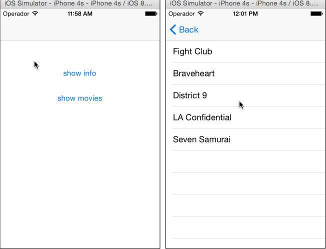

# Destroying Data Bindings

Demonstrates best practices for data binding memory management.

::: tip App Folder Location
alloy/test/apps/**models/binding\_destroy**
:::


To prevent memory leaks and ensure that bindings are properly released, you should always call `destroy()` on a controller that references a global data collection when you are done with that controller. Calling this method frees binding resources associated with this controller and its UI components. The sample app's main `index.xml` view, shown below, declares global references to the `movies` collection and `info` model.

**views/index.xml**

```xml
<Alloy>
    <!-- global reference to info model -->
    <Model src="info"/>
    <!-- global reference to movies collection -->
    <Collection src="movies"/>
    <!-- ...abbreviated for clarity... -->
    </Window>
</Alloy>
```

This info model and movies collection are bound to the info.xml and movies.xml views, respectively.

**app/views/info.xml**

```xml
<Alloy>
    <Window layout="vertical">
        <Label text="{info.name}"/>
        <Label text="{info.email}"/>
        <Label text="{info.twitter}"/>
    </Window>
</Alloy>
```

**app/views/movie.xml**

```xml
<Alloy>
    <Window>
        <TableView dataCollection="movies">
            <TableViewRow title="{title}"/>
        </TableView>
    </Window>
</Alloy>
```

The view-controllers for the movies and info views call `$.destroy()` from their `close` event handlers to properly dispose of allocated memory.

**app/controllers/info.js**

```javascript
$.info.addEventListener('close', function() {
    $.destroy();
});
```

**app/controllers/movies.js**

```javascript
$.movies.addEventListener('close', function() {
    $.destroy();
});
```

## See Also

* [Alloy Data Binding](/guide/Alloy_Framework/Alloy_Guide/Alloy_Models/Alloy_Data_Binding/)
