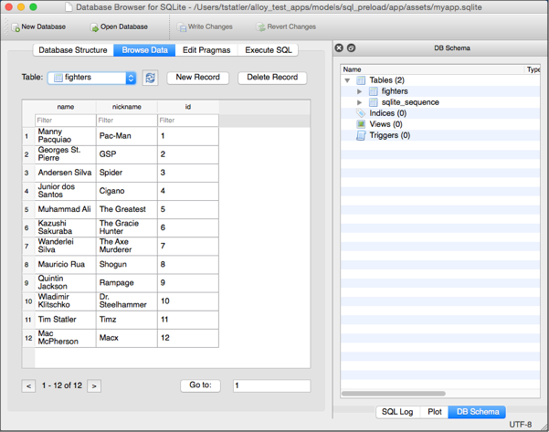

# SQL Preload

Demonstrates how to preload a SQLite database for your Alloy appliccation using an external SQLite database file.

::: tip 💡 App Folder Location
alloy/test/apps/**models/sql\_preload**
:::

Rather than creating and populating your SQLite database with JavaScript or a migration file, your model configuration file can specify an external SQLite data file. The following image shows the contents of the `myapp.sqlite` included with the sample app.



The .sqlite database file must be placed in your Alloy project's **app/assets** folder. By default, Alloy creates a database using the name of the database file, minus the file extension, if one does not exist. You can also specify the name of the database to create, as explained below.

The **config.adaptor** object in the Alloy application's model configuration file must specify the following key-value pairs:

* **collection\_name** – The table name inside the SQLite file to use for models and collections.

* **db\_file** – The SQLite file to use to preload the application database.

* **db\_name** – The name to for the SQLite database name. If not specified, the database name is set to the base name of the .sqlite file.

**app/models/fighters.js**

```javascript
exports.definition = {
  config: {
    // No need to define columns object, loading the db_file
    // below will do that for us.
    "adapter": {
      "type": "sql",
      // The table name inside the sqlite database to use for
      // models and collections based on this definition.
      "collection_name": "fighters",
      // db_file tells model to use myapp.sqlite file to install
      // database
      "db_file": "/myapp.sqlite",
      // db_name tells model to use the given name as the database
      // name instead of using the filename. In this case we'll be
      // using "fighters" instead of "myapp".
      "db_name": "fighters",
      // idAttribute tells Alloy/Backbone to use this column in
      // my table as its unique identifier field. Without
      // specifying this, Alloy's default behavior is to create
      // and "alloy_id" field which will uniquely identify your
      // rows in the table.
      "idAttribute": "id",
      // remoteBackup tells Alloy to set the value of the property
      // Ti.Filesystem.File.remoteBackup. This setting tells iOS
      // whether or not to allow your database to be backed up to
      // iCloud or in iTunes backups.
      "remoteBackup": false
    }
  }
};
```

## See Also

* [Alloy Sync Adapters and Migrations](/guide/Alloy_Framework/Alloy_Guide/Alloy_Models/Alloy_Sync_Adapters_and_Migrations/)
