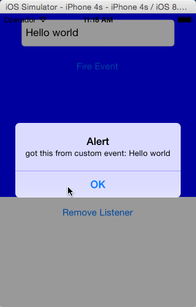

# Controller events

Demonstrates using [Backbone events](http://backbonejs.org/#Events) to communicate between view-controllers.

::: tip 💡 App Folder Location
alloy/test/apps/**basics/controller\_events**
:::


The main XML view consists of a TextField and two buttons, labeled "Fire Event" and "Remove Listener". When the user clicks "Fire Event" the required CustomView view-controller uses the Backbone library's `trigger()` method to generate an event named **someEvent.** The event object includes a field named `message` field that contains the text entered in the TextField.

**app/controllers/CustomView.js**

```javascript
function fireEvent(e) {
  $.trigger('someEvent', {
    message:$.text.value
  });
}
```

The main application view-controller binds a callback function named **handler** to the `someEvent` event, and displays the message enter in the TextField. It also provides a button that un-binds the handler from the same event.

**app/controllers/index.js**

```javascript
function handler(e) {
  alert('got this from custom event: '+e.message);
}
function removeListener() {
  $.requiredController.off('someEvent', handler);
}
$.requiredController.on('someEvent', handler);
```

## See Also

* [Backbone Events guide](http://docs.appcelerator.com/backbone/0.9.2/#Events)
