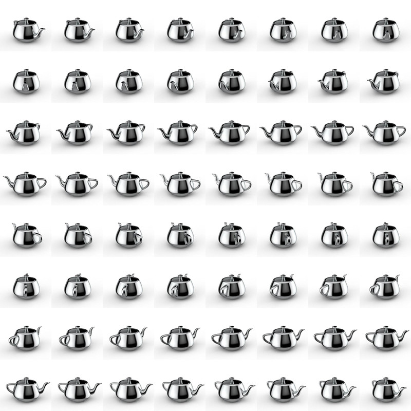

# Create Turntable Animation

This document shows how to create turntable animation. 

Turntable animation is a 360° animation in one axis that is mostly used to show 3D objects from all sides:

Since we cannot use a 3D engine, we will use a pre-rendered [sprite sheet](https://en.wikipedia.org/wiki/Sprite_(computer_graphics)) to create our animation. The sprite sheet contains all frames of the 360° animation and is stacked in a grid. The bigger you create the image, the higher the resolution will be; if you create more frames, you will have a smoother animation. In this example, we use a 8×8 grid with a 250 x 250px frame. So, the full image will be 2000 x 2000px.



_Full sprite sheet_

The Alloy setup is rather easy – a View with the whole image and one View around it that displays only one frame:

**index.xml**

```xml
<Alloy>
 <Window>
 <View id="frameView">
 <View id="img"/>
 </View>
 </Window>
</Alloy>
```

**index.tss**

```javascript
"#frameView" : {
    width: 250,
    height: 250,
    touchEnabled: false
}
"#img" : {
    width: 2000,
    height: 2000,
    backgroundImage: "/images/turntable.jpg",
    touchEnabled: false,
    top:0,
    left:0
}
```

The whole logic is inside the controller where we use `touchStart` and `touchMove` to cycle through the frames. To do this, we have disabled `touchEnabled` on the two views and add two event listeners to our index window:

```javascript
function onStart(e) {
}

function onMove(e) {
}

$.index.addEventListener("touchstart", onStart);
$.index.addEventListener("touchmove", onMove);

$.index.open();
```

Inside `onStart`, we store the first x coordinate where the user clicks on the screen and calculate the distance to it every time `touchmove` is called:

```javascript
var distX = 0;
var sX = 0;
var frame = 0;

function onStart(e) {
    // set start value
    sX = e.x;
}

function onMove(e) {
    // calculate distance between start and current x
    distX = (sX - e.x);
}

$.index.addEventListener("touchstart", onStart);
$.index.addEventListener("touchmove", onMove);

$.index.open();
```

If we move 5px, we will change a frame and set the start point the the new x coordinate. When we reach frame 64, we have to go to frame 0 again and visa versa so we have an endless loop.

```javascript
function onMove(e) {
    // calculate distance between start and current x
    distX = (sX - e.x);

    // 5px buffer until we change a frame
    if (distX < -5) {
      frame--;
      sX = Math.floor(e.x);
    } else if (distX > 5) {
      frame++;
      sX = Math.floor(e.x);
    }

    // check frame
    if (frame >= 64) {
      frame = 0;
    } else if (frame < 0) {
      frame = 63;
    }
}
```

The last thing we need to do is calculate the top and left position of our frame. Frames 1 to 8 are at `top=0` and `left=0`, `250`, `500`, …. Once we reach frame 9, we will start from `left=0` again, but move top one row down (250px). In Javascript, we can do this simply with:

```javascript
// frame to px
var x = Math.floor((frame * 250) % 2000);
var y = Math.floor((frame * 250) / 2000) * 250;

// change image
$.img.left = -x;
$.img.top = -y;
```

When you start your app and move your finger from one side to another, you will see a spinning object! The whole `index.js` looks like this:

```javascript
var distX = 0;
var sX = 0;
var frame = 0;

function onStart(e) {
    // set start value
    sX = e.x;
}

function onMove(e) {
    // calculate distance between start and current x
    distX = (sX - e.x);

    // 5px buffer until we change a frame
    if (distX < -5) {
      frame--;
      sX = Math.floor(e.x);
    } else if (distX > 5) {
      frame++;
      sX = Math.floor(e.x);
    }

    // check frame
    if (frame >= 64) {
      frame = 0;
    } else if (frame < 0) {
      frame = 63;
    }

    // frame to px
    var x = Math.floor((frame * 250) % 2000);
    var y = Math.floor((frame * 250) / 2000) * 250;

    // change image
    $.img.left = -x;
    $.img.top = -y;
}

$.index.addEventListener("touchstart", onStart);
$.index.addEventListener("touchmove", onMove);

$.index.open();
```

Guide credit: [Michael Gangolf](http://github.com/m1ga)
