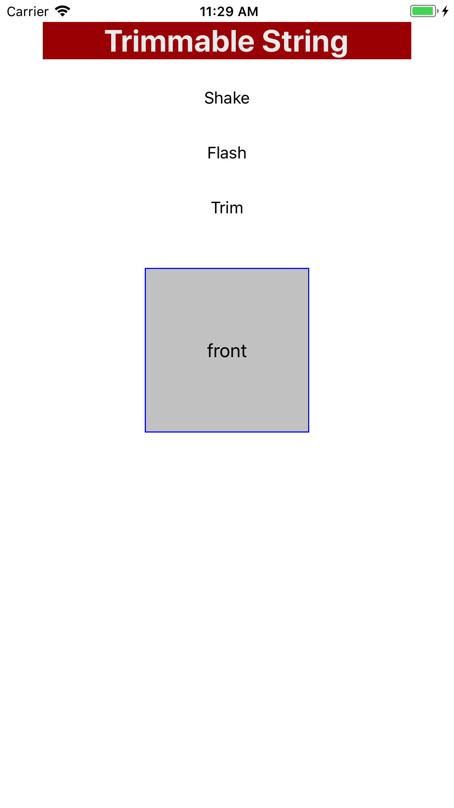

# Global Styles

Demonstrates using the global style file to apply a set of default styles to an entire Alloy project.

::: tip 💡 App Folder Location
alloy/test/apps/**basics/global\_style**
:::


An Alloy project can include a [global style file](/guide/Alloy_Framework/Alloy_Guide/Alloy_Views/Alloy_Styles_and_Themes/#global-styles) located at `app/styles/app.tss`. The styles defined by this file apply to all controls and views, but are over-ridden by "local" styles declared by the following:

* ID or class styles declared by a controller styles (`views/index.tss`, for example).

* Styles assigned directly to an XML element

In this example, the main **index.xml** view requires **item.xml.**

**app/views/index.xml**

```xml
<Alloy>
    <Window>
        <Require src="item"/>
    </Window>
</Alloy>
```

The `item.xml` view contains a `<View/>` element whose "class" attribute is set to "container".

**app/views/item.xml**

```xml
<Alloy>
    <View class="container">
        <Label id="label">should be bold, red text on blue background</Label>
    </View>
</Alloy>
```

The global style file defines a blue `backgroundColor` to the "container" class, and a color, font size and weight, and text alignment for all Label objects.

**styles/app.tss**

```javascript
".container": {
  backgroundColor: "#00f"
}
"Label": {
  color: "#f00",
  font: {
    fontSize: 24,
    fontWeight: 'bold'
  },
  textAlign: 'center'
}
```

## See also

* [Global Styles](#undefined)

* [Custom TSS Queries](/guide/Alloy_Framework/Alloy_Guide/Alloy_Test_Apps/Advanced/Custom_TSS_Queries/)
