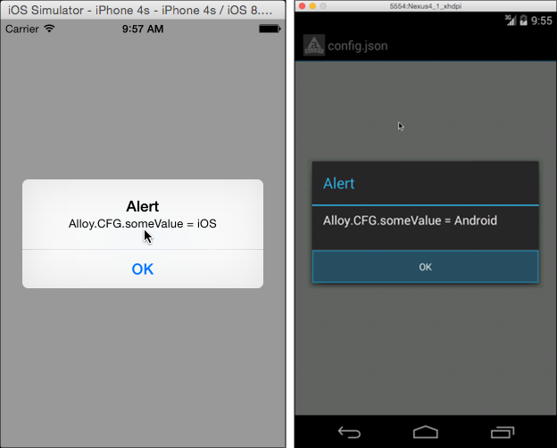

# Project Configuration File

Demonstrates use of the Alloy configuration file.

::: tip 💡 App Folder Location
alloy/test/apps/**basics/config\_json**
:::

The Alloy configuration file is named config.json and located in the Alloy project's app directory. It's used to specify global variables, conditional environment and platform values, and widget dependencies. For a list of supported configuration values, see [Project Configuration File](/guide/Alloy_Framework/Alloy_How-tos/Alloy_Reference_Guides/Project_Configuration_File_(config.json)/).



At runtime, you can access a configuration file property by its key name on the global `Alloy.CFG` object. For instance, in the sample app configuration file defines a global property named **someValue** that's defined for all environments and platforms, and for individual platforms.

**apps/config.json**

```json
{
    "global": { "someValue": "unknown" },
    "os:android": { "someValue": "Android" },
    "os:ios": { "someValue": "iOS" },
    "os:mobileweb": { "someValue": "Mobileweb" },
    "sourcemap": false,
    "adapters": []
}
```

The main XML view contains a <Button/> element whose click handler displays the value of `Alloy.CFG.someValue`, whose value depends on the runtime platform.

**app/controllers/index.js**

```javascript
function showAlert(e) {
  alert('Alloy.CFG.someValue = ' + Alloy.CFG.someValue);
}
```

## See Also

* [Project Configuration File (config.json)](/guide/Alloy_Framework/Alloy_How-tos/Alloy_Reference_Guides/Project_Configuration_File_(config.json)/)
