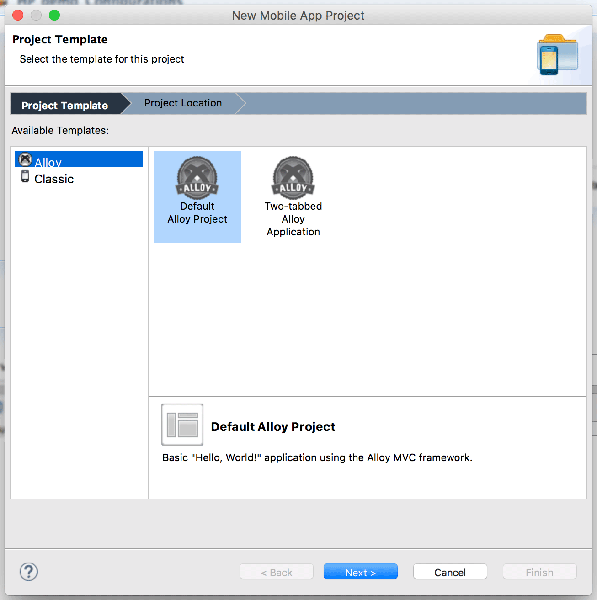

# Alloy Test Apps

The Alloy GitHub [repository](https://github.com/appcelerator/alloy) includes a number of small [test applications](https://github.com/appcelerator/alloy/tree/master/samples/apps) that demonstrates various Alloy features.

To build and run one of the test applications, do the following:

1. Clone the Alloy project locally.

2. Create a new Alloy project, either using Studio or the CLI tools.

3. Copy the contents of the desired sample folder into the newly created Alloy project's `/app` folder and overwrite any existing files.

4. Build and run the application on a device, simulator, or emulator.

The sample apps are organized in several folders representing the following categories:

* [User Interface](/guide/Alloy_Framework/Alloy_Guide/Alloy_Test_Apps/User_Interface/)

* [Advanced](/guide/Alloy_Framework/Alloy_Guide/Alloy_Test_Apps/Advanced/) — Samples in the advanced/ folder demonstrate advanced Alloy topics and approaches, such as advanced styling, using modules, using CommonJS modules, and more.

* [Basics](/guide/Alloy_Framework/Alloy_Guide/Alloy_Test_Apps/Basics/) — Samples in the basics/ folder demonstrates basic Alloy concepts.

* [Alloy Test Models](/guide/Alloy_Framework/Alloy_Guide/Alloy_Test_Apps/Alloy_Test_Models/) — Samples in the alloy/test/apps/models/ folder demonstrates using models, collections, and data binding in Alloy.

* [Widgets](/guide/Alloy_Framework/Alloy_Guide/Alloy_Test_Apps/Widgets/)

Note that some samples demonstrate platform-specific features that only run on certain platforms.

## Importing and Running an Alloy Test App

To import one of the sample application, first clone the Alloy GitHub project locally:

```
git clone https://github.com/appcelerator/alloy
```

Once you've selected a test app to build and run, you first create a new "blank" Alloy project, and then copy the contents of the sample folder into the `/app` folder of the newly created Alloy project. You can do this either using Appcelerator Studio or on the command line using the CLI tools, as explained below.

### Using the CLI tools

You can generate a new Alloy project using a test application from the Alloy Github repo. (The source code is copied from the global or local install of the Alloy npm package.)

To create an Alloy application based on a test application, first create a skeleton Titanium project, then run the Alloy new command with the `--testapp <path_to_test_app>` option. Pass the option the relative path to the test application after the `alloy/test/apps` path.

```bash
appc new -t titanium --classic -i com.appc.picker -n AlloyPicker
cd AlloyPicker
appc alloy new --testapp ui/picker
```

Prior to Alloy 1.7.6, you need to manually copy the source code to the new Titanium project:.

**Creating a test project**

```bash
appc new -t titanium -n picker_test --id com.yourdomain -d . -url yourdomain.com -p all
cd picker_test/
cp -r <alloy_repo>/test/apps/ui/picker/ app/
appc run -p ios
```

### Using Appcelerator Studio

1. To build a sample using **Appcelerator Studio**, first create a new Alloy project by selecting **File** > **New** \> **Mobile App Project**.

    
2. Drag and drop the contents of the desired test app folder from the desktop into the new project's `/app` folder in Project Explorer.

3. When prompted, select **Copy file and folders** option in the File and Folder Operation dialog and click OK.

4. Select **Yes To All** when asked if you want to overwrite files in the target folder.

You can now build or run the application on a target device, simulator or emulator.
