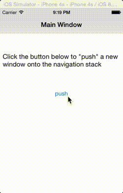

# NavigationWindow

Demonstrates how to navigate a hierarchy of content using the NavigationWindow object.

::: tip 💡 Example App Source Location
You can find this example app in the Alloy repository under [samples/apps/ui/navwindow](https://github.com/appcelerator/alloy/tree/master/samples/apps/ui/navwindow). Check the [instructions](/guide/Alloy_Framework/Alloy_Guide/Alloy_Test_Apps/) how to run these sample projects.
:::

A [NavigationWindow](#!/api/Titanium.UI.iOS.NavigationWindow) implements a specialized view that manages the navigation of hierarchical content. You call the NavigationWindow object's [openWindow()](#!/api/Titanium.UI.iOS.NavigationWindow-method-openWindow) method to open a new window in the navigation group, [closeWindow()](#!/api/Titanium.UI.iOS.NavigationWindow-method-closeWindow) to remove it.



The sample's main index.xml view declares a NavigationWindow element named `navWindow`.

**app/views/ios/index.xml**

```xml
<Alloy>
    <NavigationWindow>
        <Window id="main" title="Main Window">
            <Label class="space">Click the button below to "push" a new window onto the navigation stack</Label>
            <Button class="space" onClick="Alloy.Globals.openWindow">push</Button>
        </Window>
    </NavigationWindow>
</Alloy>
```

::: warning ⚠️ Warning
As of Titanium 8.0.0, you don't need to specify the platform type (e.g. `<NavigationWindow platform="ios">`).
:::

When the "Push" button is clicked, it invokes the `Alloy.Globals.openWindow()` function. This function is defined in the application's alloy.js file, and calls the `navWindow's` [openWindow()](#!/api/Titanium.UI.iOS.NavigationWindow-method-openWindow) method, passing it a new window created from the `app/views/win.xml` view. It also initializes a global counter variable named `ctr` that's displayed by each window added to the navigation stack.

**app/alloy.js**

```javascript
Alloy.Globals = {
  ctr: 0,
  openWindow: function(e) {
    Alloy.Globals.ctr++;
    Alloy.Globals.navwindow.openWindow(Alloy.createController('win').getView());
  }
};
```

Each newly created window displays left and right navigation buttons that let you push a new window on the navigation stack, or pop the current window off the stack. The "Push" button calls the same global `openWindow()` function, and the "Pop" button calls the view-controller's `closeWindow()` function, which calls calls `closeWindow()` on the `navWindow` object.

**app/views/ios/win.xml**

```xml
<Alloy>
    <Window layout="vertical">
        <LeftNavButton>
            <Button onClick="closeWindow">pop</Button>
        </LeftNavButton>
        <RightNavButton>
            <Button onClick="Alloy.Globals.openWindow">push</Button>
        </RightNavButton>
        <Label class="space">Click the left nav button above to pop this window off the navigation stack. Click the right one to push another window onto the stack.</Label>
        <Label id="windowNumber" class="space"/>
    </Window>
</Alloy>
```

The view-controller for each window pushed onto the navigation stack displays the value of the global `ctr` in a Label, as well as property in the window's title.

**app/controllers/ios/win.js**

```javascript
function closeWindow(e) {
    Alloy.Globals.ctr--;
    Alloy.Globals.navwindow.closeWindow($.win);
}
$.win.title = "Window #" + Alloy.Globals.ctr;
$.windowNumber.text = "I'm window #" + Alloy.Globals.ctr + " on the stack";
```
