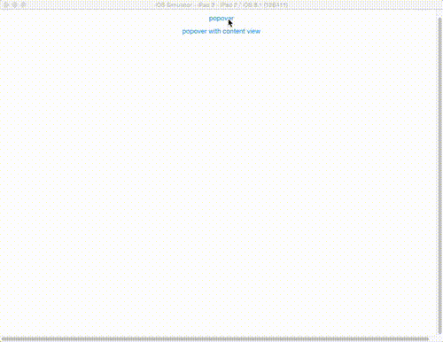

# Popover

Demonstrates how to use a PopOver control iPad devices to present temporary information.

::: tip 💡 Example App Source Location
You can find this example app in the Alloy repository under [samples/apps/ui/popover](https://github.com/appcelerator/alloy/tree/master/samples/apps/ui/popover). Check the [instructions](/guide/Alloy_Framework/Alloy_Guide/Alloy_Test_Apps/) how to run these sample projects.
:::



[Popovers](#!/api/Titanium.UI.iPad.Popover) are used to present temporary information in a non-modal manner. The popover remains visible until the user taps outside of the popover window, or it is explicitly dismissed. The main `index.xml` view presents two buttons, "Popover" and "Popover with content view" that call the view-controller's `openPopover()` and `openPopoverWithContentView()`, respectively, when clicked.

**app/views/index.xml**

```xml
<Alloy>
    <Window layout="vertical" backgroundColor="white">
        <Button id="button1" onClick="openPopover" top="20">popover</Button>
        <Button id="button2" onClick="openPopoverWithContentView">popover with content view</Button>
    </Window>
</Alloy>
```

The `popover.xml` and `popover_with_window.xml` views each declare a `<Popover>` element that, in turn, contains a `<ContentView>` element. The `<ContentView>` element contains the actual content that is displayed by the popup.

**app/views/popover.xml**

```xml
<Alloy>
  <Popover title="popover" height="300" width="250">
    <ContentView>
      <NavigationWindow id="navWindow">
        <Window>
          <LeftNavButton>
            <Button onClick="showAlert">left</Button>
          </LeftNavButton>
          <RightNavButton>
            <Button onClick="showAlert">right</Button>
          </RightNavButton>
          <Label>I'm a popover</Label>
        </Window>
      </NavigationWindow>
    </ContentView>
  </Popover>
</Alloy>
```

**app/views/popover\_with\_window.xml**

```xml
<Alloy>
  <Popover title="popover" height="300" width="250">
    <ContentView>
      <NavigationWindow id="navWindow">
        <Window>
          <RightNavButton>
            <Button title="Open Window" onClick="open_window"/>
          </RightNavButton>
          <Label>This is a window in a popover</Label>
        </Window>
      </NavigationWindow>
    </ContentView>
  </Popover>
</Alloy>
```

When a button on the main view is clicked, the main view-controller gets a reference to a popover XML view, and calls its show() method, passing it a [PopoverParams](#!/api/PopoverParams) object whose `view` property that specifies the view to which the popover should be anchored.

**app/controllers/index.js**

```javascript
function openPopover() {
    if (Ti.Platform.osname === 'ipad') {
        var popover = Alloy.createController('popover').getView();
        popover.show({view:$.button1});
    } else {
        alert('Popover only supported on iPad');
    }
}
function openPopoverWithContentView() {
    if (Ti.Platform.osname === 'ipad') {
        var popover = Alloy.createController('popover_with_window').getView();
        popover.show({view:$.button2});
    } else {
        alert('Popover only supported on iPad');
    }
}
```

## See also

* [Titanium.UI.iPad.Popover](#!/api/Titanium.UI.iPad.Popover) API reference

* [PopoverParams (abstract type](#!/api/PopoverParams)) API reference
