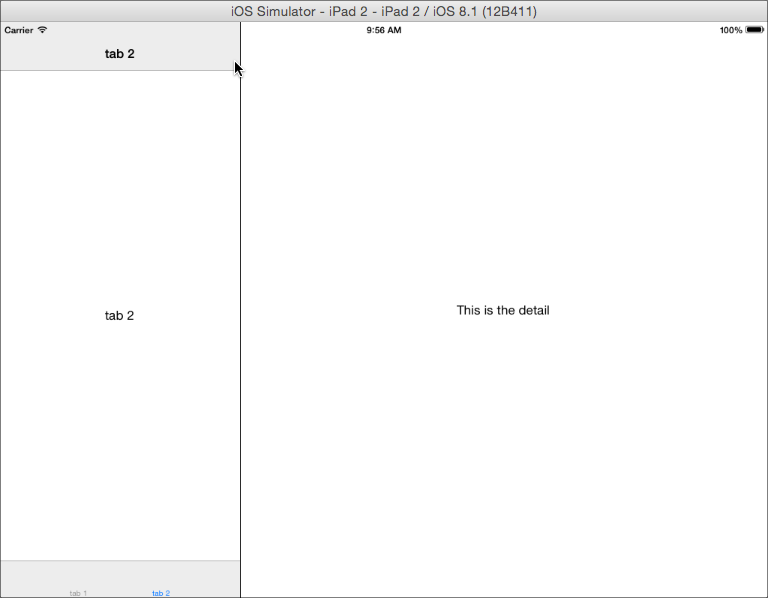

# SplitWindow

Demonstrates how to use a SplitWindow control, an iPad-only control for managing the presentation of two views in a master-detail UI.

::: tip 💡 Example App Source Location
You can find this example app in the Alloy repository under [samples/apps/ui/splitwindow](https://github.com/appcelerator/alloy/tree/master/samples/apps/ui/splitwindow). Check the [instructions](/guide/Alloy_Framework/Alloy_Guide/Alloy_Test_Apps/) how to run these sample projects.
:::



The `<SplitWindow/>` element expects two `<Window/>` elements as children. The first declared `<Window/>` is the "master" view and the second is the "detail" view. If a `<Require>` element is used to insert a Window, as in the sample, the required XML view must contain only one top-level element under the `<Alloy>` tag and that element must be a [Ti.UI.Window](#!/api/Titanium.UI.Window) object.

**views/index.xml**

```xml
<Alloy>
  <SplitWindow platform="ios" formFactor="tablet">
    <!-- The 'masterView' window, added via <Require> tag -->
    <Require src="master"/>

    <!-- The 'detailView' window, using an explicit <Window> tag -->
    <Window>
      <Label>This is the detail</Label>
    </Window>
  </SplitWindow>
</Alloy>
```

The "master" view consists of `<TabGroup/>` element with two `<Tab/>` child elements.

**views/master.xml**

```xml
<Alloy>
  <TabGroup>
    <Tab title="tab 1">
      <Window title="tab 1">
        <Label>tab 1</Label>
      </Window>
    </Tab>
    <Tab title="tab 2">
      <Window title="tab 2">
        <Label>tab 2</Label>
      </Window>
    </Tab>
  </TabGroup>
</Alloy>
```

## See also

* [Titanium.UI.iPad.SplitWindow](#!/api/Titanium.UI.iPad.SplitWindow) API reference

* [Titanium.UI.TabGroup](#!/api/Titanium.UI.TabGroup) API reference

* [Titanium.UI.Tab](#!/api/Titanium.UI.Tab) API reference
