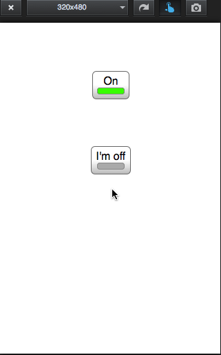

# Switch

Demonstrates how to use a Switch element.

::: tip 💡 Example App Source Location
You can find this example app in the Alloy repository under [samples/apps/ui/switch](https://github.com/appcelerator/alloy/tree/master/samples/apps/ui/switch). Check the [instructions](/guide/Alloy_Framework/Alloy_Guide/Alloy_Test_Apps/) how to run these sample projects.
:::

The appearance of a [Switch](#!/api/Titanium.UI.Switch) control varies by platform:

* On Android, a Switch object can be styled either as a checkbox or toggle button using the [Ti.UI.Android.SWITCH\_STYLE\_CHECKBOX](#!/api/Titanium.UI.Switch-property-style) property, as shown below. The checkbox style can optionally display a label next to the control.

* On iOS, a Switch appears as an iOS on/off switch and doesn't have any text associated with it.

The following screenshots show the sample app running on Android and iOS.

 

The main `index.xml` view displays a default Switch control that appears on all platforms, a titled switch that appears on Android and mobile web, and a checkbox style switch that only appears on Android.

**app/views/index.xml**

```xml
<Alloy>
  <Window>
    <!-- just the default switch, works on all platforms -->
    <Switch/>
    <!-- switch with some platform-specific styling -->
    <Switch class="titles" platform="android,mobileweb"/>
    <!-- an android checkbox -->
    <Switch class="checkbox" platform="android"/>
    </Window>
</Alloy>
```

The main XML view's TSS file defines the initial [value](#!/api/Titanium.UI.Switch-property-value), [titleOn](#!/api/Titanium.UI.Switch-property-titleOn) and [titleOff](#!/api/Titanium.UI.Switch-property-titleOff) properties for the titled switch, and sets the [style](#!/api/Titanium.UI.Switch-property-style) and title values of the checkbox-styled switch.

**app/styles/index.tss**

```javascript
'Switch': {
  top: '70dp'
}
'#index': {
  backgroundColor: '#fff',
  modal: false,
  exitOnClose: true,
  layout: 'vertical'
}
'.titles': {
  value: false,
  titleOn: "I'm on",
  titleOff: "I'm off"
}
'.checkbox': {
  value: true,
  style: Ti.UI.Android.SWITCH_STYLE_CHECKBOX,
    titleOn: "I'm on",
    titleOff: "I'm off"
}
```

## See also

* [Titanium.UI.Switch](#!/api/Titanium.UI.Switch) API reference
