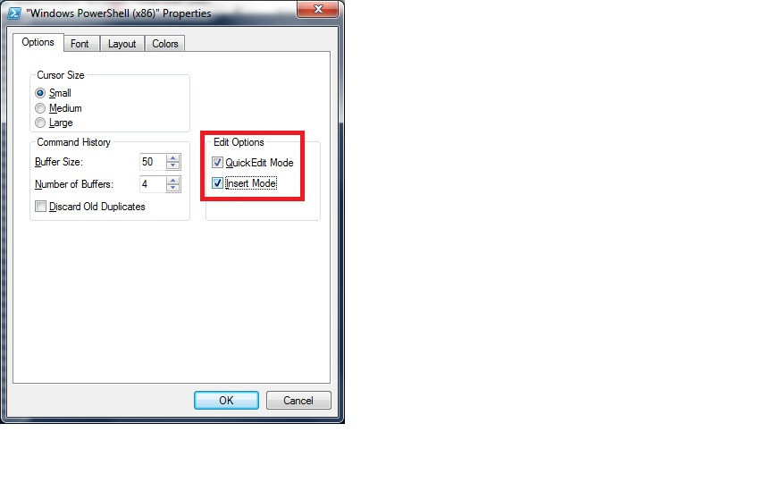

# Appcelerator CLI FAQ

This document provides answers and links to commonly asked questions about Appcelerator CLI.

## Submitting a bug

Refer to [Reporting Bugs or Requesting Features](/guide/Axway_Appcelerator_Studio/Axway_Appcelerator_Studio_Guide/Studio_Troubleshooting/Reporting_Bugs_or_Requesting_Features/) for more information.

## Windows

### Powershell "falls asleep" when backgrounded while building or downloading a new SDK

If the **QuickEdit Mode** and\\or **Insert options** are checked within the Console properties and you click within the console, it will pause the output. If those options are unchecked, the output cannot be paused by clicking within the console.



::: warning ⚠️ Warning
This issue and fix also applies to Windows Command terminal.
:::

## Errors

### Please Re-Try This Install Again

Please review [Please re-try this install again](/guide/Appcelerator_CLI/Appcelerator_CLI_Guide/Appcelerator_CLI_Troubleshooting/#please-re-try-this-install-again) section of [Appcelerator CLI Troubleshooting](/guide/Appcelerator_CLI/Appcelerator_CLI_Guide/Appcelerator_CLI_Troubleshooting/) for details.

### Application deployment failed

Please review [Application deployment failed](/guide/Appcelerator_CLI/Appcelerator_CLI_Guide/Appcelerator_CLI_Troubleshooting/#application-deployment-failed) section of [Appcelerator CLI Troubleshooting](/guide/Appcelerator_CLI/Appcelerator_CLI_Guide/Appcelerator_CLI_Troubleshooting/) for details.

## Change the Android buildtools version in Appcelerator

You can change the build tools version using this command: `appc ti config android.buildTools.selectedVersion ##.##.##`

In your Android SDK location, you will see the version number: `/users/<user>/Library/Android/sdk/build-tools/<version_number>`

## How to install app on SD card

Add the following code in your `tiapp.xml` file in the Android section then run it again:

```xml
<android xmlns:android="http://schemas.android.com/apk/res/android">
  <manifest android:installLocation="preferExternal">
      <uses-sdk android:minSdkVersion="14" android:targetSdkVersion="23"/>
  </manifest>
</android>
```

## Fixing npm permission for Mac

Execute the following commands:

```bash
npm config set prefix /usr/local
sudo chown -R `whoami` /usr/local/
```

See [Fixing npm permissions](https://docs.npmjs.com/getting-started/fixing-npm-permissions) for more details.

## Appc command not found

**Windows**

If npm prefix is not in your PATH, open a command prompt and execute this command: `echo %PATH%`. The output of this command should look something like this: `C:\Users\Ewan\AppData\Roaming\npm`

If the npm path hasn't been set, execut this command: `SET PATH=%USERPROFILE%\AppData\Roaming\npm;%PATH%`

With the npm prefix set, install Appcelerator and get the latest updates:

```bash
npm install -g appcelerator
appc use latest
appc setup
```

**Mac**

1. Check if npm's prefix default value is set to `usr/local` by executing one of the following commands:

    * `npm config get prefix`

    * `npm get prefix`

2. If these commands do not refer to the default value, then set it: `npm config set prefix /usr/local`

3. With the npm prefix set, install Appcelerator and get the latest updates:

```bash
sudo npm install -g appcelerator
appc use latest
appc logout -D
appc login
appc setup
```

## How to build a module for iOS from command line?

Execute this command: `build.py`

## Arrow module not found

Execute the following commands:

```bash
sudo npm cache clean
rm -rf .appcelerator
sudo npm -g install appcelerator
appc use latest
```

## How to solve “Unable to connect to Xcode”?

1. Open Xcode and confirm that you can run a sample native project.

2. If the sample native project runs, open your Studio preferences by going to **Preferences** > **Studio** > **Platforms** > **iOS** and check if Xcode is available or not.

3. If it's not available, execute the following command in the terminal: `sudo sudo xcode-select -switch <xcode_folder_path>`

For more details, please review [Configuring XCode inside Studio](/guide/Axway_Appcelerator_Studio/Axway_Appcelerator_Studio_Guide/Titanium_Development/Configuring_XCode_inside_Studio/).
