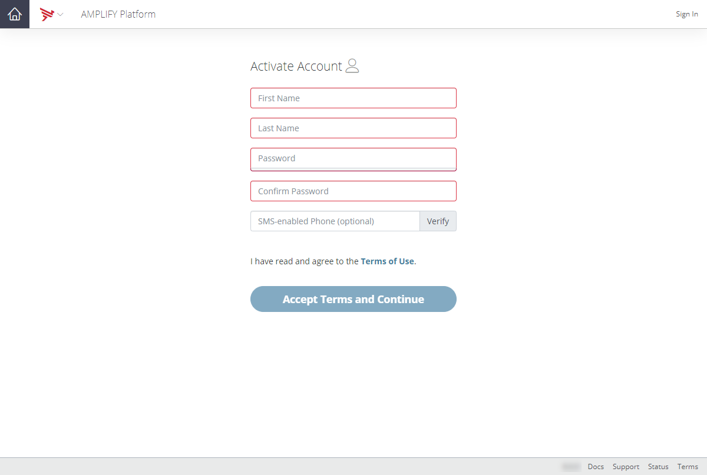
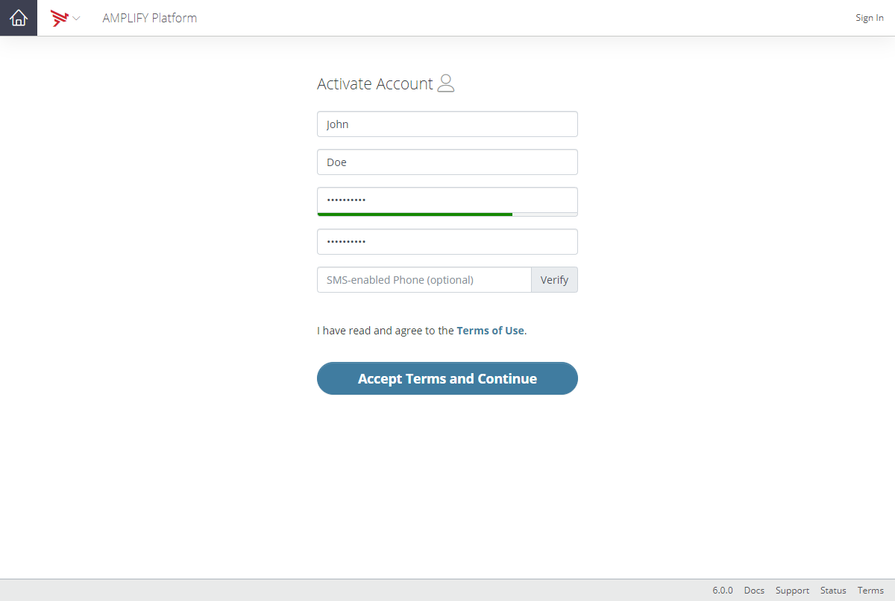
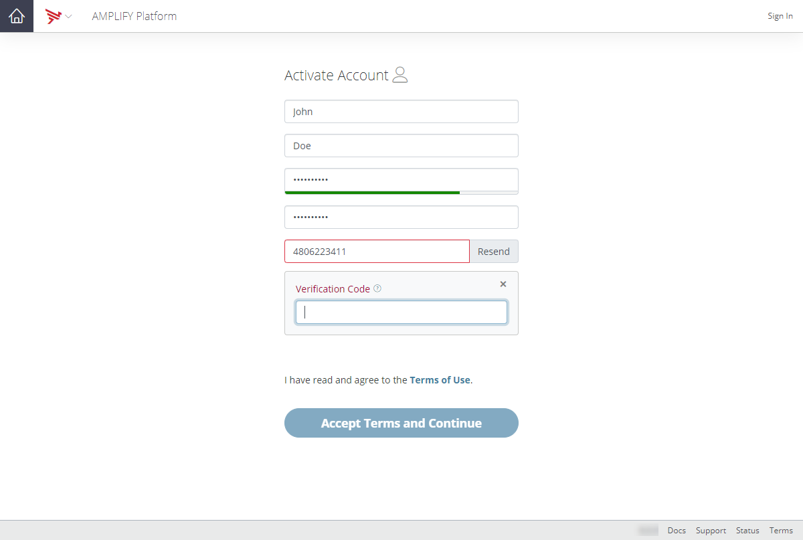
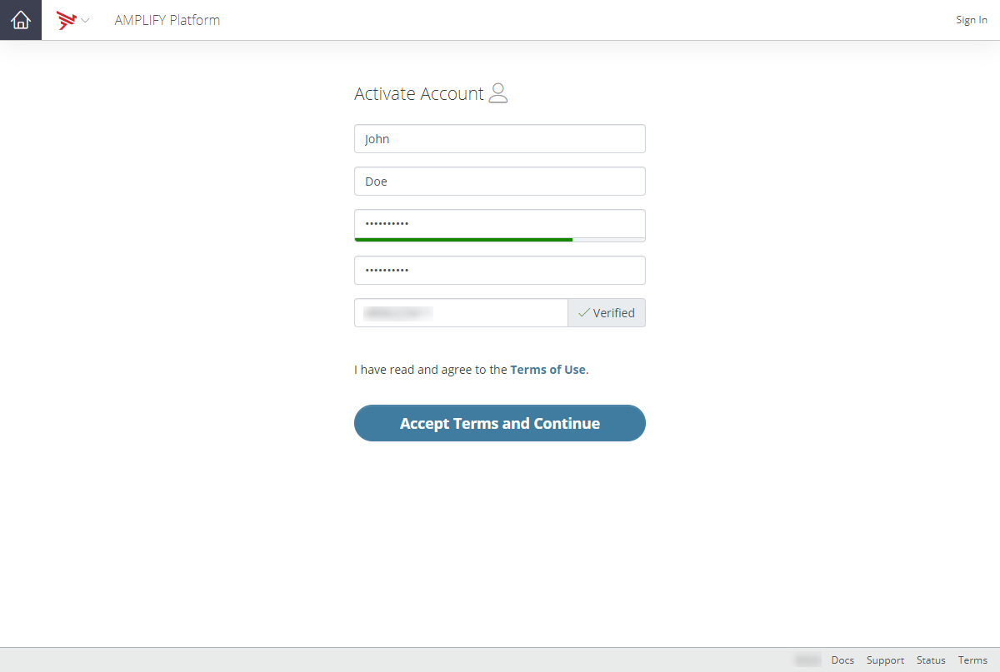
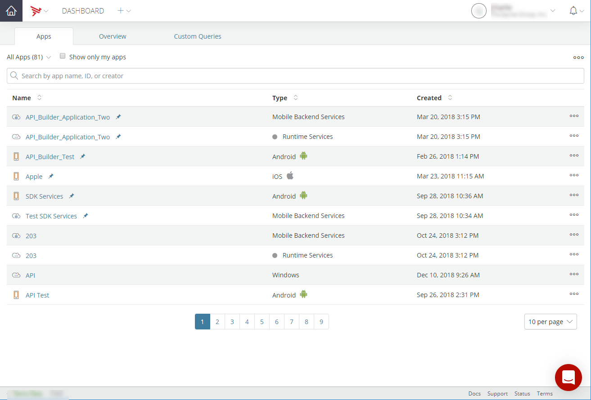
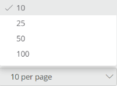
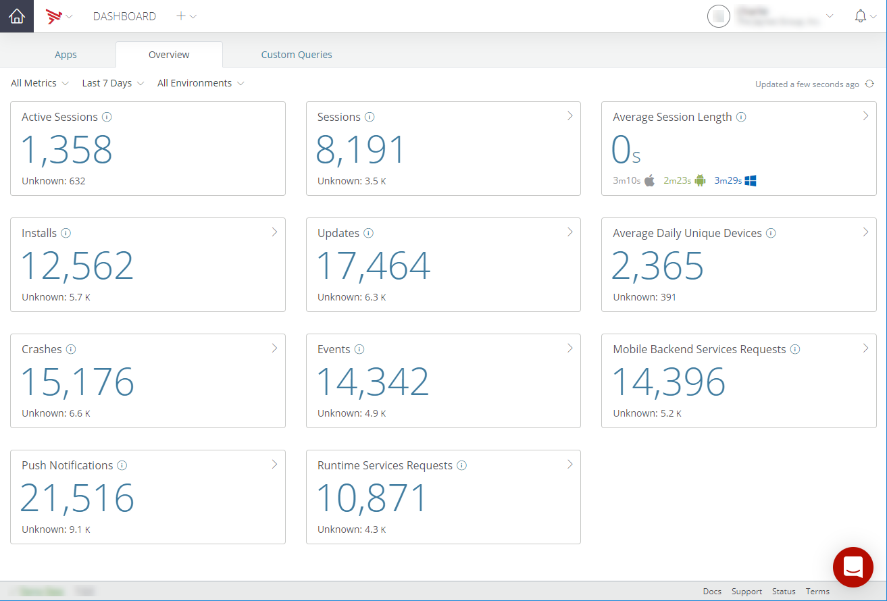
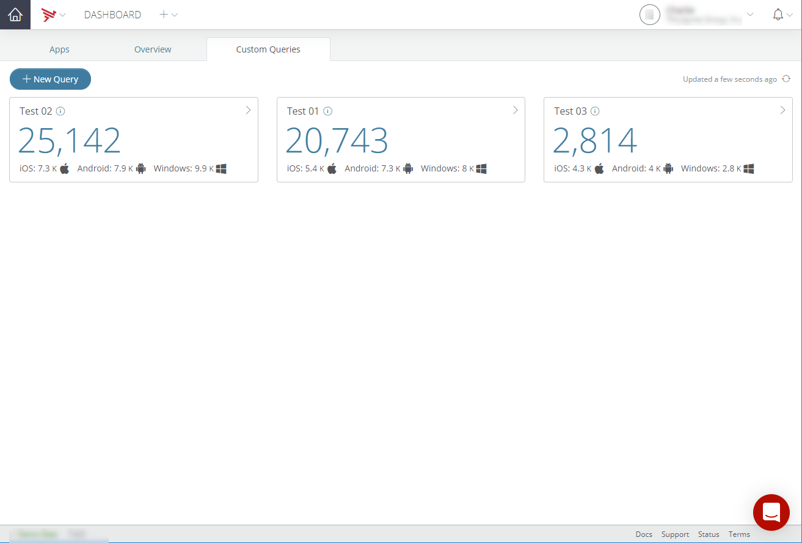

# Appcelerator Dashboard Getting Started

This document provides information on how to authorize a browser or device for the AMPLIFY Platform, an overview of the AMPLIFY Platform home page, and how to access and navigate the Dashboard.

## AMPLIFY Platform Sign-up

To sign up for access to AMPLIFY Platform and to create an AMPLIFY Platform account:

1. Navigate to [https://platform.axway.com](https://platform.axway.com/). If this is your initial visit to [https://platform.axway.com](https://platform.axway.com/), the AMPLIFY Platform Overview page is displayed.

    
2. To proceed with creating a new AMPLIFY Platform account, click **TRY NOW**. Clicking **TRY NOW** will forward you to the AMPLIFY Platform _Sign In_ page.

3. On the AMPLIFY Platform sign-in page, click **Register**. Clicking **Register** will forward you to the AMPLIFY Platform _Sign Up_ page.

    
4. Enter your email address in the **Create your account** field. You may alternatively create an account using your GitHub account information.

5. Once you have entered your email address, click **Sign up with Email**. Clicking **Sign up with Email** will forward you to the _Check your email_ page.

    
6. Check your email. You should have an email similar to the following in your inbox.

    
7. Click **Active your Account**. Clicking **Active your Account** will forward you to the _Activate Account_ page.

    
8. Enter your first name, last name, password, and confirm your password to continue your account activation.

    
9. Optionally, enter your SMS-enabled phone number and click **Verify**. When you click **Verify**, a text with a verification code is sent to your phone.

    
10. Enter the verification code in the **Verification Code** field. Once you enter the verification code, your SMS-enabled phone number will be verified.

    
11. Click **Accept Terms and Continue** to acknowledge that you have reviewed and accepted the Terms of Use. Clicking **Accept Terms and Continue** will forward you to the _User Authentication_ page.

    
12. To authenticate you as a user, click **Continue**. Clicking **Continue** will forward you to the AMPLIFY Platform home page. For an overview of the AMPLIFY Platform, refer to the [AMPLIFY Platform Overview](#Platform).

## AMPLIFY Platform Sign-in

Use the following sign-in instructions if your organization has the single sign-on (SSO) feature enabled.

**To sign into the AMPLIFY Platform using single sign-on:**

1. Navigate to [https://platform.axway.com](https://platform.axway.com/). The _Sign In_ page is displayed.

    .png)
2. Enter the email address associated with your account. If you do not have an AMPLIFY Platform account, click **Register** and follow the [AMPLIFY Platform Sign-up](#Signup) instructions.

3. Click **Next**. Clicking Next will forward you to your organization's _Single Sign-on_ page.

4. Enter your organization account password and click **Sign In**. Clicking **Sign In** will forward you to the AMPLIFY Platform home page. For an overview of the AMPLIFY Platform, refer to the [AMPLIFY Platform Overview](#Platform).

Use the following sign-in if your organization does not have the single sign-on (SSO) feature enabled.

**To sign into the AMPLIFY Platform using your AMPLIFY Platform password:**

1. Navigate to [https://platform.axway.com](https://platform.axway.com/). The _Sign In_ page is displayed.

    .png)
2. Enter the email address associated with your account. If you do not have an AMPLIFY Platform account, click **Register** and follow the [AMPLIFY Platform Sign-up](#Signup) instructions.

3. Click **Next**. Clicking Next will forward you to the AMPLIFY Platform _Sign-on_ page.

    .png)
4. Enter the password associated with your AMPLIFY Platform account and click **Sign In**.

5. If requested, enter the device authorization code forwarded to the email address associated with your account and click **Authorize**.

    
6. If you are a member of multiple organizations, you may be forwarded to the _Select Organization_ page.

    
7. Select the organization to sign into from the Select Organization drop-down menu.

8. Click **Continue**. Clicking **Continue** will forward you to the AMPLIFY Platform home page. For an overview of the AMPLIFY Platform, refer to the [AMPLIFY Platform Overview](#Platform).

## AMPLIFY Platform Overview

Once you are signed into the AMPLIFY Platform, the AMPLIFY Platform home page is displayed.

The AMPLIFY Platform home page provides who you are logged in as, your assigned role, and your user account information.

### AMPLIFY Platform Buttons

The AMPLIFY Platform home page includes the following buttons:

* **Service Offerings & Products** - Navigate to **Service Offerings & Products** to view the AMPLIFY Platform service offerings and products. The AMPLIFY Platform provides a wide range of capabilities for your hybrid integration use cases. Notice that you may need to deploy a product or activate a service offering to gain access to some of these capabilities. You will find various pointers and actions on this view to get you started. You can also navigate to **My Capabilities** to see what is currently available to you based on your role and your organization's subscriptions.

* **My Capabilities** - Navigate to My Capabilities to view the capabilities that you have access to based on your organization's subscription(s) and your role.

* **Support Portal** - Click to navigate to the Axway Support Portal (login required).

* **Community Portal** - Click to navigate to the Axway Community Portal.

* **Developer Portal** - Click to navigate to the Axway Developer Portal.

### Service Offerings & Products Tiles

The AMPLIFY Platform Service Offerings and Products page includes the following tiles:

* Application Integration

* API Management

* Application Development

* Mobile Integration

* Runtime Services

* Streams

* Content Collaboration

#### Application Integration

Application Integration enables you to integrate cloud and on-premises systems. The Application Integration tile includes the following links:

* **How It Works** - Click to navigate to the Developer Portal and watch the AMPLIFY SLK Platform Introduction video.

* **Capabilities** - Click to navigate to the _Application Integration_ page and view the capabilities of Application Integration. The _Application Integration_ page includes the Integration Builder, Central, Unified Catalog, API Builder, Runtime Services, and Choreography tiles. For additional information, refer to [My Capabilities Tiles](#captiles).

* **Plans** - Click to navigate to the _Billing_ page and explore the Application Integration purchase plans. For additional information, refer to [Managing Billing](/guide/Appcelerator_Dashboard/Appcelerator_Dashboard_Guide/Managing_Billing/).

* **Usage** - Click to navigate to the Dashboard **Usage** tab and view the usage of the resources currently allocated to Application Integration. For additional information, refer to [Managing Organizations](/guide/Appcelerator_Dashboard/Appcelerator_Dashboard_Guide/Managing_Organizations/).

* **Getting Started Guide** - Click to navigate to Documentation Portal and explore the Getting started with AMPLIFY Integration guide.

Additionally, click **Application Integration** to navigate to the _Application Integration_ page and view the capabilities of Application Integration.

#### API Management

API Management enables you to implement full lifecycle API management. The API Management tile includes the following link:

* **How It Works** - Click to navigate to the Developer Portal and learn how to get started building and managing APIs.

* **Capabilities** - Click to navigate to the _API Management_ page and view the capabilities of API Management. The _API Management_ page includes the Central, Unified Catalog, API Builder, Runtime Services, Mesh Governance, and Choreography tiles. For additional information, refer to [My Capabilities Tiles](#captiles).

Additionally, click **API Management** to navigate to the _API Management_ page and view the capabilities of API Management.

#### Application Development

Application Development enables you to develop cross-platform native apps with Titanium. The Application Development tile includes the following links:

* **Capabilities** - Click to navigate to the _Application Development_ page and view the capabilities of Application Development. The _Application Development_ page includes the Dashboard, App Builder, API Builder, Mobile Integration, and Runtime Services tiles. For additional information, refer to [My Capabilities Tiles](#captiles).

* **Plans** - Click to navigate to the _Billing_ page and explore the Application Development purchase plans. For additional information, refer to [Managing Billing](/guide/Appcelerator_Dashboard/Appcelerator_Dashboard_Guide/Managing_Billing/).

* **Usage** - Click to navigate to the Dashboard **Usage** tab and view the usage of the resources currently allocated to Application Development. For additional information, refer to [Managing Organizations](/guide/Appcelerator_Dashboard/Appcelerator_Dashboard_Guide/Managing_Organizations/).

* **Documentation** - Click to navigate to the Documentation Portal and explore the App Development documentation.

Additionally, click **Application Development** to navigate to the _Application Development_ page and view the capabilities of Application Development.

#### Mobile Integration

Mobile Integration enables you to power all your mobile data needs with a purpose-built MBaaS framework. The Mobile Integration tile includes the following link:

* **Capabilities** - Click to navigate to the _Mobile Integration_ page and view the capabilities of Mobile Integration. The _Mobile Integration_ page includes the API Builder, Mobile Backend Services, Runtime Services tiles. For additional information, refer to [My Capabilities Tiles](#captiles).

Additionally, click **Mobile Integration** to navigate to the _Mobile Integration_ page and view the capabilities of Mobile Integration.

#### Runtime Services

Runtime Services enables you to add instant elastic infrastructure for all your runtime needs. The Runtime Services tile includes the following links:

* **Capabilities** - Click to navigate to the _Runtime Services_ page and view the capabilities of Runtime Services. The _Runtime Services_ page includes the Runtime Services tile. For additional information, refer to [My Capabilities Tiles](#captiles).

* **Plans** - Click to navigate to the _Billing_ page and explore the Runtime Services purchase plans. For additional information, refer to [Managing Billing](/guide/Appcelerator_Dashboard/Appcelerator_Dashboard_Guide/Managing_Billing/).

* **Usage** - Click to navigate to the Dashboard **Usage** tab and view the usage of the resources currently allocated to Runtime Services. For additional information, refer to [Managing Organizations](/guide/Appcelerator_Dashboard/Appcelerator_Dashboard_Guide/Managing_Organizations/).

* **Documentation** - Click to navigate to the Documentation Portal and explore the Runtime Services documentation.

Additionally, click **Runtime Services** to navigate to the _Runtime Services_ page and view the capabilities of Runtime Services.

#### Streams

Streams enables you to add event-driven capabilities to any JSON API. The Streams tile includes the following links:

* **Capabilities** - Click to navigate to the _Streams_ page and view the capabilities and highlights of Streams. The Streams page includes the Streams tile.

* **Learn More** - Click to navigate to the _AMPLIFY Streams_ product page and learn more about Streams.

* **Start Free Trial** - Click to start your free trial of Streams.

#### Content Collaboration

Content Collaboration enables you to sync and share files and enable content flows. The Content Collaboration tile includes the following links:

* **Capabilities** - Click to navigate to the _Content Collaboration_ page and view the capabilities of Content Collaboration. The _Content Collaboration_ page includes the Syncplicity tile. For additional information, refer to [My Capabilities Tiles](#captiles).

* **Start Free Trial** - Click to navigate to the Syncplicity website to sign up for a free trial of Syncplicity or to purchase a Syncplicity plan.

Additionally, click **Content Collaboration** to navigate to the _Content Collaboration_ page and view the capabilities of Content Collaboration.

### My Capabilities Tiles

The AMPLIFY Platform My Capabilities page can include the following tiles based on your role and your organization's subscriptions:

* Dashboard

* Integration Builder

* Central

* Unified Catalog

* App Builder

* API Builder

* Mobile Backend Services

* Runtime Services

* Mesh Governance

* Choreography

* Syncplicity

::: warning ⚠️ Warning
The available links on the My Capabilities tiles may vary based on your role and your organization's subscriptions.
:::

#### Dashboard

AMPLIFY Dashboard (Appcelerator Dashboard) provides you full lifecycle visibility and real-time insights for all of your apps and APIs. The Dashboard tile includes the following links:

* **Documentation** - Click to navigate to the Documentation Portal and explore the Dashboard documentation.

* **Apps** - Click to navigate to the **Apps** tab on the Dashboard home page. For additional Dashboard home page information, refer to the [Dashboard](#DashboardHome) section.

* **Overview** - Click to navigate to the **Overview** tab on the Dashboard home page. For additional Dashboard home page information, refer to the [Dashboard](#DashboardHome) section.

Additionally, click **Dashboard** to navigate to the Dashboard home page.

#### Integration Builder

Integration Builder enables you to develop applications, including mobile applications. The Integration Builder tile includes the following links:

* **How It Works** - Click to navigate to the Developer Portal and learn how Integration Builder works by watching the Integration Builder videos.

* **Documentation** - Click to navigate to the Documentation Portal and explore the Integration Builder documentation.

* **Sandbox** - Click to navigate to the Integration Builder **Quick Start** tab to explore the connectors catalog and to start building connector integrations, mappings, and flows.

Additionally, click **Integration Builder** to navigate to the Integration Builder **Quick Start** tab.

#### Central

Central provides API management functions for your Hybrid Integration use cases. The Central tile includes the following links:

* **How It Works** - Click to navigate to the Developer Portal and learn how Central works.

* **Documentation** - Click to navigate to the Documentation Portal and explore the Central documentation.

Additionally, click **Central** to navigate to the AMPLIFY Central user interface.

#### Unified Catalog

Unified Catalog enables you to subscribe to various types of packaged endpoints to quickly solve your integration needs. The Unified Catalog tile includes the following link:

* **How It Works** - Click to navigate to the Developer Portal and learn how the Unified Catalog works.

Additionally, click **Unified Catalog** to navigate to the AMPLIFY Central user interface.

#### App Builder

App Builder enables you to build cross-platform native apps with Titanium SDK, Studio, and CLI. The App Builder tile includes the following links:

* **Documentation** - Click to navigate to the Documentation Portal and explore the Titanium SDK documentation.

* **Getting Started** - Click to navigate to the _Get started with App Builder_ page and to learn how to get started building native applications.

* **Manage** - Click to navigate to the Dashboard **Apps** tab and manage your applications.

Additionally, click **App Builder** to navigate to the _Get started with App Builder_ page and to learn how to get started building native applications.

#### API Builder

API Builder enables you to build APIs and microservices. The API Builder tile includes the following links:

* **How It Works** - Click to navigate to the Developer Portal to watch videos and learn how API Builder works.

* **Documentation** - Click to navigate to the Documentation Portal and explore the API Builder Standalone documentation.

* **Getting Started Guide** - Click to navigate to the Documentation Portal and review the API Builder Getting Started Guide.

Additionally, click **API Builder** to navigate to the Documentation Portal and explore the API Builder Standalone documentation.

#### Mobile Backend Services

Mobile Backend Services enables you to use pre-built services like push notifications, NoSQL database, geolocation, and more. The Mobile Backend Services tile includes the following links:

* **Documentation** - Click to navigate to the Documentation Portal and explore the API Runtime Services documentation.

* **Manage** - Click to navigate to the **Apps** tab on the Dashboard home page and manage your applications. For additional Dashboard home page information, refer to the [Dashboard](#DashboardHome) section.

* **Add Capacity** - Click to navigate to the _Billing_ page and explore the Mobile Backend Services purchase options to add additional capacity. For additional information, refer to [Managing Billing](/guide/Appcelerator_Dashboard/Appcelerator_Dashboard_Guide/Managing_Billing/).

Additionally, click **Mobile Backend Services** to navigate to the **Apps** tab on the Dashboard home page and manage your Mobile Backend Services applications.

#### Runtime Services

Runtime Services enables you to add instant elastic infrastructure for all your runtime needs.

* **Documentation** - Click to navigate to the Documentation Portal and explore the API Runtime Services documentation.

* **Manage** - Click to navigate to the **Apps** tab on the Dashboard home page and manage your runtime services applications. For additional Dashboard home page information, refer to the [Dashboard](#DashboardHome) section.

* **Add Capacity** - Click to navigate to the _Billing_ page and explore the Application Development plans to add additional capacity. For additional information, refer to [Managing Billing](/guide/Appcelerator_Dashboard/Appcelerator_Dashboard_Guide/Managing_Billing/).

Additionally, click **Runtime Services** to navigate to the **Apps** tab on the Dashboard home page and manage your runtime services applications.

#### Mesh Governance

::: warning ⚠️ Warning
Mesh Governance is a beta feature.
:::

Mesh Governance provides visibility and control of service meshes across multiple clouds.

* **Documentation** - Click to navigate to the Documentation Portal and explore the AMPLIFY Central for mesh governance documentation.

* **Quick Start** - Click to get started using AMPLIFY Central mesh governance.

* **Manage Services** - Click to explore the AMPLIFY Central services.

* **Manage Policies** - Click to review the AMPLIFY Central policies.

Additionally, click **Mesh Governance** to navigate to the AMPLIFY Central user interface.

#### Choreography

::: warning ⚠️ Warning
Choreography is a beta feature.
:::

Choreography enables you to build resilient and adaptive integration architectures with lower coupling. The Choreography tile includes the following links:

* **Documentation** - Click to navigate to the Documentation Portal and explore the AMPLIFY Choreography Developer Guide.

* **Getting Started Guide** - Click to navigate to the Documentation Portal and review the AMPLIFY Choreography Getting Started documentation.

#### Syncplicity

Syncplicity enables you to sync and share files and enable content flows. The Syncplicity tile includes the following links:

* **How It Works (Integrations)** - Click to navigate to Developer Portal to learn about how Syncplicity works.

* **Documentation** - Click to navigate to Documentation Portal and explore the Syncplicity documentation.

Additionally, click **Syncplicity** to navigate to the Syncplicity website.

## Access Dashboard

To access the AMPLIFY Dashboard, click either **Apps**, **Overview**, or **Dashboard** on the Dashboard tile on the AMPLIFY Platform _My Capabilities_ page. The Dashboard home page will open. For more information, refer to the [Dashboard](#DashboardHome) section.

## Dashboard

The AMPLIFY Dashboard home page includes the **Apps** tab, the **Overview** tab, and; if custom queries are configured, the **Custom Queries** tab.

### Apps Tab

The **Apps** tab displays the list of applications for the selected organization. Select the **Show only my apps** checkbox to limit the displayed list of applications to only display your projects or applications. The list of apps can also be filtered by app type. You can also search the list of apps by app name, ID, or creator and select and pin apps from the list of apps.

To manage an application, select the application to manage from the list of applications.

If you haven't created any applications yet, you will be directed to the _You don't have any apps yet!_ page. Don't worry. It's easy to get started creating apps using the AMPLIFY Platform. It should take you only a few minutes to create an app. Once you do, your Dashboard will have data here. To get started creating applications, click **Get the latest tools**. You will be forwarded to the _Get started with App Builder_ page where you can select to get started building apps with either [Axway Appcelerator Studio](/guide/Axway_Appcelerator_Studio/) or [Appcelerator CLI.](/guide/Appcelerator_CLI/)

#### App List Filtering

The apps list can be filtered by:

* All Apps

* Titanium SDK Apps

* APS SDK Apps

* Runtime Services

* Mobile Backend Services

* APIs/Microservices

* Website/Web Apps

* Other

To filter the apps list by a selected app type:

1. Select **All Apps**.

2. Select an app type from the _All Apps_ down-down menu.

The displayed apps list will be updated and will only display the apps matching the selected application type.

#### Apps List Sorting

The Name, Type, and Created columns in the apps list can be sorted either in ascending and descending order. Note that pinned apps will always appear at the top of the apps list in the sorted order.

#### Apps List Paging

The number of displayed applications per page can be selected using the _per page_ drop-down menu.

The number of applications displayed per page can be set to:

* 10 per page

* 25 per page (default)

* 50 per page

* 100 per page

### Select Favorite Apps

To select an app or to pin an app:

1. Select an app to pin from the apps list.

2. Click the **Pin** icon next to the app name.

The app will be pinned, and the **Pin** icon will be updated to indicate that the app is pinned. Additionally, apps pinned as favorites will be displayed at the beginning of the apps list.

To unpin an app or to remove an app as a favorite:

1. Select a pinned app from the apps list.

2. Click the **Pin** icon next to the app name.

The app will be unpinned, and the **Pin** icon will be updated to indicate that the app is not pinned.

### Delete Apps

To delete a single app:

1. Click the **Action Menu** icon associated with the app to delete.

2. Select Delete from the Action Menu.

3. Enter the name of application or datasource to delete.

4. To confirm the deletion, click **I understand that this a permanent and irreversible action. Continue**.

To delete multiple apps:

1. Select the apps to delete.

2. Click the **Action Menu** icon at the top right of the **Apps** tab.

3. Enter your AMPLIFY Platform password.

4. To confirm the deletion, click **I understand that this a permanent and irreversible action. Continue**.

### Overview Tab

The **Overview** tab displays key metric information. For additional information on the key metrics, refer to [Viewing Metrics](/guide/Appcelerator_Dashboard/Appcelerator_Dashboard_Guide/Managing_Applications/Viewing_Metrics/).

### Custom Queries Tab

The **Custom Queries** tab displays custom query summary information and enables the creation of custom analytics queries. For information on creating custom queries, refer to [Creating Custom Queries](/guide/Appcelerator_Dashboard/Appcelerator_Dashboard_Guide/Managing_Applications/Creating_Custom_Queries/).

## Dashboard Navigation

The top navigation bar in the AMPLIFY Dashboard lets you select an application or API to view or manage, register a new Android or iOS application, and change your current organization. Application team members can access information about their applications. Organization admins can access information about all of the organization's applications. See [Managing Organizations](/guide/Appcelerator_Dashboard/Appcelerator_Dashboard_Guide/Managing_Organizations/) for more information.

Use the following items to navigate through Dashboard:

* **Platform home** – Navigate to the AMPLIFY Platform home page.

* **Navigation menu** – Navigate to the AMPLIFY Platform products and Support and Learning.

* **Home** – Click to return to the Dashboard home page.

* **Add menu** – Register an app for services, create a new Mobile Backend Services datasource, or add an organization member.

* **User menu** – View your account, organization, billing information, or access the Download Center to download premium modules.

* **Notifications menu** – Displays notifications and latest organization activity.

### User menu - Single organization

If you are a member of a single organization, the _User Menu_ will appear similar to the following.

* **Account** - View and manage your account information.

* **Organization** - Displays the selected organization. To manage the selected organization, click **Organization**.

* **Members** - View organization members. Admins can also manage organization members.

* **Usage** - View the usage of managed resources.

* **Billing** (Admin only) - View and manage your account billing information.

* **Downloads** - Navigate to the Download Center.

* **Sign out** - Select to sign out of your account.

### User menu - Multiple organizations

If you are a member of multiple organizations, the _User Menu_ will appear similar to the following.

* **Account** - View and manage your account information.

* **Organization** - Displays the selected organization. To manage the selected organization, click on the organization name.

* **Members** - View organization members. Admins can also manage organization members.

* **Usage** - View the usage of managed resources.

* **Billing** (Admin only) - View and manage your account billing information.

* **Downloads** - Navigate to the Download Center.

* **Switch Org** - Select to switch organizations.

* **Sign out** - Select to sign out of your account.

### Bottom Navigation Bar

The bottom navigation bar contains menus for enabling Demo Data mode, viewing documentation and release notes, and sending feedback.

* Click **Demo Data** to populate Dashboard with demonstration data to see how the Dashboard looks if you have several applications and APIs in production.

* Click **Docs** to view the latest [Dashboard](/guide/Appcelerator_Dashboard/) documentation.

* Click **Support** to open the Axway Support Portal (login required).

* Click **Status** to open the Axway AMPLIFY Platform Status page.

* Click **Release Notes** to view the latest Dashboard release notes.

* Click **Terms** to view the AMPLIFY Platform Terms of Use.

* Click the **Chat** icon to open to report a problem or make a suggestion.
