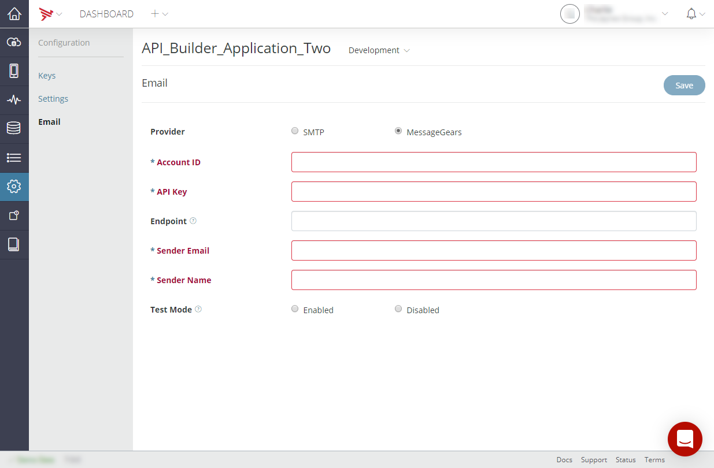

# Configuring Cloud Services

The **Configuration** tab lets you do the following:

* View Cloud application keys

* Configure application settings for Cloud services

* Provide SMTP, or [Message Gears](http://messagegears.com/) account information to send e-mails for notifications

Before configuring Cloud settings, make sure you select the correct environment from the **Environment** menu. The changes you make in the **Configuration** tab only affects the selected environment.

## Keys

Click the **Keys** tab to display the keys. Click **Show** to display a key. Use the App Key to make requests to the Cloud service.

## Settings

Click the **Settings** tab to configure application settings for Cloud services.

* **Description**: Enter a Cloud application description.

* **Friend Request Type**: Configures the behavior for the [Friends](/arrowdb/latest/#!/api/Friends) objects. Select either:

    * **Two Way** (default): Friend each other (Facebook).

    * **One Way**: Follow a friend (Twitter).

* **New User Email Verification**: With this option enabled, new users must provide a valid email address and prove they can access it before their account is activated. You must have your SMTP settings completed before this setting is enabled.

* **Allow User Creation**: With this option disabled, app users can only be created through this administrative website.

    
* Click **Save** to save any setting changes you made.

## Email

On the **Email** configuration tab, you can configure Dashboard to send email using SMTP or Message Gears on behalf of your application. To send an email, you use the [custom\_mailer/email\_from\_template.json](/arrowdb/latest/#!/api/Emails-method-email_from_template) REST method, the [Cloud.Emails.send()](#!/api/Modules.Cloud.Emails-method-send) method, or the equivalent native [iOS](http://docs.appcelerator.com/aps-sdk-apidoc/latest/ios/Classes/APSEmails.html#//api/name/send:withBlock:) or [Android](http://docs.appcelerator.com/aps-sdk-apidoc/latest/android/com/appcelerator/aps/APSEmails.html#send(java.util.Map,%20com.appcelerator.aps.APSResponseHandler)) method. To send an email, you must specify an email template that you previously created in Dashboard (see [Managing Email Templates](/guide/Appcelerator_Dashboard/Appcelerator_Dashboard_Guide/Managing_Applications/Managing_Mobile_Backend_Services_Datasources/Managing_Mobile_Backend_Services_data_objects/Managing_Email_Templates/) for details).

**Notes:**

* If not specified, the **End Point** URL for Message Gears defaults to **https://api.messagegears.net/3.1/WebService**.

**To configure your application to send an email:**

1. In the **Provider** field, select either **SMTP** or **Message Gears** and enter your SMTP or Message Gears server or account settings.

2. For SMTP, complete the **Username**, **Password**, **SMTP Address**, and **Port** fields and then make the **Authentication**, **Use Default Sender**, **Test Mode**, **TLS** selections.

3. For MessageGears, complete the **Account ID**, **API Key**, **Sender Email**, **Sender Name**, and (optionally) **Endpoint** fields and then make the **Test Mode** selection.

4. To have all sent emails sent to a specified email for testing purposes:

    1. In the **Test Mode** field, select **Enable**.

    2. In the **Administrator's Email** field, enter the email address where emails should be sent.

5. Click **Save**.

    
