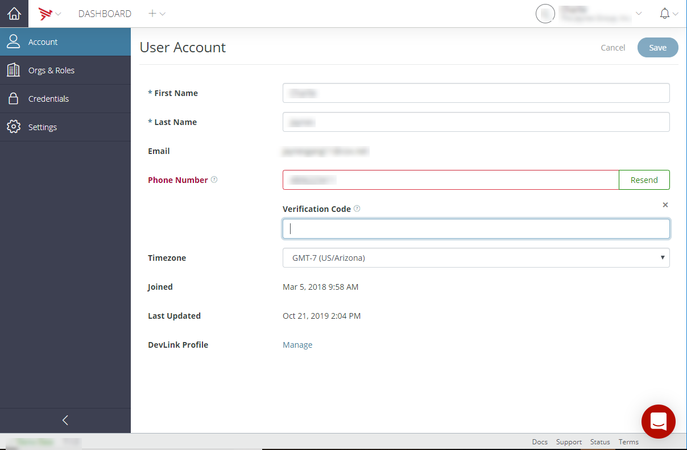
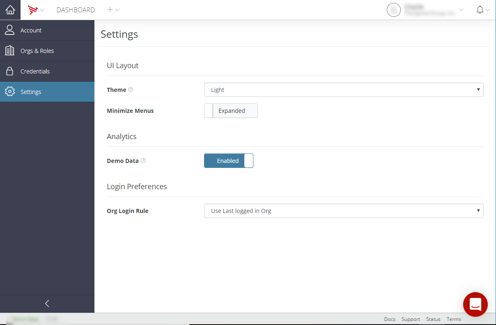
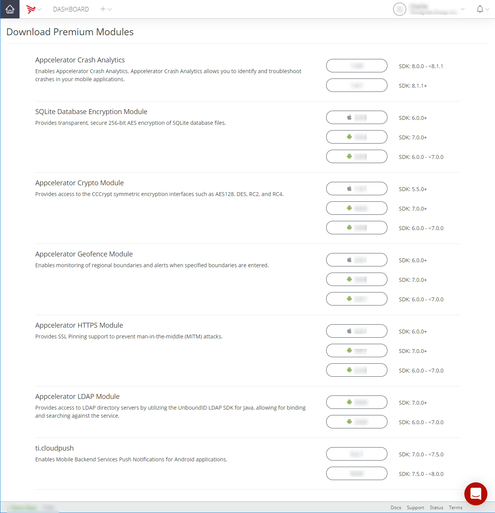

# Managing Accounts

## User menu

The _User Menu_ allows you to manage your account, organization, and billing information and to access the Download Center to download premium modules. To access the _User Menu_, click the down arrow next to your profile name.

* **Account** - View and manage your account information.

* **Organization** - View and manage your organization.

* **Members** - View organization members. Admins can also manage organization members.

* **Usage** - View and manage the usage of the selected organization.

* **Billing** (Admin only) - View and manage your account billing information.

* **Usage** - View and manage the usage of the selected organization.

* **Downloads** - Navigate to the Download Center**.**

* **Switch Org** - Select to switch to another organization.

* **Sign out** - Select to sign out of your account.

## Manage accounts

To manage your account information, select **Account** from the User menu. Selecting Account opens the **Account** tab.

The Account Information page includes the following account information:

* First Name - Verify and edit the first name on your account.

* Last Name - Verify and edit the last name on your account.

* Email - Lists your email address.

* Phone Number - Verify your phone number. Refer to [Verify your phone number](#Phone).

* Timezone - Your selected time zone. Click the **Edit Account** button to choose a different time zone.

* Joined - Lists when you joined the listed organization.

* Last Updated - Provides the date and time you last updated your user account information.

* DevLink Profile - Click the **Manage** link to manage your public developer link profile. Refer to [Manage your public developer link profile](#DevLink).

## Edit account

To edit your account details, click the **Edit Account** button.

Clicking the **Edit Account** button enables the editing of the **First Name** and **Last Name** fields. It also enables the **Phone Number** field and the verification of the entered phone number. For additional instructions on verifying your phone number, refer to [Verify your phone number](#Phone). Clicking on the Edit Account button also enables the **Timezone** and **Org Login Rule** dropdown menus. For additional information on selecting and Org Login Rule, refer to [Select the org login rule](#loginpath). Once you have finished editing your user account information, click the **Save** button.

### Verify your phone number

Verifying your phone number is optional but **highly recommended** for increased security with multi-factor authentication. It must be SMS-capable and will be used to receive activation codes. **Standard text-messaging rates apply.** Format: \[+\]\[country code\] \[number including area code\]

To verify your phone number:

1. Complete the **Phone Number** field. The phone number should be entered as digits only.

2. Click the **Verify** button. When the **Verify** button is clicked, Dashboard sends a phone verification code to the phone number entered in the **Phone Number** field, and the **Verification Code** field is displayed. If you do not receive a verification code, click **Resend**.

    
3. Enter the received verification code in the **Verification Code** field. If you have not received a verification code, click the **Resend** button.
    Once a valid verification code is entered, Dashboard will process the verification and update the verification status of the phone number.

    

### Manage your public developer link profile

To manage your public developer link profile, click **Manage**. When you click **Manage**, you will be transferred to the Appcelerator DevLink portal. You can manage, update, and publish your developer profile, and you can find additional developers either by searching the developer links or exploring the developer map.

## View organizations and roles

The **Orgs & Roles** tab lists the organizations you are a member of by org name and assigned roles. To view organization details, click on a selected **Org Name** link.

## Manage credentials

The **Credentials** tab enables you to change your account password and to enable or disable multi-factor authentication.

### Change your password

To change your password:

1. Select the **Credentials** tab.

2. Enter a new password in the **Change Password** field. The password should be at least eight characters. As you enter a new password in the **Change Password** field, the **Confirm Password** field is displayed.

    
3. Confirm the new password in the **Confirm Password** field. The entry in the **Confirm Password** field must be the same as the entry in the **Password** field.

4. Select the **Force Logout** checkbox to force the log out of any current sessions.

5. Click the **Save** button. The password changes are saved, and the Dashboard sends an Account Information Changed notification email.

### Manage multi-factor authentication

To enable multi-factor authentication:

1. Select the **Credentials** tab.

2. Select the **Multi-Factor Authentication Enabled** checkbox.

3. Click **Save**.

Once the **Enabled** checkbox is selected and the account saved, multi-factor authentication will be enabled, and a notification email will be sent.

To disable multi-factor authentication:

1. Select the **Credentials** tab.

2. Deselect the **Multi-Factor Authentication Enabled** checkbox.

3. Click **Save**.

Once the **Enabled** checkbox is deselected and the account saved, multi-factor authentication will be disabled, and the multi-factor authentication is disabled notification email will be sent.

## Managing settings

The **Settings** tab enables you to manage your organization account settings. You can select your organization account theme (Light, Dark, or Match OS), expand or minimize side-bar menus, enable or disable demo data, and select your org login rule.

### Select the org login rule

If you are a member or owner of multiple accounts, to configure the login path and organization to log in to, select one of the following options from the **Org Login Rule** dropdown menu:

* **Use Last logged in Org** - The last account logged in to will be logged in to on the next login.

* **Use Default Org** - The default account will be logged in to on every login.

* **Always ask for Org** - You will be queried for which account to log in.

To view details of a listed organization, click on the organization name and refer to [Managing Organizations](/guide/Appcelerator_Dashboard/Appcelerator_Dashboard_Guide/Managing_Organizations/).

## Managing organizations

For information on managing organizations, refer to [Managing Organizations](/guide/Appcelerator_Dashboard/Appcelerator_Dashboard_Guide/Managing_Organizations/).

## Managing members

For information on managing organization members, refer to [Managing Organizations](/guide/Appcelerator_Dashboard/Appcelerator_Dashboard_Guide/Managing_Organizations/).

## Viewing usage

For information on viewing organization usage, refer to [Managing Organizations](/guide/Appcelerator_Dashboard/Appcelerator_Dashboard_Guide/Managing_Organizations/).

## Managing billing

For information on managing your billing, refer to [Managing Billing](/guide/Appcelerator_Dashboard/Appcelerator_Dashboard_Guide/Managing_Billing/).

## Access the Download Center

To access the Download Center, select **Downloads** on the **Profile** menu. Selecting **Downloads** opens the _Download Premium Modules_ page.

To download a premium module, click the module download button associated with your current Appcelerator SDK installation. The following premium modules are available for download:

* **Appcelerator Crash Analytics** - Enables Appcelerator Crash Analytics. Appcelerator Crash Analytics allows you to identify and troubleshoot crashes in your mobile applications.

* **SQLite Database Encryption Module** - Provides transparent, secure 256-bit AES encryption of SQLite database files.

* **Appcelerator Crypto Module** - Provides access to the CCCrypt symmetric encryption interfaces such as AES128, DES, RC2, and RC4.

* **Appcelerator Geofence Module** - Enables monitoring of regional boundaries and alerts when specified boundaries are entered.

* **Appcelerator HTTPS Module** - Provides SSL Pinning support to prevent man-in-the-middle (MITM) attacks.

* **Appcelerator LDAP Module** - Provides access to LDAP directory servers by utilizing the UnboundID LDAP SDK for Java, allowing for binding and searching against the service.

* **ti.cloudpush** - Enables Mobile Backend Services Push Notifications for Android applications.
