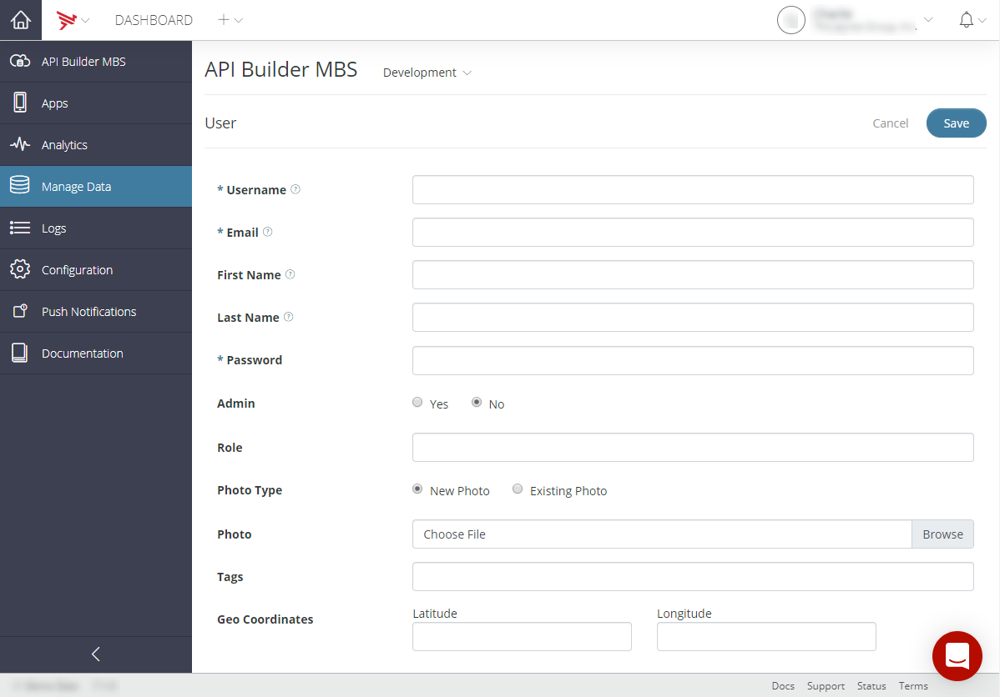
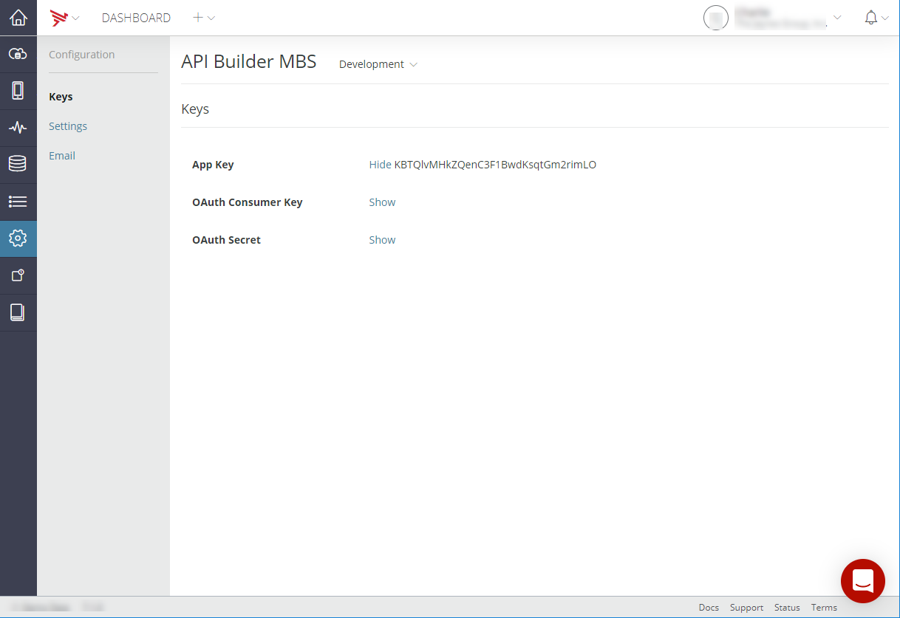

# Getting Started with Mobile Backend Services Datasources

This guide provides how-to instructions for getting started with Mobile Backend Services (MBS) datasources.

1. [Creating a datasource](#creating-a-datasource)

2. [Creating a user](#creating-a-user)

3. [Retrieving the app key](#retrieving-the-app-key)

## Creating a datasource

To create a standalone Mobile Backend Services datasource (an MBS datasource not tied to a specific client application):

1. Log into the [AMPLIFY Platform](https://platform.axway.com/).

2. Select **Dashboard** on the Dashboard tile.

3. Click the Add menu (+) in the top navigation bar.

4. Select **Create Mobile Backend Services Datasource**.

5. Enter the **Name** for the datasource.

    
6. If you have multiple environments, select the environments to enable for the datasource.

7. Assign teams to the application by selecting the **+** icons from the Assign Teams list.

8. Click **Create**. Dashboard will redirect you to the **Overview** tab for the new MBS datasource.

For additional information on managing MBS datasources, refer to [Managing Mobile Backend Services Datasources](/guide/Appcelerator_Dashboard/Appcelerator_Dashboard_Guide/Managing_Applications/Managing_Mobile_Backend_Services_Datasources/).

## Creating a user

::: warning ⚠️ Warning
When creating a user, the **Username**, **Email**, and **Password** fields must be completed. Entering information for the additional fields is optional.
:::

To create a user for the new MBS datasource:

1. Select the **Manage Data** tab.

2. From the _Environment_ dropdown, select either **Development** or **Production**.

3. Select **Users** from the _Manage Data Objects_ list.

4. Click **\+ User**. The _User_ view is displayed
    

5. At a minimum, enter the **Username**, **Email**, and **Password**.

    ::: warning ⚠️ Warning
    Record the username and password. You need the username and the password to configure connectivity to an MBS connector. For additional MBS connector information, refer to [MBS Connector](https://docs.axway.com/bundle/API_Builder_4x_allOS_en/page/mbs_connector.html).
    :::

6. Click **Save**.

For additional information on managing MBS data objects, refer to [Managing Mobile Backend Services data objects](/guide/Appcelerator_Dashboard/Appcelerator_Dashboard_Guide/Managing_Applications/Managing_Mobile_Backend_Services_Datasources/Managing_Mobile_Backend_Services_data_objects/).

## Retrieving the app key

To retrieve the App Key for the new MBS datasource:

1. Select the **Configuration** tab.

2. Select the **Keys** tab.

3. Click **Show** to display the App Key.
    

    ::: warning ⚠️ Warning
    Record the App Key. For additional MBS connector information, refer to [MBS Connector](https://docs.axway.com/bundle/API_Builder_4x_allOS_en/page/mbs_connector.html).
    :::

4. Click **Hide** to hide the App Key.
