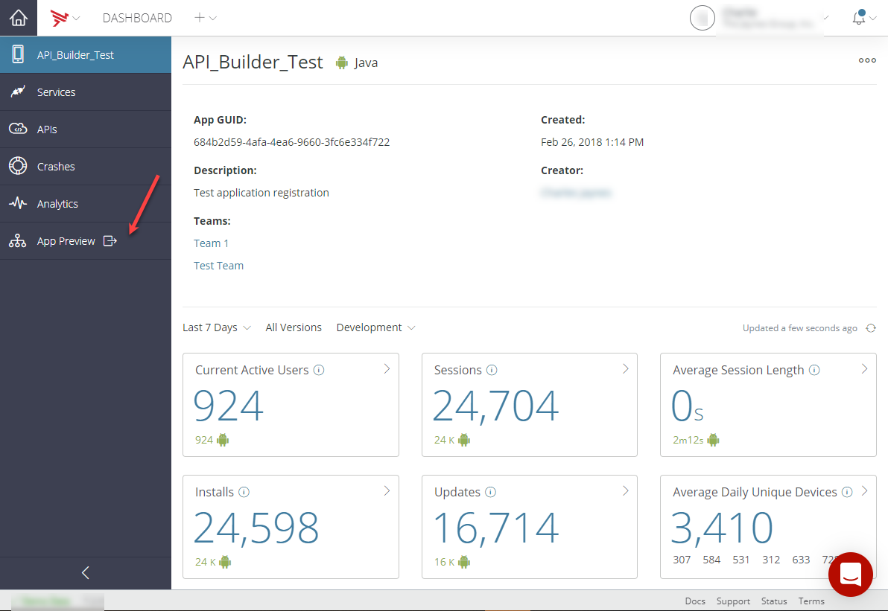
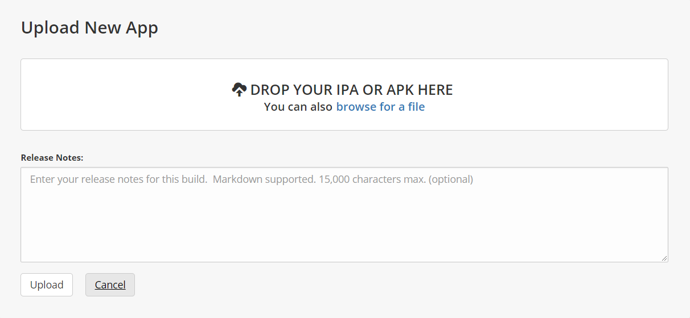
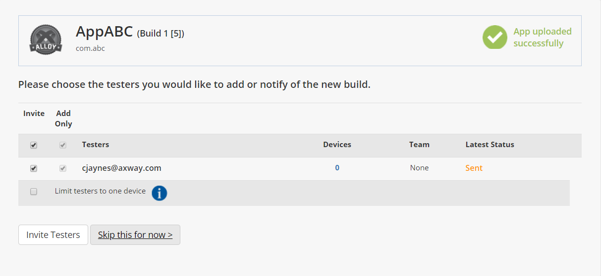

# Previewing Applications

The App Preview functionality is now available on the Dashboard. Previously, this functionality was only accessible from Appcelerator Studio. The App Preview feature allows you to distribute different versions of your application to testers and stakeholders reviewing the application. The App Preview feature is available for Professional and Enterprise organizations and is accessible from the **App Preview** tab.

::: warning ⚠️ Warning
For first-time users of the App Preview feature, a description of the App Preview feature will be displayed when the **App Preview** tab is selected. To navigate to the application upload flow, click the **Go to App Preview** button. To prevent the description of the App Preview feature being displayed again, select **Do not show this page again**.
:::

Select the **App Preview** tab, or in the case of first-time users, click the **Go to App Preview** button to open the application upload navigation flow. The upload navigation flow will guide you through the steps to upload an application and make it available to the selected list of users. Applications can be uploaded as IPA or APK files.

Once an application is successfully uploaded, you can invite testers and stakeholders to test and review the application. The invited testers and stakeholders will be sent a notification email with invite information and a link to download the preview application to their mobile device for testing.

Additionally, to upload additional versions of the application, click the **Upload New Version** button. Once the new version of the application is uploaded, you can choose to notify any current testers that a new build of the application is available. You can also invite additional testers by selecting the **Team** tab. The **TEAM** tab also lists the Invited Testers and Developers.

The **TEAM** tab also provides the anonymous application download link. If you want to send the application file to testers and stakeholders, you can download the application file using the anonymous download link.

You can edit the Releases Notes by selecting the **INFO** tab.

The **SETTINGS** tab allows you to do daily or weekly monitoring of tester installations of the application by email notification. You can also anonymously check the status of the current build using the provided App Status URL.

The **BUILD HISTORY** tab provides a listing of the recent builds. If you select a previous build from the Recent Builds list, you can delete the build by clicking the **Delete Build** button or rollback to the selected build version by clicking the **Rollback to this version** button. You can also delete invited testers. If you select the latest build from the Recent Builds list, you can only delete invited testers.

The **Activity** panel tracks all application-related actions.
