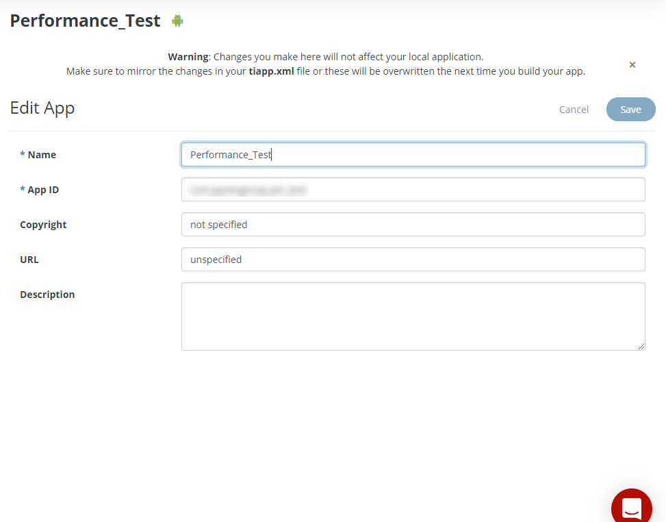
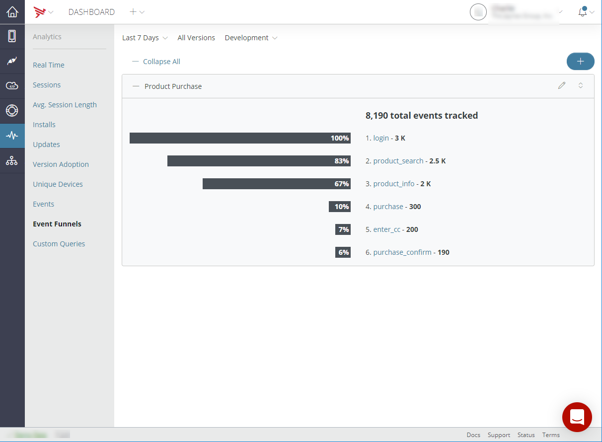

# Managing Client Applications

This document provides information on app overview and service keys, what the API Builder, test, and performance tabs entail, how to view real-time and aggregated analytics, and managing application team members.

## App Overview and Service Keys

When you select a client application from the **Apps** tab, its **Overview** tab opens. The **Overview** tab displays basic information about the application, including its name, description, and application GUID, category, creator, admin, and assigned teams. It also includes [key metrics](/guide/Appcelerator_Dashboard/Appcelerator_Dashboard_Guide/Managing_Applications/Viewing_Metrics/) collected by the Analytics service.

For Titanium applications, the **Overview** tab also specifies the **App ID** and **SDK Version** assigned to the application when it was created. The Titanium applications **Overview** tab also the application's publisher, copyright, and URL information.

Native iOS and Android applications include the same basic information on the **App Info** tab as Titanium applications. The **App Info** tab includes Category, Creator, and Admin information. Additionally, you can click the **Action Menu** icon in the upper-right of the screen and select **Edit** to edit the Name, Category, and Description of your application for iOS and Android applications. Once you have completed your edits, click the **Save** button to save your edits. To return the **Overview** tab without saving your edits, click the **Cancel** button.

For Titanium applications, you can click the **Action Menu** icon in the upper-right of the screen and select **Edit** to edit the Name, App ID, Copyright, URL, and Description of your application. Once you have completed your edits, click the **Save** button to save your edits. To return the **Overview** tab without saving your edits, click the **Cancel** button.

::: danger ❗️ Warning
Changes you make here will not affect your local application. Make sure to mirror the changes in your `tiapp.xml` file, or these will be overwritten the next time you build your app.
:::

You can also permanently delete the selected application by clicking the **Action Menu** icon and selecting **Delete**. To confirm the deletion of the selected application, type the name of the application you would like to delete permanently, and then select, **I understand that this a permanent and irreversible action. Continue**.

## APIs Tab

The **APIs** tab lists the Services, APIs, API Builder (**Service**) applications, and Mobile Backend Services (**Data**) and used by the application. Click an item in the list to view or manage its services. See [Managing Mobile Backend Services Datasources](/guide/Appcelerator_Dashboard/Appcelerator_Dashboard_Guide/Managing_Applications/Managing_Mobile_Backend_Services_Datasources/) for details.

## Crashes Tab

The **Crashes** tab displays the total number of crashes of your application for the selected time frame and the crash rate for your application. The crash for your application is calculated by dividing the total number of crashes by the total number of sessions. Additionally, error messages, time of the first occurrence, time of the last occurrence, total occurrences, and triage status are displayed for each operating system (for example, Windows, iOS, and Andriod). The displayed crash analytics can be filtered by the environment, crash type, and crash status. To export the crash analytics information, click the **Action Menu** icon, and select either **Chart** or **Table**.

To upload symbol files:

1. Click the **Action Menu** icon and select **Upload Symbols**.

2. Select the **Platform**.

3. Select the **Version**.

4. Choose the symbol file to upload.

5. Click **Upload**.

To filter and search crashes by username:

1. Enter the username in the **Search by username** field.

2. Click **Search.**

## Viewing Real-time and Aggregated Analytics

The **Analytics** tab displays real-time analytics, such as the number of active users, the number of installs, the number of sessions, and the number of events.

You can also view custom events captured by your application using the [Titanium.Analytics](#!/api/Titanium.Analytics) object, or the performance APIs provided by the Platform Services SDK for [iOS](/guide/AMPLIFY_Appcelerator_Services/AMPLIFY_Appcelerator_Platform_Services_How-tos/AMPLIFY_Appcelerator_Services_Native_SDKs/AMPLIFY_Appcelerator_Platform_Services_for_iOS/APS_Analytics_for_iOS/) or [Android](/guide/AMPLIFY_Appcelerator_Services/AMPLIFY_Appcelerator_Platform_Services_How-tos/AMPLIFY_Appcelerator_Services_Native_SDKs/AMPLIFY_Appcelerator_Platform_Services_for_Android/APS_Analytics_for_Android/).

You can define event funnels, or custom ordered collections of captured events that track a particular user or business process, such as a sales funnel (for example, purchase and purchase confirm).

For more information, see [Viewing Analytics](/guide/Appcelerator_Dashboard/Appcelerator_Dashboard_Guide/Managing_Applications/Viewing_Analytics/).

## Application Preview

The **App Preview** tab lets you upload and preview applications. For more information, see [Previewing Applications](/guide/Appcelerator_Dashboard/Appcelerator_Dashboard_Guide/Managing_Applications/Managing_Client_Applications/Previewing_Applications/).
