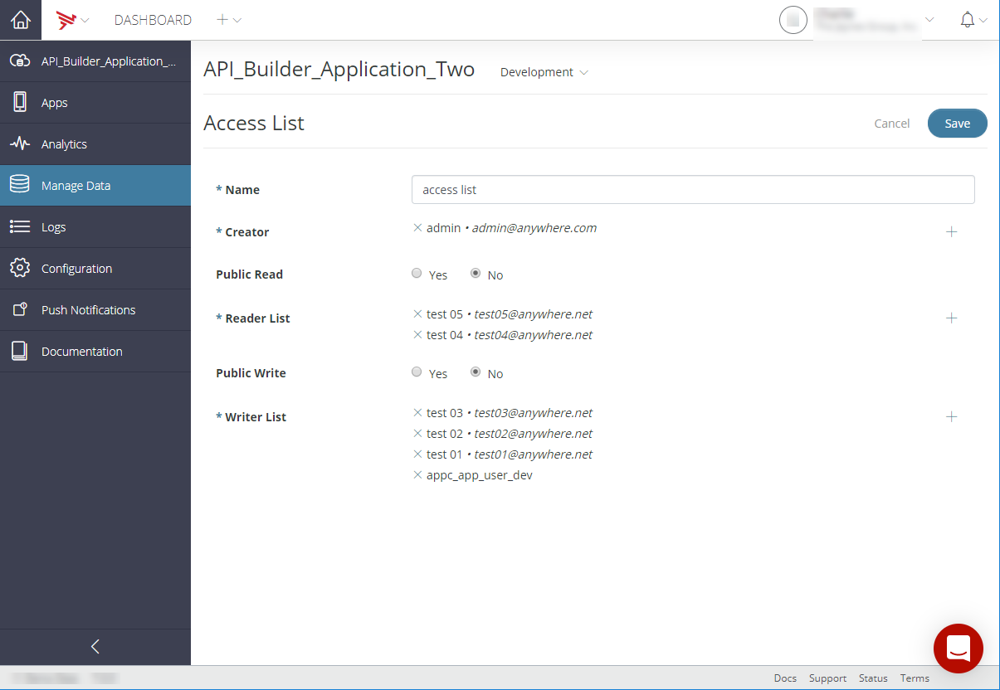

# Managing Access Control Lists

Access control lists let you control read and write access to Mobile Backend Services (MBS) objects. Read permission includes the ability to show, query, and search MBS objects. Write permission includes the ability to update and delete MBS objects. An Access Control List (ACL) consists of the following:

* A public read flag granting read permission to all users, **or** a list of users granted read permission

* A public write flag granting write permission to all users, **or** a list of users granted write permission

An object's owner always has read and write permission.

## Creating an ACL

To create an ACL:

1. On the main Manage Data screen, click **Access Control**.

2. Click **\+ Access List** to open the ACL creation form.

3. In the **Name** field, enter the name of the ACL.

4. In the **Creator** field, click the **+** icon and select the object's owner from the list of application Users.

    ::: warning ⚠️ Warning
    The object's owner always has read and write permission.
    :::

5. In the **Public Read** field, do one of the following:

    1. Select **Yes** to allow read access for all users.

    2. Select **No** and click **+** to select users who should have read access (as shown below).

        
6. Similarly, in the **Public Write** field, do one of the following:

    1. Select **Yes** to allow write access for all users.

    2. Select **No** and click **+** to select users who should have write access.

7. Click **Save**.

## Editing an ACL

To edit an ACL:

1. On the main Manage Data screen, click **Access Control**.

2. Select the **+** icon for the ACL to edit. The ACL details are displayed.

3. Select the **Action** icon for the ACL.

4. Select **Edit** from the _Action_ menu list.

5. Make the desired changes to the ACL.

6. Click **Save**.

## Deleting an ACL

To delete an ACL:

1. On the main Manage Data screen, click **Access Control**.

2. Select the **+** icon for the ACL to delete. The ACL details are displayed.

3. Select the **Action** icon for the ACL.

4. Select **Delete** from the _Action_ menu list.

5. Click **Continue** to confirm the deletion of the ACL.
