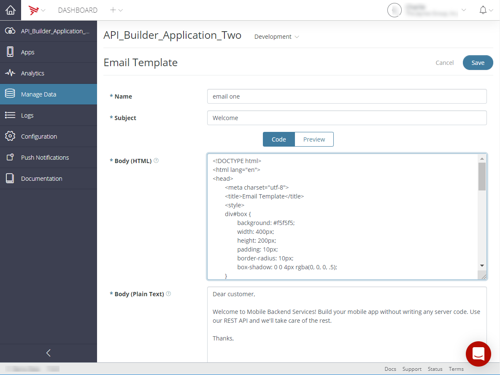

# Managing Email Templates

The Email Templates screen lets you create and edit plain text and HTML email templates. The email template's subject and body can contain [placeholder values](#placeholder) that are dynamically replaced with values you specify when sending the email using the Mobile Backend Services (MBS) [email\_from\_template](/arrowdb/latest/#!/api/Emails-method-email_from_template) REST API, Titanium.Cloud.Emails.send() method or equivalent native [iOS](http://docs.appcelerator.com/aps-sdk-apidoc/latest/ios/Classes/APSEmails.html#//api/name/send:withBlock:) or [Android](http://docs.appcelerator.com/aps-sdk-apidoc/latest/android/com/appcelerator/aps/APSEmails.html) method. The email can be sent as plain text, HTML, or multi-part using these methods.

## Creating an email template

An email template specifies the email subject line and body, which may be HTML or plain-text. You specify the template name when calling [email\_from\_template](/arrowdb/latest/#!/api/Emails-method-email_from_template), the recipients, and values for any [placeholder values](#placeholder).

To create an email template:

1. In Dashboard, select the Mobile Backend Services datasource for which to create the email template.

2. Select **Manage Data**, then click **Email Templates**.

3. Click **\+ Email Template**.

4. Click the **Code** tab, and provide values for the following fields:

    1. **Name** – Name of the email template. You will specify this name when [sending](#!/api/Modules.Cloud.Emails) the email.

    2. **Subject** – The email's subject. The subject can contain [placeholder values](#placeholder) in double curly brackets.

    3. **Body (HTML)** – The email's HTML-formatted body text. The body can contain [placeholder values](#placeholder) in double curly brackets.

    4. **Body (Plain Text)** – The email's plain text-formatted body text. The body can contain [placeholder values](#placeholder) in double curly brackets.

5. Click **Preview** to view a rendered version of the HTML body text.

    
6. Click **Save**.

Below is the sample HTML used in the above screenshot:

```xml
<!DOCTYPE html>
<html lang="en">
<head>
    <meta charset="utf-8">
    <title>Email Template</title>
    <style>
    div#box {
        background: #f5f5f5;
        width: 400px;
        height: 200px;
        padding: 10px;
        border-radius: 10px;
        box-shadow: 0 0 4px rgba(0, 0, 0, .5);
    }
    span {
        font: 16px/20px Arial, sans-serif;
        color: #1c94c4;
    }
    p {
        font: 14px/20px Arial, sans-serif;
        color: #666;
    }
    p.foot {
        font: 14px/20px Arial, sans-serif;
        color: #666;
        text-align: right;
        margin: 0 50px 0 0;
    }
    span.green {
        font: 14px/20px Arial, sans-serif;
        color: #9C9;
    }
    </style>
    <body>
        <div id="box">
            <span>Dear {{first_name}},</span>
            <p>
                Welcome to Mobile Backend Services! Build your mobile app without writing any server code.
                Use our REST API and we'll take care of the rest.
            </p>
            <p class="foot">
                thanks,
                <br />
                <span class="green">The Platform Team</span>
            </p>
        </div>
    </body>
</html>
```

## Editing an email template

To edit an email template:

1. In Dashboard, select the Mobile Backend Services datasource for which to edit an email template.

2. Select **Manage Data**, then click **Email Templates**.

3. Select the **+** icon for the email template to edit. The email template details are displayed.

4. Select the **Action** icon for the email template. You may have to scroll to the right.

5. Select **Edit** from the _Action_ menu list.

6. Make the desired changes to the email template.

7. Click **Save**.

## Deleting an email template

To delete an email template:

1. In Dashboard, select the Mobile Backend Services datasource from which to delete an email template.

2. Select **Manage Data**, then click **Email Templates**.

3. Select the **+** icon for the email template to delete. The email template details are displayed.

4. Select the **Action** icon for the email template. You may have to scroll to the right.

5. Select **Delete** from the _Action_ menu list.

6. Click **Continue** to confirm the deletion of the email template.

## Sending email based on a template

To send an email based on a template, call the `email_from_template` MBS method from your application. For example, the following code example uses the Titanium.Cloud.Emails.send() method to send an email based on the 'welcome\_template' to a user.

```javascript
Cloud.Emails.send({
    template: 'welcome_template',
    recipients: 'nobody@appcelerator.com'
}, function (e) {
    if (e.success) {
        alert('Success');
    } else {
        alert('Error:\n' +
            ((e.error && e.message) || JSON.stringify(e)));
    }
});
```

## Using placeholder fields

The template's subject and body can contain placeholder fields delineated by double curly brackets (`{{}}`). When [sending an email](#se), you include a parameter for each placeholder field that specifies the value to insert. For example, suppose that your email template's subject field contains **Hi {{first\_name}}!**. When sending the email, you would include a `first_name` parameter, as shown below:

```
curl -F "recipients=joe@company.com" -F "template=welcome" -F "first_name=Joe" https://api.cloud.appcelerator.com/v1/custom_mailer/email_from_template.json?key=<YOUR APP APP KEY>
```

In a Titanium application, you would add the placeholder field as another parameter to the `send()` method:

```javascript
Cloud.Emails.send({
    template: 'welcome_template',
    recipients: 'jim@appcelerator.com',
  first_name: 'Jim'
}, function (e) {
    if (e.success) {
        alert('Success');
    } else {
        alert('Error:\n' +
            ((e.error && e.message) || JSON.stringify(e)));
    }
});
```
