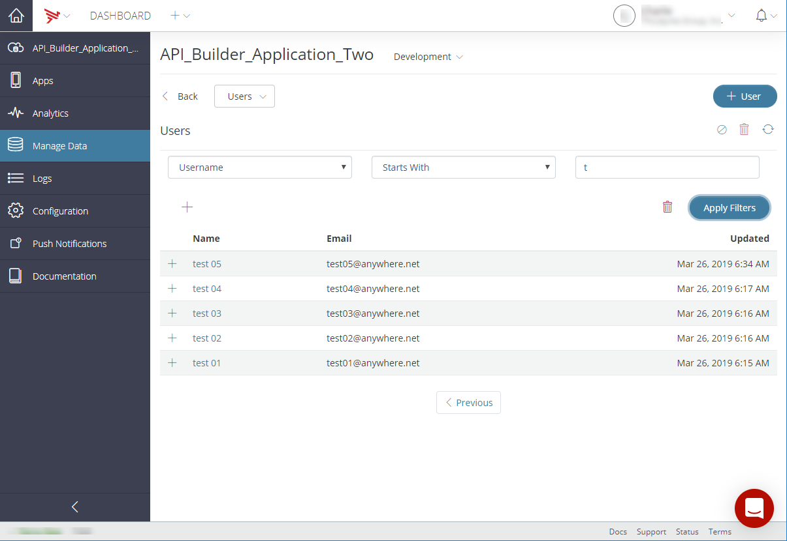
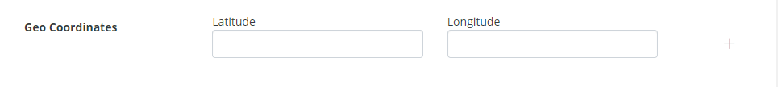

# Managing Mobile Backend Services data objects

The **Manage Data** tab in Dashboard provides a visual interface to the various [Mobile Backend Services APIs](/arrowdb/latest/#!/api) for creating, updating, deleting, and querying your application's Mobile Backend Services (MBS) objects – Photos and Chats, for example – on behalf of its users. You can also create and edit administrative MBS objects, like access control lists and email templates.

To manage MBS objects of a specific API, select the API from the Dashboard home page **Apps** tab whose data objects you want to manage. Then, select the **Manage Data** tab, as shown below. The main screen displays a table listing all MBS object types and the total number of each type.

::: warning ⚠️ Warning
To manage Mobile Backend Services data objects, you must be an administrator or the application creator.
:::

Click an MBS type to view a paginated table that lists all the objects of that type. The column headers displayed depend on the type of object being listed. Click the **Next** and **Previous** buttons at the bottom of the table to paginate forward and back through the list.

To filter the list of objects displayed in the table, click the **Filter** icon. Select a field to filter on, a filter operand (for example, "Equals" or "Starts With"), and the value on which to filter. The fields you can filter on vary according to the type of object. See [Filtering Mobile Backend Services object data](#Filtering) for more information.

To delete an object or objects, select an object or objects from the list and click the **Delete** icon and then verify the deletion of the selected object or objects.

To refresh the object list, click the **Refresh** icon.

| Icon | Function |
| --- | --- |
|  | Filter icon |
|  | Delete icon |
|  | Refresh icon |

To quickly switch to another object type, click the **Type** drop-down menu and select the desired MBS type.

Click a row to expand it and view additional fields. To edit an object, either click its name in the row heading or select **Edit** from the _Tools_ drop-down menu. To delete an object, select the **Action Menu** icon and select **Delete**. See [Editing and Deleting objects](#editing-and-deleting-objects).

## Editing and Deleting objects

To edit an object, click its name in the table row header to open the edit form. To delete an object, select its table row and then click the **Delete** icon and confirm the object deletion.

## Filtering Mobile Backend Services object data

Some MBS object tables can be filtered according to one or more queries that you define. To filter a table, click the **Filter** icon. Clicking the **Filter** icon displays the filter controls, which let you define filter rules.

* To add a new filter rule, click the (**+**) button.

* To apply new or modified filters, click **Apply Filters**.

* To remove all filters, click **Clear Filter**.

Each rule consists of three parts:

* **Field name** – The name of the field on which to filter. The list of filterable fields varies by object type.

* **Operation** – The operation to perform. The operation will be performed in the specified field (described in the table below).

* **Value** – The value to apply to the operation. This can either be a simple string value, regular expression, or a complex value specified in multiple form fields.

| Operation | Field type | Description |
| --- | --- | --- |
| Contained in | Number | Displays objects where the field value is within the range of the inputted values. The range is inclusive. |
| Equals | Boolean, Date, Number, String | Displays objects where the field value is the same as the inputted value. |
| Greater than | Date | Displays objects where the field value is greater than the inputted value. |
| Less than | Date | Displays objects where the field value is less than the inputted value. |
| Not equal to | Number, String | Displays objects where the field value is not the same as the inputted value. |
| Regular expression | String | Displays objects where the field value matches the regular expression.  ::: warning ⚠️ Warning Currently, only prefix matches are supported, that is, the regular expression must begin with an anchor (^) followed by a letter or digit. For example, '^a', '^a.\*', and '^a.\*$' are allowed, but not '^.\*a\*'. ::: |
| Starts with | String | Displays objects where the field value starts with the inputted value. |

For example, the Users table below has been filtered to display only those users whose username starts with the letter "t".

## Deleting application data

You can delete all the MBS objects created by your application.

**To delete all application data**:

1. On the **Manage Data** tab, click the **Action Menu** icon in the upper-right of the screen and select **Delete Data**.

2. Verify by the deletion of all the application data for the selected application by entering the name of the application data store.

3. Click **I understand that this is a permanent and irreversible action. Continue** to permanently delete the application data store data or select **Cancel** to stop the operation.

## Exporting application data

You can export the data from your application to a JSON format, either for a specific period or all MBS data. The export creates a JSON file for each MBS object type with a non-zero object count. Each object is output one per-line in the JSON file.

The following types of data objects are included in the application data export: ACLs, Chat Groups, Chats, Checkins, PhotoCollections, Custom Objects, Files, Email Templates, Events, Event Occurrences, GeoFences, Key Values, Likes, Messages, Photos, Places, Posts, Push Schedules, Push Notifications Subscriptions, Reviews, Statuses, and Users.

The following limitations apply to exported data:

* A maximum of 700,000 objects per MBS data type can be exported.

* A total of 9,800,000 (9.8 million) objects per application can be exported.

For a given export, if the total number of objects of a specific MBS type data is over 700,000, or if the total number of objects being exported is over 9,800,000, the export will stop.

**To export an application's data**:

1. On the **Manage Data** tab, click the **Action Menu** icon in the upper-right of the screen and select **Export Data**.

2. In the **Export App Data** dialog box, select **All** to export all application data, or to export data created during a certain period, select **Between** and select a date range.

    
3. Click **Export App Data.** When the export package is ready to download, an email will be sent to your Dashboard user's registered email address.

::: warning ⚠️ Warning
You cannot export data if it has been exported in the past seven (7) days.
:::

## Creating Mobile Backend Services objects

### Common object fields

Each MBS object has fields unique to its purpose and function. Several types of fields, listed below, are common to all object types.

* **Owner/User** – The MBS user on whose behalf the object was created.

* **Created** – Date the object was created.

* **Updated** – Date the object was last updated.

* **ID** – Object GUID.

* **Custom Fields** – One more name/value pairs you can define for an object. See [Creating custom fields](#creating-custom-fields).

* **Geo Coordinates** – One or more geographic coordinates. See [Creating Geo Coordinates](#creating-geo-coordinates).

* **Tags** – A comma-delimited list of strings to which to tag the object.

* **Access Control List** – An ACL to restrict read or write access to the object.

### Creating custom fields

Most all MBS object creation forms have a **Custom Fields** field you use to attach custom fields to the object. This allows you to annotate pre-built MBS objects, such as Photos or Chats, with custom data fields. In the screenshot below, a custom field named **isNew** has been added to a File object.

A custom field can be one of the following data types:

| Type | Example |
| --- | --- |
| Boolean | true or false |
| String | "blue" |
| Number | 23 or 1.234 |
| Date | "2011-11-02 17:07:37 -0700".  If a string value matches date format "`yyyy-mm-dd hh:mm:ss +zzzz`" or "`yyyy-mm-ddThh:mm:ss+zzzz`" it will be converted to Date type on the MBS backend. |
| Array | `[1, 2, 3, 4]` or `[ "words", "go", "here" ]` |
| Dictionary | `{ "property": "value", "anotherProperty": true, "thirdProp": 123 }` |

**To add a custom field to an object:**

1. In the **Name** field, enter the custom field name.

2. Select the field's [data type](/guide/Mobile_Backend_Services/Mobile_Backend_Services_Guide/Custom_Objects_and_Fields/) from the **Field Type** menu.

3. In the **Value** field, enter the custom field's value, or select it from the provided control (Boolean or Date fields, only).

4. Click the **+** icon to create the custom field

**To delete a custom field from an object**, hover your mouse over an existing custom field and click the **X** to delete it.

### Creating Geo Coordinates

You can attach one or more latitude/longitude pairs to most MBS objects. For example, in the following screenshot, the coordinate pair \[22, 125\] has been added as a Geo Coordinate.

When present on an object, the geo-coordinates field enables your application to query it by location. See [Geographic Coordinates](/guide/Mobile_Backend_Services/Mobile_Backend_Services_How-tos/Geographic_Coordinates/) in the MBS Guide.
