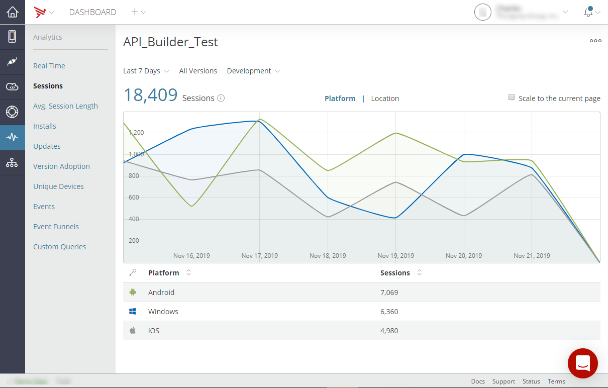
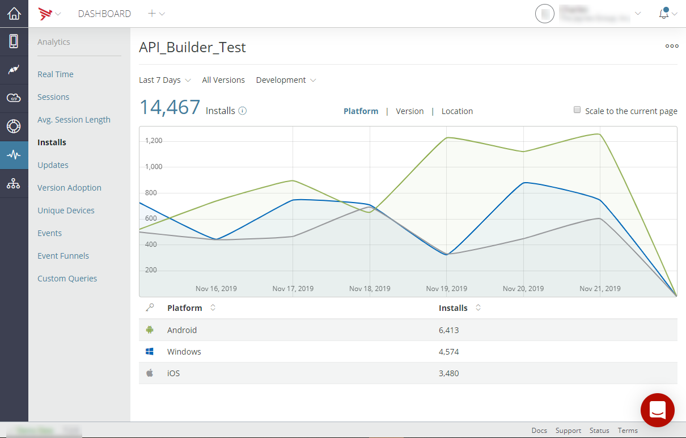
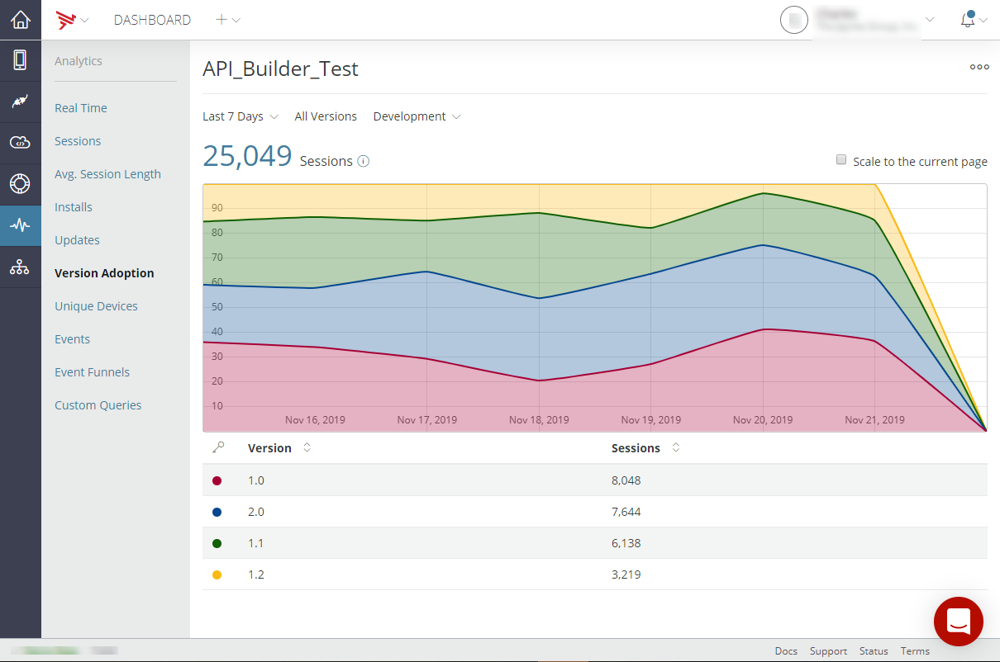
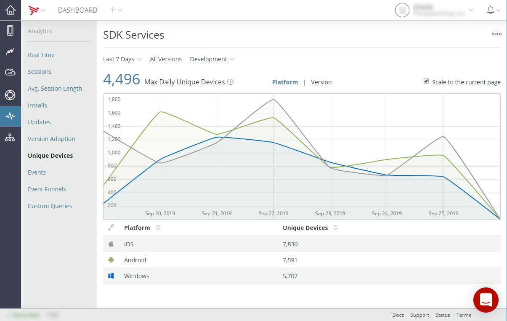
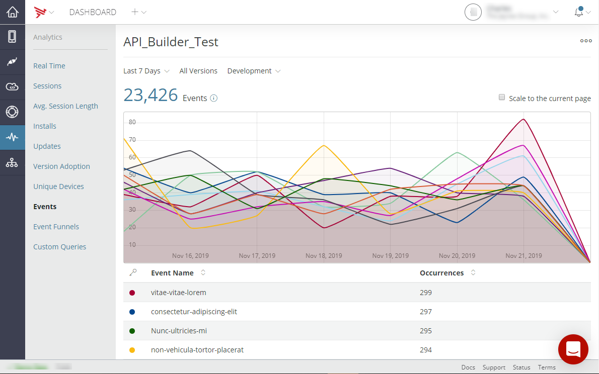
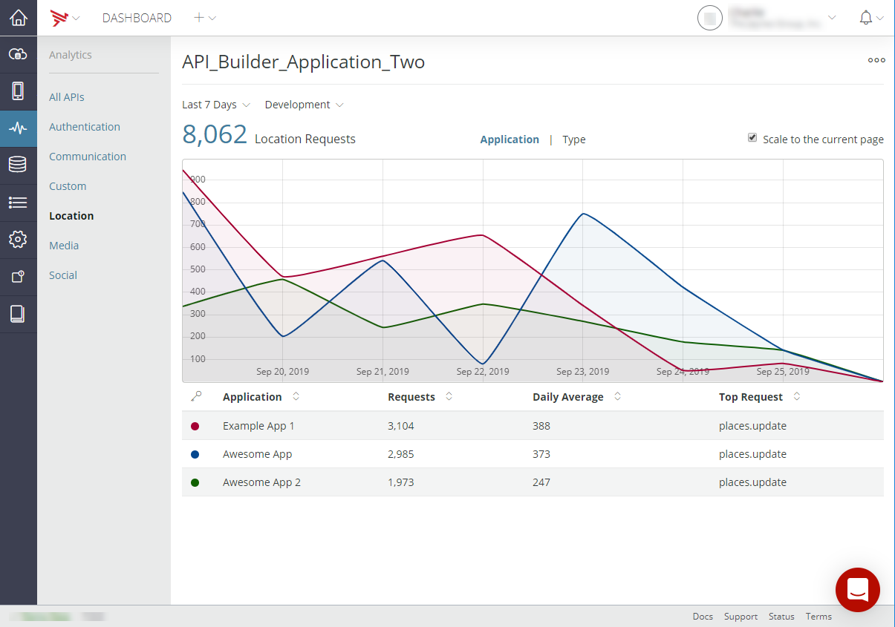
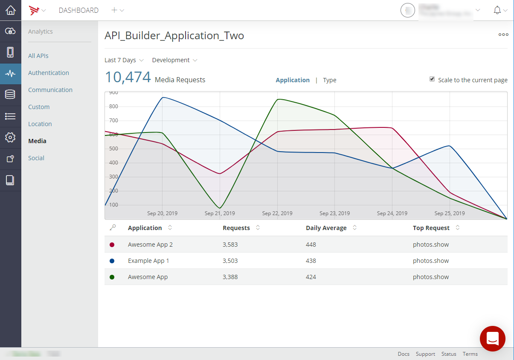
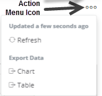

# Viewing Analytics

## Analytics tab for client services

The **Analytics** tab lets you view detailed analytics for each application. The **Analytics** tab contains several sub-tabs to view different metric categories and create event funnels and queries. Each sub-tab is explained below.

### Real-time tab

The **Real-Time** tab displays the number of currently active sessions, as well as the number of installs, sessions, and the average session length over the last hour. Note that all times are in Coordinated Universal Time (UTC).

**Active Users** - The number of users in the application at the moment.

**Installs** - The number of application installs within the past 15 minutes.

**Sessions** - The number of users in the application within the past 15 minutes.

**Events** - The number of events generated by the application within the past 15 minutes.

The real-time analytics information can be filtered by version and environment.


### Sessions tab

The **Sessions** tab displays the total number of user sessions for the application for the provided time interval and environment and how long on average users spent using it by platform and location. To toggle on and off displayed analytics information in the chart, click the on the item in the table legend. To export the metrics data, click the **Action Menu** icon in the upper-right of the screen. For details on exporting the metrics, refer to [Export data](#Exportdata). To scale the analytics display to the current page, select **Scale to the current page**.



Session length is calculated based on the following user actions:

* Starting and closing an application

* Starting an application and putting it in the background

* Resuming an application that was in the background, and returning it to the background

* Resuming an application that was in the background, and closing it

::: warning ⚠️ Warning
If the application was placed in the background and resumed within the timeout value (default is 30 seconds), both events are canceled, and the previous session remains active.
:::

In the Platform view:

* At the top, a line chart displays the time series of the metric; hover your mouse over an inflection point in the chart to view data for that time.

* Below the chart, a table displays additional details for the metric

In the Location view:

* Double-click the map to zoom in on a region to view more granular session counts by region.

* Hover over a circle to view an outline of the region represented by the displayed count.

* To zoom out, shift+click on the map. You can also use the on-screen zoom controls.

### Avg. Session Length tab

The **Avg. Session Length** tab displays the average length of use of the application by the platform for the provided time interval and environment. To toggle on and off displayed analytics information in the chart, click the on the item in the table legend. To export the metrics data, click the **Action Menu** icon in the upper-right of the screen. For details on exporting the metrics, refer to [Export data](#Exportdata). To scale the analytics display to the current page, select **Scale to the current page**.


### Installs tab

The **Installs** tab displays the total number of installs of the application by platform, version, and location for the provided time interval and environment. To toggle on and off displayed analytics information in the chart, click the on the item in the table legend. To export the metrics data, click the **Action Menu** icon in the upper-right of the screen. For details on exporting the metrics, refer to [Export data](#Exportdata). To scale the analytics display to the current page, select **Scale to the current page**.



In the Platform and Version views:

* At the top, a line chart displays the time series of the metric; hover your mouse over an inflection point in the chart to view data for that time.

* Below the chart, a table displays additional details for the metric.

In the Location view:

* Double-click the map to zoom in on a region to view more granular session counts by region.

* Hover over a circle to view an outline of the region represented by the displayed count.

* To zoom out, shift+click on the map. You can also use the on-screen zoom controls.

### Updates tab

The **Updates** tab displays the total number of updates of the application by platform, version, and location for the provided time interval and environment. To toggle on and off displayed analytics information in the chart, click the on the item in the table legend. To export the metrics data, click the **Action Menu** icon in the upper-right of the screen. For details on exporting the metrics, refer to [Export data](#Exportdata). To scale the analytics display to the current page, select **Scale to the current page**.


In the Platform and Version views:

* At the top, a line chart displays the time series of the metric; hover your mouse over an inflection point in the chart to view data for that time.

* Below the chart, a table displays additional details for the metric.

In the Location view:

* Double-click the map to zoom in on a region to view more granular session counts by region.

* Hover over a circle to view an outline of the region represented by the displayed count.

* To zoom out, shift+click on the map. You can also use the on-screen zoom controls.

### Version Adoption tab

The **Version Adoption** tab shows the number of sessions by platform version for the selected time interval and environment. To toggle on and off displayed analytics information in the chart, click the on the item in the table legend. To export the metrics data, click the **Action Menu** icon in the upper-right of the screen. For details on exporting the metrics, refer to [Export data](#Exportdata). To scale the analytics display to the current page, select **Scale to the current page**.



### Unique Devices tab

The **Unique Devices** tab displays the maximum daily number of unique devices using the application by platform and application version for the provided time interval and environment. The maximum unique devices number provides you with a measure of the number of real users using your application, normalized for the fact that some users may use the application multiple times a day. To toggle on and off displayed analytics information in the chart, click the on the item in the table legend. To export the metrics data, click the **Action Menu** icon in the upper-right of the screen. For details on exporting the metrics, refer to [Export data](#Exportdata). To scale the analytics display to the current page, select **Scale to the current page**.



In the Platform and Version views:

* At the top, a line chart displays the time series of the metric; hover your mouse over an inflection point in the chart to view data for that time.

* Below the chart, a table displays additional details for the metric.

### Events tab

The **Events** tab lists the name and number of each custom events generated by your application, as well as a timeline of when events were generated for the selected time interval and environment. To get custom events to appear on the list, you must build your application and trigger each event to ensure that the events are registered with the analytics engine. To toggle on and off displayed analytics information in the chart, click the on the item in the table legend. To export the metrics data, click the **Action Menu** icon in the upper-right of the screen. For details on exporting the metrics, refer to [Export data](#Exportdata). To scale the analytics display to the current page, select **Scale to the current page**.

The **Events** tab also displays events generated by the [Appcelerator Mobile Backend Services](/guide/Mobile_Backend_Services/) API calls. Mobile Backend Services API events are named `cloud-class-method`.



### Event Funnels tab

The **Event Funnels** tab lets you create new event funnels, edit existing event funnel, and view event funnel analytics for the selected time interval and environment. To export the metrics data, click the **Action Menu** icon in the upper-right of the screen. For details on exporting the metrics, refer to [Export data](#Exportdata). To scale the analytics display to the current page, select **Scale to the current page**.


An event funnel is a sequence of custom events you define that corresponds to a process you want to measure and analyze. For example, a shopping application would likely want to measure the flow of users through the process of searching for, viewing, and purchasing a product. By analyzing event funnel data, you can identify, for example, where users drop out of the purchase process. For instructions on creating and viewing event funnels, see [Appcelerator Analytics: Creating and Viewing Event Funnels](/guide/AMPLIFY_Appcelerator_Services/AMPLIFY_Appcelerator_Services_Guide/Appcelerator_Analytics/#CreatingandViewingEventFunnels).


### Custom Queries tab

The **Custom Queries** tab enables you to create and view queries. For additional information on creating custom queries, refer to [Creating Custom Queries](/guide/Appcelerator_Dashboard/Appcelerator_Dashboard_Guide/Managing_Applications/Creating_Custom_Queries/).


::: warning ⚠️ Warning
Once custom queries are created for the application, the **Custom Queries** tab will display a preview for each created custom query.
:::

## Analytics tab for Mobile Backend Services

The **Analytics** tab lets you view detailed analytics for Mobile Backend Services APIs. The **Analytics** tab contains several sub-tabs to view different metric categories. Each sub-tab is explained below.

### All APIs tab

The **All APIs** tab displays the total number of Mobile Backend Services requests made for the selected time interval and environment either by application or by request type. To toggle on and off displayed analytics information in the chart, click the on the item in the table legend. To export the metrics data, click the **Action Menu** icon in the upper-right of the screen. For details on exporting the metrics, refer to [Export data](#Exportdata). To scale the analytics display to the current page, select **Scale to the current page**.


### Authentication tab

The **Authentication** tab displays the authentication application names, the number of authentication requests, the daily average of authentication requests, and the top authentication requests for the selected time interval and the selected environment when **Application** is selected. When **Type** is selected, the authentication request names and the number of authentication requests are displayed for the selected time interval and environment. To toggle on and off displayed analytics information in the chart, click the on the item in the table legend. To export the metrics data, click the **Action Menu** icon in the upper-right of the screen. For details on exporting the metrics, refer to [Export data](#Exportdata). To scale the analytics display to the current page, select **Scale to the current page**.


### Communication tab

The **Communication** tab displays the communication application names, the number of communication requests, the daily average of communication requests, and the top communication requests for the selected time interval and the selected environment when **Application** is selected. When **Type** is selected, the communication request names and the number of communication requests are displayed for the selected time interval and environment. To toggle on and off displayed analytics information in the chart, click the on the item in the table legend. To export the metrics data, click the **Action Menu** icon in the upper-right of the screen. For details on exporting the metrics, refer to [Export data](#Exportdata). To scale the analytics display to the current page, select **Scale to the current page**.


### Custom tab

The **Custom** tab displays the custom object application names, the number of custom object requests, the daily average of custom object requests, and the top custom object requests for the selected time interval and the selected environment when **Application** is selected. When **Type** is selected, the custom object request names and the number of custom object requests are displayed for the selected time interval and environment. To toggle on and off displayed analytics information in the chart, click the on the item in the table legend. To export the metrics data, click the **Action Menu** icon in the upper-right of the screen. For details on exporting the metrics, refer to [Export data](#Exportdata). To scale the analytics display to the current page, select **Scale to the current page**.


### Location tab

The **Location** tab displays the location application names, the number of location requests, the daily average of location requests, and the top location requests for the selected time interval and the selected environment when **Application** is selected. When **Type** is selected, the location request names and the number of location requests are displayed for the selected time interval and environment. To toggle on and off displayed analytics information in the chart, click the on the item in the table legend. To export the metrics data, click the **Action Menu** icon in the upper-right of the screen. For details on exporting the metrics, refer to [Export data](#Exportdata). To scale the analytics display to the current page, select **Scale to the current page**.



### Media tab

The **Media** tab displays the media application names, the number of media requests, the daily average of media requests, and the top media requests for the selected time interval and the selected environment when **Application** is selected. When **Type** is selected, the media request names and the number of media requests are displayed for the selected time interval and environment. To toggle on and off displayed analytics information in the chart, click the on the item in the table legend. To export the metrics data, click the **Action Menu** icon in the upper-right of the screen. For details on exporting the metrics, refer to [Export data](#Exportdata). To scale the analytics display to the current page, select **Scale to the current page**.



### Social tab

The **Social** tab displays the social application names, the number of social requests, the daily average of social requests, and the top social requests for the selected time interval and the selected environment when **Application** is selected. When **Type** is selected, the social request names and the number of social requests are displayed for the selected time interval and environment. To toggle on and off displayed analytics information in the chart, click the on the item in the table legend. To export the metrics data, click the **Action Menu** icon in the upper-right of the screen. For details on exporting the metrics, refer to [Export data](#Exportdata). To scale the analytics display to the current page, select **Scale to the current page**.


## Data filters

When viewing analytics, you can filter analytics data by a time interval, the version number of the application, and the environment (development or production). Click the appropriate drop-down box and select a filter option. The data on the dashboard page will be updated based on the new filter setting. Note that the filters you select persist when navigating through the Dashboard.

### Custom date/time range filter

To filter data for a specific time interval, either select one of the predefined options or specify a custom start and end date/time. To use the custom date/time range filter:


1. Click on the date filter and select a granularity level from the granularity drop-down list.

    1. **Last 3 Months**: aggregate results by the last three months.

    2. **Last 30 Days**: aggregate results by the last 30 days.

    3. **Last 7 Days**: aggregate results by the last seven days.

    4. **Last 24 Hours**: aggregate results by day.

    5. **Last 60 Minutes**: aggregate results by the last 60 minutes.

2. To set a custom time range, click on one of the calendar date fields.

3. Select a start and end date with the calendar widget. The date range is capped to one year.

4. If the dates selected are less than four days apart, you also need to select a start time and end time with the time picker.

5. Click **Set**.

The data on the dashboard page will be updated based on the newly set date/time range filter. Note that the filters you select persist when navigating through the Dashboard.


## Export data

You can export chart and table data to CSV format to use in other programs, such as Microsoft Excel, to analyze offline.

1. To export data, first select the data you want to export, including the time frame, version, and environment. The data frequency is based on the granularity level selected in the custom date/time range filter.

2. Click the **Action Menu** icon, then select either:

    1. **Refresh** - To refresh the data export and the displayed analytics information**.** The elapsed time since the last data refresh is displayed.

    2. **Chart** - To export the data in the chart.

    3. **Table** - To export the data from the table.

    

Once you select the export option, your data download begins.

In the example below, session data over a custom time interval for all the organization's projects were exported. Since the granularity level for the data/time range file is set to daily, each data point in the table is also daily.

**appceleratordemo\_sessions\_app\_chart\_day\_20140501\_20140625\_20140625221049.csv**

```
"Date/Time","iOS","Android","Mobileweb"
"2014-05-01 23:59:59+00:00","1510","3121","1126"
"2014-05-02 23:59:59+00:00","4087","1332","636"
"2014-05-03 23:59:59+00:00","3235","4849","3673"
...
```

**appceleratordemo\_sessions\_app\_table\_day\_20140501\_20140625\_20140625221052**

```
"Application","Sessions"
"1726483d-aae6-43e1-a2ba-8104e679247e","4117"
"30c6f050-3289-4be5-86cc-fdfb44ee5f42","3344"
"18a950f6-2888-420b-b9b1-927e61f1f46c","4075"
"89b45622-b9bd-466d-8c81-454bf013a9ec","4076"
"4ac81c71-7c4a-4903-96d2-ecd59dfd286c","2283"
"f0249b68-4e4b-4d4c-bded-52a1a21feae6","4844"
"710c3f3b-ae73-49e8-8a01-78076d67141f","2897"
```

## Unspecified metric names and values

In some cases, a metric's value may be unknown to the Dashboard analytics engine. In such cases, a placeholder value – "(not set)" – or placeholder is displayed instead. The following describes why, when, and where these placeholder values appear.

### Platform icons for Mobile Backend Services requests

In the metrics for Mobile Backend Services Requests, if a Mobile Backend Services API call originated from a source other than a Titanium application or native iOS application using AMPLIFY Appcelerator Services SDK, an icon is displayed. For instance, this icon would appear for calls made to the Mobile Backend Services APIs using a command-line tool, such as cURL.

### Version and environment values for Crash and Test metrics

When viewing Test and Crash analytics, the **Version** and **Environment** drop-down menus display "(not set)" since version and environment are not available. For the same reason, graphs that display a version series of Crash or Test metrics will display "(not set)"

### Geographic analysis

On a metric's **Geo** tab, if the country could not be determined from the metric's included geographic coordinates or coordinates were not provided at all, "(not set)" is displayed as the Country name.
