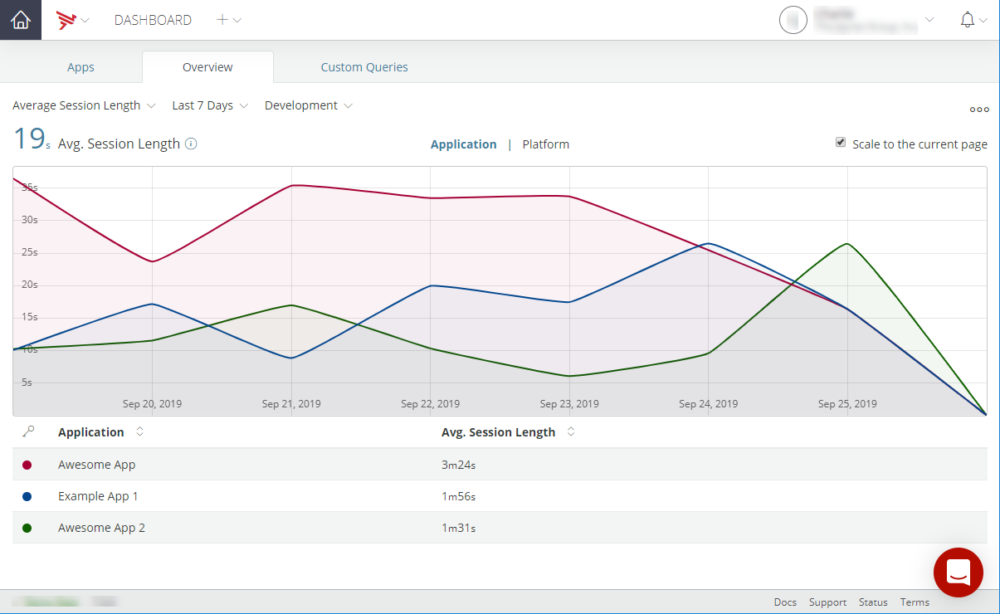
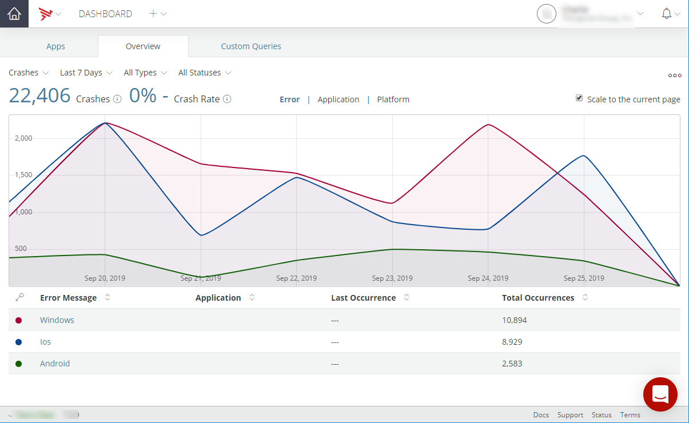
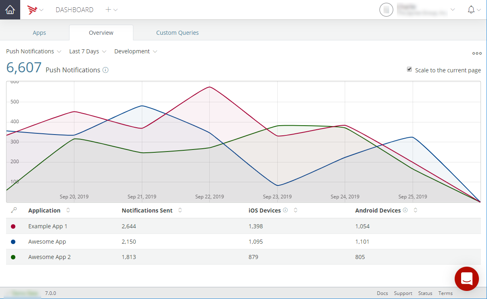
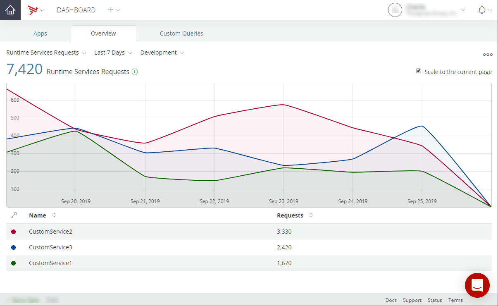
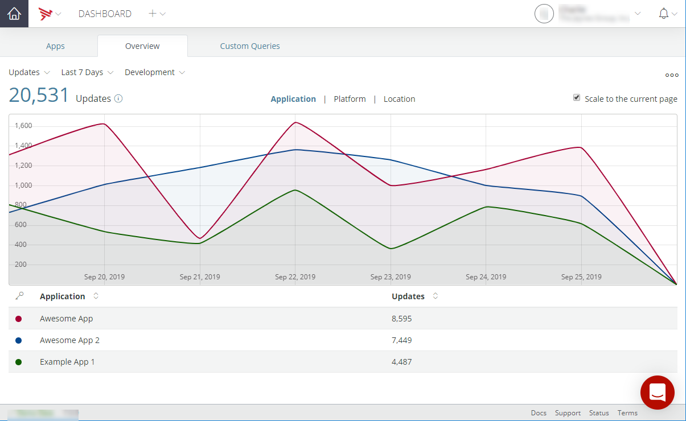

# Viewing Metrics

## Metrics Overview

To access the Metrics Overview screen, select the **Overview** tab on the Dashboard home page. The Metrics Overview screen displays several key metrics from Analytics, Cloud, Performance, and Test services. These metrics aggregate data from all applications, deployment environments, and versions. Select a metric to open a details page for that metric or select a metric from the Metrics drop-menu to view details of the selected metric.

The following metrics are displayed:

* **Active Sessions** – Number of users in your applications at the moment.

* **Sessions** – Total number of user sessions for your applications during the provided time range.

* **Average Session Length** – Average length of use of your applications during the provided time range.

* **Installs** – Total installs of your applications during the provided time range.

* **Updates** - Total updates of your applications during the provided time range.

* **Average Daily Unique Devices** – Average daily unique devices using your applications during the provided time range.

* **Crashes** – Total crashes of your during the provided time range.

* **Events** – Total number of events generated by your applications during the provided time range.

* **Mobile Backend Services Requests** – The total number of Mobile Backend Services requests made during the provided time range.

* **Push Notifications** – Total number of push notifications sent during the provided time range.

* **Runtime Services Requests** – Total number of Runtime Services requests made during the provided time range.

The displayed metrics can be filtered by the selected time interval and environment. For information on selecting a time interval or setting a custom time interval, refer to the **Data Filter** section of [Viewing Analytics](/guide/Appcelerator_Dashboard/Appcelerator_Dashboard_Guide/Managing_Applications/Viewing_Analytics/).

The Metrics drop-menu includes the following selections:

* **All Metrics** - Displays the overview of several key metrics.

* **Average Session Length** - Displays detailed average session length metrics.

* **Crashes** - Displays detailed crash information metrics.

* **Events** - Displays detailed event metrics.

* **Installs** - Displays detailed metric information for installations.

* **Mobile Backend Service Requests** - Displays detailed MBS requests metrics.

* **Push Notifications** - Displays detailed push notifications metrics.

* **Runtime Services Requests** - Displays detailed AMPLIFY Runtime requests metrics.

* **Sessions** - Displays detailed sessions metrics.

* **Unique Devices** - Displays detailed unique devices metrics.

* **Updates** - Displays detailed metric information for updates.

## Average Session Length

The **Average Session Length** selection displays detailed metrics on the average session length either by application or by the platform for the selected time interval, version, and environment. The average length of use of your applications during the provided time range is also displayed. To toggle on and off displayed metrics information in the chart, click the on the item in the table legend. Additionally, the average session length metrics can be exported for use in other programs. For details on exporting the average session length metrics, refer to the **Export Data** section of [Viewing Analytics](/guide/Appcelerator_Dashboard/Appcelerator_Dashboard_Guide/Managing_Applications/Viewing_Analytics/). To scale the metrics display to the current page, select **Scale to the current page**.

## Crashes

The **Crashes** selection displays the total number of crashes for your applications either by error, application, or platform for the selected time interval and crash status (All Crashes, Pending, Resolved, or Unresolved). The crash rate is also displayed. To toggle on and off displayed metrics information in the chart, click the on the item in the table legend. Additionally, the crash metrics can be exported for use in other programs. For details on exporting the sessions metrics, refer to the **Export Data** section of [Viewing Analytics](/guide/Appcelerator_Dashboard/Appcelerator_Dashboard_Guide/Managing_Applications/Viewing_Analytics/). To scale the metrics display to the current page, select **Scale to the current page**.

## Events

The **Events** selection displays detailed metrics for event occurrences for the selected time interval and environment either by application or by event name. The total number of events is also displayed. To toggle on and off displayed metrics information in the chart, click the on the item in the table legend. Additionally, the number of event occurrences metrics can be exported for use in other programs. For details on exporting the number of event occurrences metrics, refer to the **Export Data** section of [Viewing Analytics](/guide/Appcelerator_Dashboard/Appcelerator_Dashboard_Guide/Managing_Applications/Viewing_Analytics/). To scale the metrics display to the current page, select **Scale to the current page**.

## Installs

The **Installs** selection displays detailed metrics of the total number of installs of your applications during the provided time range either by application, by platform, or by geographic location for the selected time interval and environment. The total number of all installations is also displayed. To toggle on and off displayed metrics information in the chart, click the on the item in the table legend. Additionally, the number of installations metrics can be exported for use in other programs. For details on exporting the number of installations metrics, refer to the **Export Data** section of [Viewing Analytics](/guide/Appcelerator_Dashboard/Appcelerator_Dashboard_Guide/Managing_Applications/Viewing_Analytics/). To scale the metrics display to the current page, select **Scale to the current page**.

## Mobile Backend Service Requests

The **Mobile Backend Service Requests** selection displays detailed metrics for the Mobile Backend Services requests either by application or by application type for the selected time interval and environment. The total number of Mobile Backend Service requests is also displayed. To toggle on and off displayed metrics information in the chart, click the on the item in the table legend. Additionally, the MBS request metrics can be exported for use in other programs. For details on exporting the MBS request metrics, refer to the **Export Data** section of [Viewing Analytics](/guide/Appcelerator_Dashboard/Appcelerator_Dashboard_Guide/Managing_Applications/Viewing_Analytics/). To scale the metrics display to the current page, select **Scale to the current page**.

## Push Notifications

The **Push Notifications** selection displays detailed metrics for push notifications for the selected time interval and environment. The total number of push notifications is also displayed. To toggle on and off displayed metrics information in the chart, click the on the item in the table legend. Additionally, the push notifications metrics can be exported for use in other programs. For details on exporting the push notifications metrics, refer to the **Export Data** section of [Viewing Analytics](/guide/Appcelerator_Dashboard/Appcelerator_Dashboard_Guide/Managing_Applications/Viewing_Analytics/). To scale the metrics display to the current page, select **Scale to the current page**.

## Runtime Services Requests

The **Runtime Services Requests** selection displays detailed metrics for AMPLIFY runtime requests for the selected time interval. The total number of AMPLIFY Runtime requests made during the provided time range is also displayed. To toggle on and off displayed metrics information in the chart, click the on the item in the table legend. Additionally, the AMPLIFY runtime requests metrics can be exported for use in other programs. For details on exporting the AMPLIFY runtime request metrics, refer to the **Export Data** section of [Viewing Analytics](/guide/Appcelerator_Dashboard/Appcelerator_Dashboard_Guide/Managing_Applications/Viewing_Analytics/). To scale the metrics display to the current page, select **Scale to the current page**.

## Sessions

The **Sessions** selection displays the total number of user sessions for your applications either by application, by platform, or by geographic location for the selected time interval and environment. The total number of sessions is also displayed. To toggle on and off displayed metrics information in the chart, click the on the item in the table legend. Additionally, the sessions metrics can be exported for use in other programs. For details on exporting the sessions metrics, refer to the **Export Data** section of [Viewing Analytics](/guide/Appcelerator_Dashboard/Appcelerator_Dashboard_Guide/Managing_Applications/Viewing_Analytics/). To scale the metrics display to the current page, select **Scale to the current page**.

## Unique Devices

The **Unique Devices** selection displays detailed metrics on maximum daily unique devices using your applications for the selected time interval and environment. To toggle on and off displayed metrics information in the chart, click the on the item in the table legend. Additionally, the maximum number of unique devices metrics can be exported for use in other programs. For details on exporting the maximum number of unique devices metrics, refer to the **Export Data** section of [Viewing Analytics](/guide/Appcelerator_Dashboard/Appcelerator_Dashboard_Guide/Managing_Applications/Viewing_Analytics/). To scale the metrics display to the current page, select **Scale to the current page**.

## Updates

The **Updates** selection displays detailed metrics of the total number of updates of your applications during the provided time range either by application, by platform, or by geographic location for the selected time interval and environment. The total number of all updates is also displayed. To toggle on and off displayed metrics information in the chart, click the on the item in the table legend. Additionally, the number of installations metrics can be exported for use in other programs. For details on exporting the number of installations metrics, refer to the **Export Data** section of [Viewing Analytics](/guide/Appcelerator_Dashboard/Appcelerator_Dashboard_Guide/Managing_Applications/Viewing_Analytics/). To scale the metrics display to the current page, select **Scale to the current page**.

