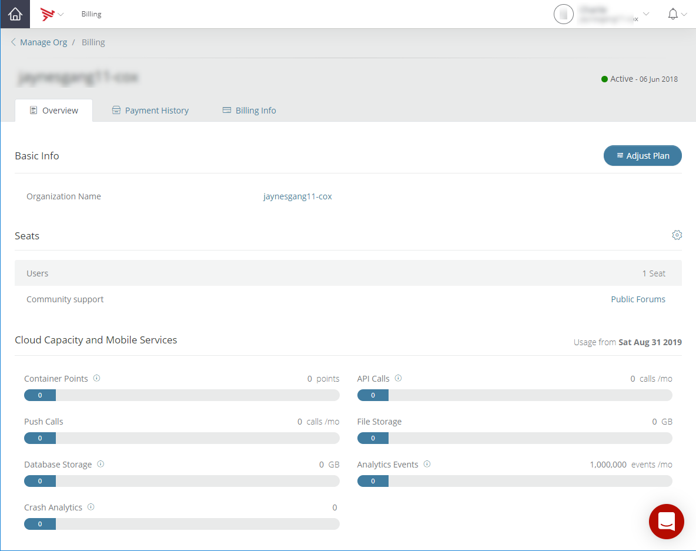
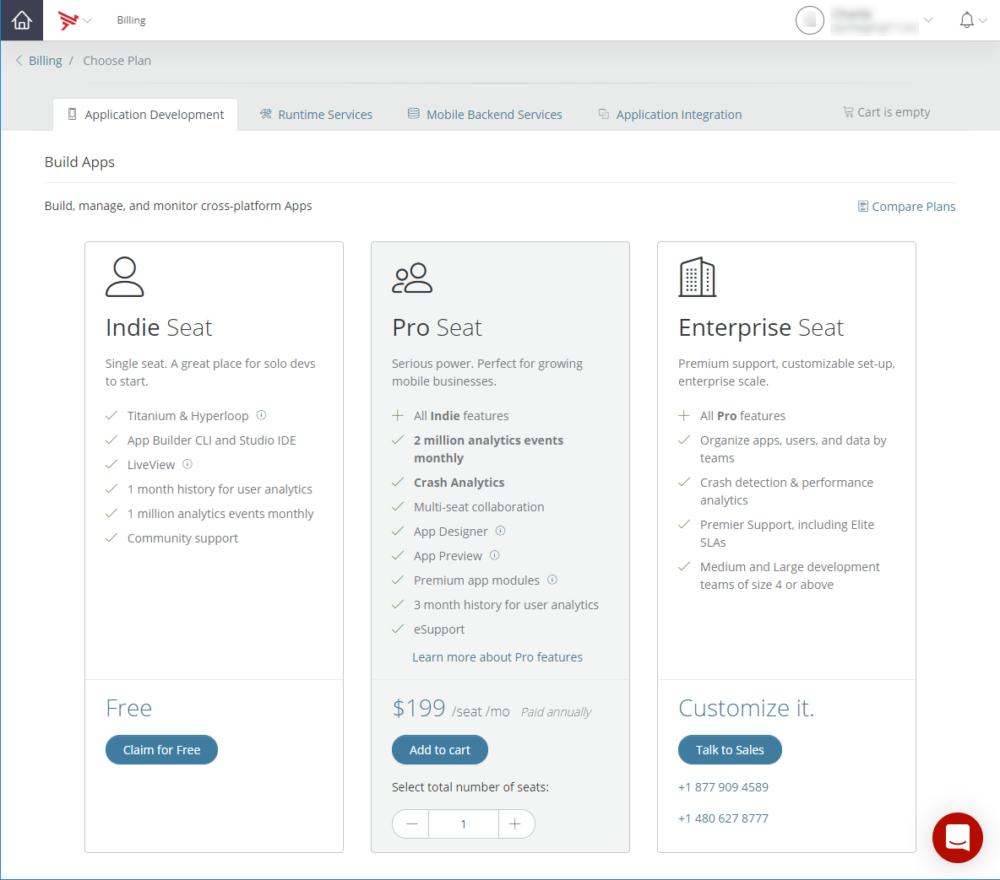
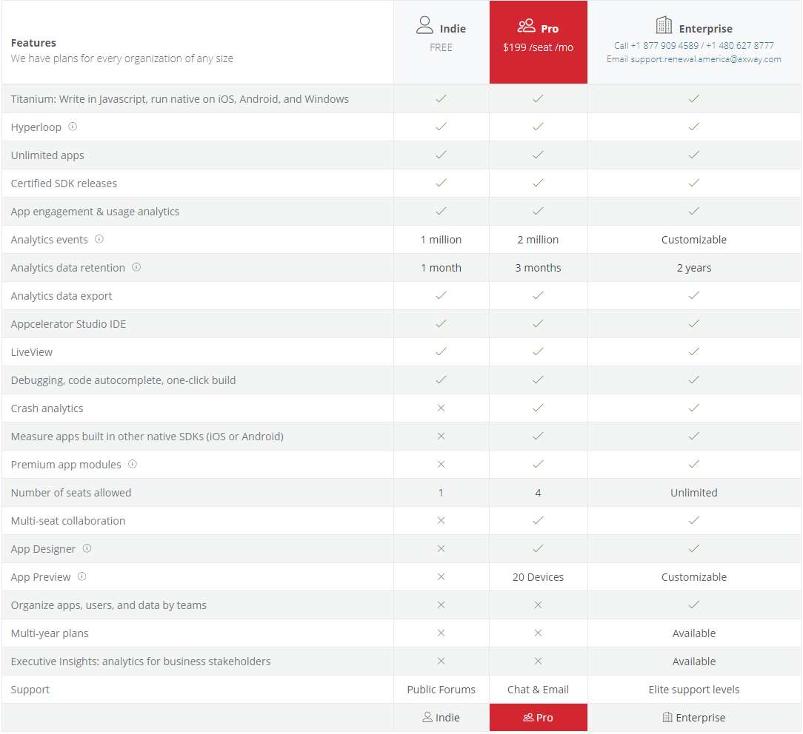
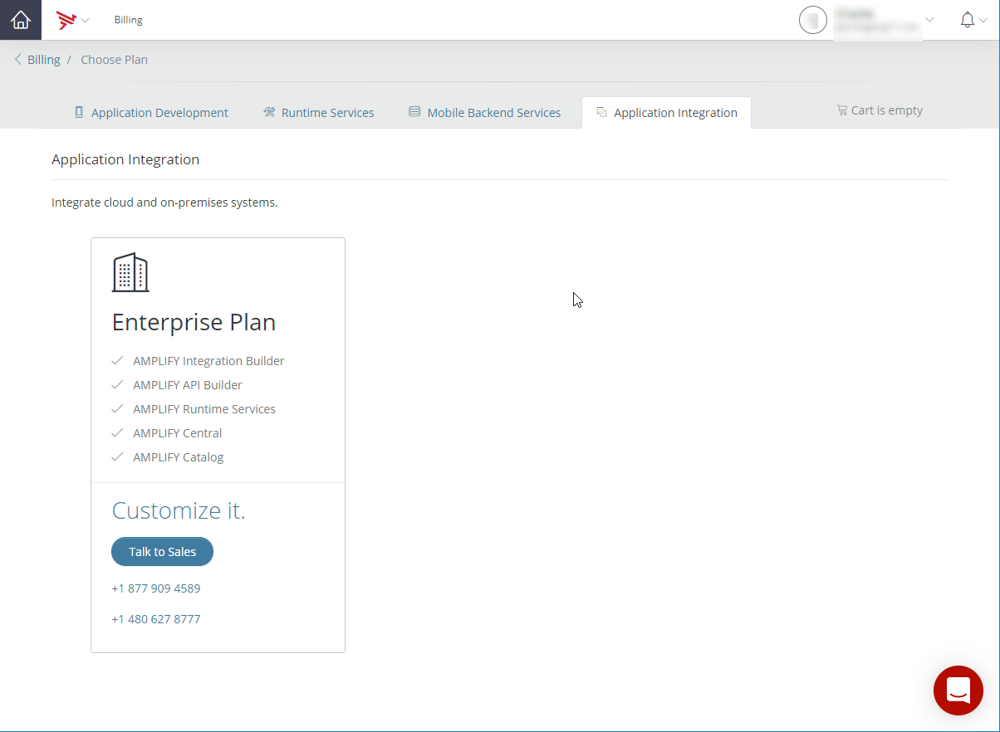
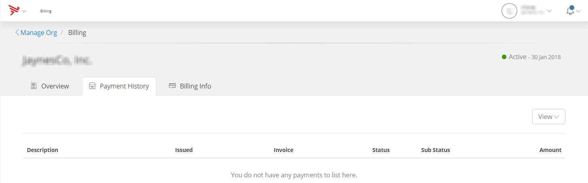
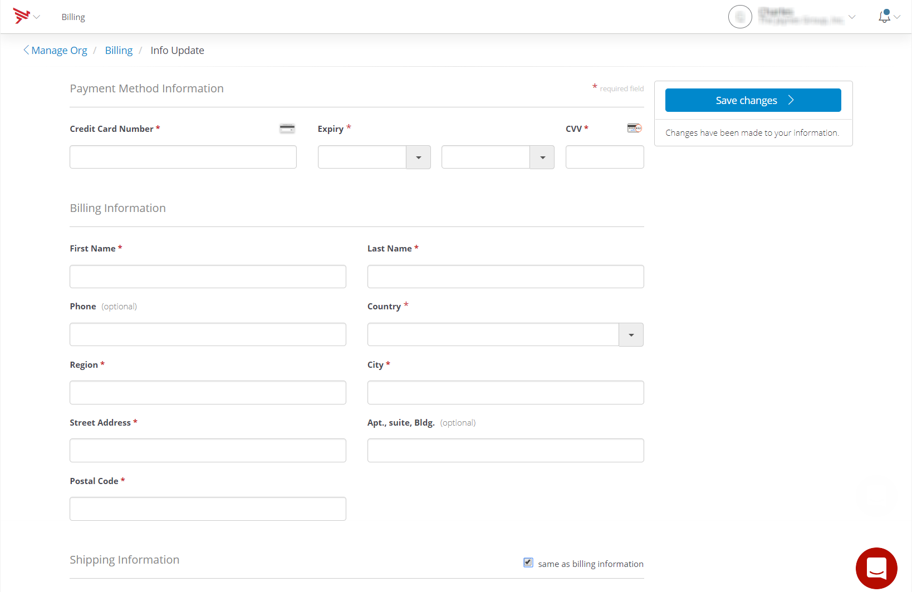

# Managing Billing

To manage your account information, select **Billing** on the **User** menu. Selecting **Billing** opens the _Billing_ page.

## Overview

The **Overview** tab provides your account basic information, number of seats, and current cloud capacity and mobile services.

The **Basic Info** section lists your organization name and provides your current plan information. To change your current plan, click the **Adjust Plan** button. When you click the **Adjust Plan** button, you will be transferred to the _Choose Plan_ page. For more information on choosing a plan, refer to [Choose Plan](#Choose).

The **Seats** section lists the number of occupied account seats versus the number of licensed account seats. It also provides a link to the community support site. To access the community support site, click the **Public Forms** link. To manage your organization's members, click the **Tool** icon.

The **Cloud Capacity and Mobile Services** section provides the current usage of the following services and your current plan limit for each service:

* Container Points - Allocate container points for the cloud resources to run your server-side application. Each container can run a single application as follows:

    * Medium Container (4 points): 512M memory/4G disk/2000 CPU share

    * Large Container (8 points): 1G memory/8G disk/4000 CPU share

    * X-Large Container (16 points): 2G memory/16G disk/8000 CPU share

* Push Calls - Number of pushes to mobile devices.

* Database Storage - An instant on-demand and schema-less data store that runs in the cloud (used for things like key/value pair, custom objects, geodata, and so forth.)

* Crash Analytics - Provides insight into crashes that occur within your applications.

* API Calls - The number of requests that can be made against your cloud datasources. We support up to 20 requests per second. (Higher rates are available to Enterprise plans.)

* File Storage - Storage for uploaded files or photos.

* Analytics Events - The number of analytic events sent. Paid events are retained for a year.

## Choose Plan

The _Choose Plan_ page provides the options to downgrade or upgrade your plan based on your team's development preferences. The Choose Plan page includes the **Application Development**, **Runtime Services**, **Mobile Backend Services**, and **Application Integration** tabs. As you make adjustments to your plan or select another plan, items and costs are added to your cart. To view your total additional costs or to check out, click the **View Cart** button.

::: warning ⚠️ Warning
Enterprise organizations with child organizations cannot be downgraded.
:::

### Application Development

The **Application Development** tab enables you to select a seat or seats that enable you to build, manage, and monitor cross-platform applications.

::: warning ⚠️ Warning
The **Application Development** tab is displayed as the **Application Development** expandable section at lower screen resolutions.
:::

You can claim an Indie seat for free by clicking the Claim for Free button. An Indie seat is a great place for solo developers to start. The Indie seat includes the following features:

* Titanium and Hyperloop - Hyperloop enhances Titanium by adding direct access to native platform APIs and 3rd-party libraries.

* App Builder CLI and Studio IDE

* LiveView - LiveView lets developers see changes to the application client in real-time as code changes are made without having to re-build, deploy, and launch the application.

* 1-month history for user analytics

* Community support

You can select Pro seats by selecting the number of Pro seats to add and then clicking the Add to Cart button. Pro seats provide serious power and are perfect for growing mobile businesses. Pro seats include all Indie seat features plus the following additional features:

* 2 million analytics events monthly

* Crash Analytics

* Multi-seat collaboration

* App Designer - A drag-and-drop RMAD editor for building native, cross-platform applications.

* App Preview - Automation for fast, simple iOS and Android beta app distributions to testers and stakeholders.

* Premium app modules - Premium app modules deliver additional services, including SQLite database encryption, geofencing, and other enhanced app capabilities.

* 3-month history for user analytics

* eSupport

To learn more about the Pro seat feature, click **Learn more about Pro features**.

To add Enterprise seats, either call one of the listed numbers or click the **Talk To Sales** button and complete the _Get in Touch_ form. Enterprise seats include all Pro seat features plus the following additional features:

* Organize apps, users, and data by teams

* Crash detection and performance analytics

* Premier Support, including Elite SLAs

* Medium and Large development teams of size four or above

#### Compare plans

To compare the options between the Indie, Pro, and Enterprise plans, select **Compare Plans**. When you select ****Compare Plans****, the plans, features, pricing information for is displayed side-by-side for easy comparison of each seat type.

### Runtime Services

The **Runtime Services** tab includes the Run APIs and Microservices and Enterprise Cloud Capacity and Support sections.

::: warning ⚠️ Warning
The **Runtime Services** tab is displayed as the **Runtime Services** expandable section at lower screen resolutions.
:::

#### Run APIs and Microservices

The **Run APIs and Microservices** section enables you to add instant, elastic infrastructure for all your runtime needs. You can purchase cloud capacity using Container Points and allocate them to containers. Each container can run a single application. To add elastic infrastructure, select the number of containers needed to run your server-side applications, and we will calculate the required points. Additional medium, large, and x-large containers can be selected or deselected by clicking by + or - symbols associated with each container type. The additional cost per month is calculated and displayed as additional containers are added or removed. Don't worry; container points can be reallocated at any time. Additionally, your organization's currently allocated container points and the number of recommended container point to run your application are displayed.

#### Enterprise Cloud Capacity and Support

The **Enterprise Cloud Capacity and Support** section provides a list of benefits offered with an enterprise-level plan for cloud capacity. Enterprise plans for cloud capacity offer:

* Higher cloud capacity limits

* Virtual private or on-premises deployment

* Premium support

* Elite service level agreements (SLAs)

* Support for multi-region global deployments

* Safe harbor compliance

* GovCloud

To request additional information on enterprise plans or to customize your current enterprise plan, either call one of the listed numbers or click the **Talk To Sales** button and complete the _Get in Touch_ form.

### Mobile Backend Services

The **Mobile Backend Services** tab includes the Mobile Backend Services and Enterprise Cloud Capacity and Support sections.

::: warning ⚠️ Warning
The **Mobile Backend Services** tab is displayed as the **Mobile Backend Services** expandable section at lower screen resolutions.
:::

#### Mobile Backend Services

The **Mobile Backend Services** section provides pre-built, scalable cloud services to accelerate your server-side applications. You can adjust your allocated number push calls and API calls per month and add database and file storage space.

* Push calls - Adjust your number of push calls per month to improve your Mobile Apps with real-time information from the server.

* API calls - Enable calls to your server-side applications to get data from your datasource. The selected number of API calls is the number of requests that can be made against your cloud datasources. We support up to 20 requests per second. Higher rates are available to Enterprise plans.

* Database storage - Adjust your allocated database storage space to increase your instant, schema-less storage in the cloud. Database storage is a schema-less, instant, on-demand data store that runs in the cloud. Database storage can be used for things like key/value pair, custom objects, geodata, and so forth.

* File storage - Adjust your allocated file storage space to increase your space to store uploaded files and photos.

#### Enterprise Cloud Capacity and Support

The **Enterprise Cloud Capacity and Support** section provides a list of benefits offered with an enterprise-level plan for cloud capacity. Enterprise plans for cloud capacity offer:

* Higher cloud capacity limits

* Virtual private or on-premises deployment

* Premium support

* Elite service level agreements (SLAs)

* Support for multi-region global deployments

* Safe harbor compliance

* GovCloud

To request additional information on enterprise plans or to customize your current enterprise plan, either call one of the listed numbers or click the **Talk To Sales** button and complete the _Get in Touch_ form.

### Application Integration

The **Application Integration** tab enables you to select a plan that provides everything you need to integrate cloud and on-premises systems.

::: warning ⚠️ Warning
The **Application Integration** tab is displayed as the Application Integration  expandable section at lower screen resolutions.
:::

To add an Enterprise plan, either call one of the listed numbers or click the **Talk To Sales** button and complete the _Get in Touch_ form.

## Payment History

The **Payment History** tab lists the payment history of the selected account. To filter the payment history, click the **View** button. The payment history can be filtered by:

* All subscriptions

* Active subscriptions

* Plan subscriptions

* Cloud Capacity subscriptions

* Training subscriptions

## Billing Info

The **Billing Info** tab list the payment method, billing information, and shipping information for your account.

To update the Billing Information, click the **Update** button. The _Payment Method Information_ page is displayed.

1. In the **Payment Information** section, complete the following fields or verify the information in the following fields:

    * Credit Card Number

    * Expiry

    * CVV

2. In the **Billing Information** section, complete the following fields or verify the information in the following fields:

    * First Name

    * Last Name

    * Country

    * Region

    * City

    * Street Address

    * Postal Code

3. Optionally, complete the following fields or verify the information in the following fields:

    * Phone

    * Apt., Suite, Bldg.

4. In the **Shipping Information** section, select the **Same as billing information** checkbox if your shipping address is the same as your billing address. If your shipping address is not the same as your billing address, deselect the **Same as billing information** checkbox and complete the following fields or verify the information in the following fields:

    * First Name

    * Last Name

    * Email Address

    * Country

    * Region

    * City

    * Street Address

    * Postal Code

5. Optionally, complete the following fields or verify the information in the following fields:

    * Company

    * Phone

    * Apt., Suite, Bldg.

6. Make sure your billing and payment information is correct, then click **Save changes**.
