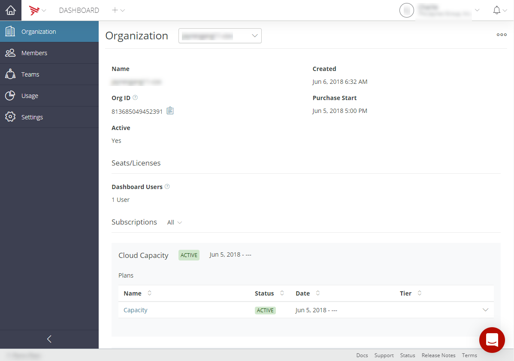
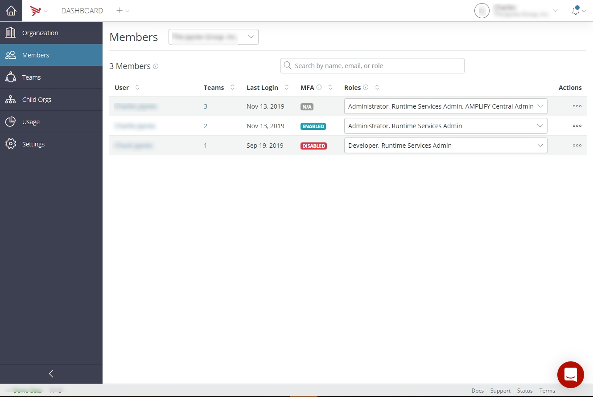
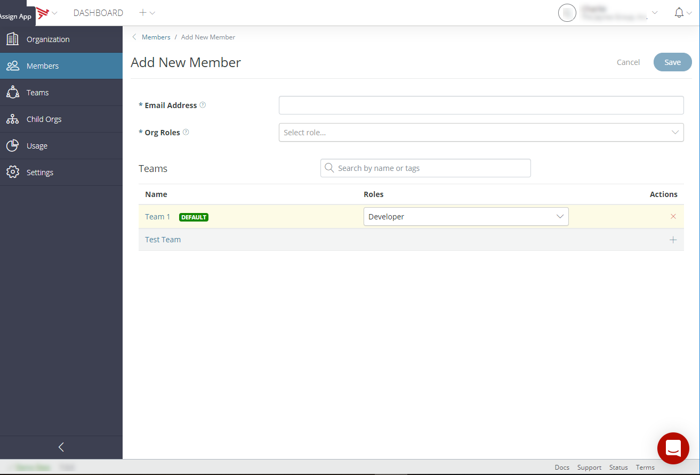
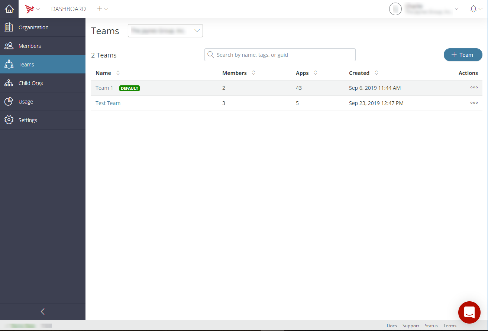
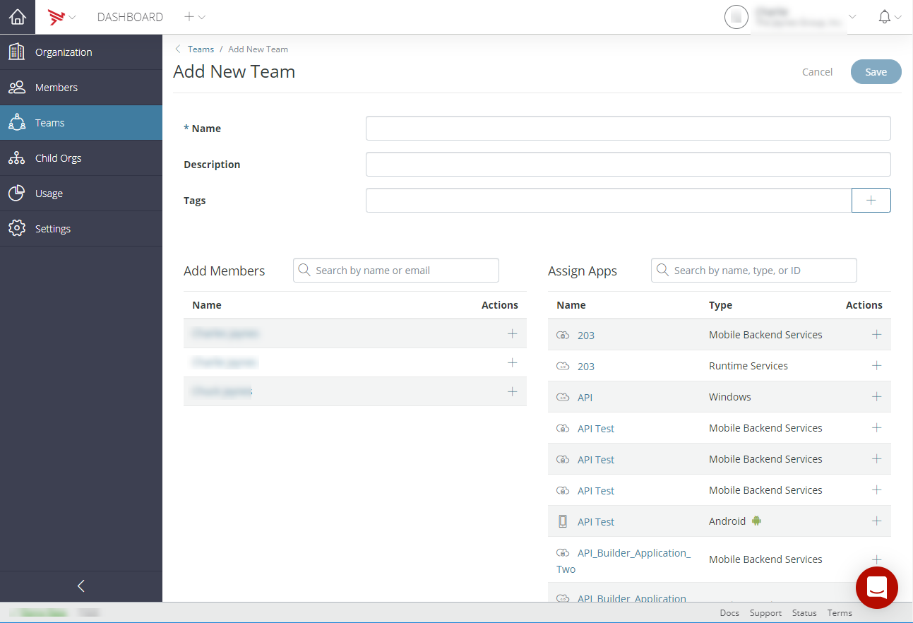
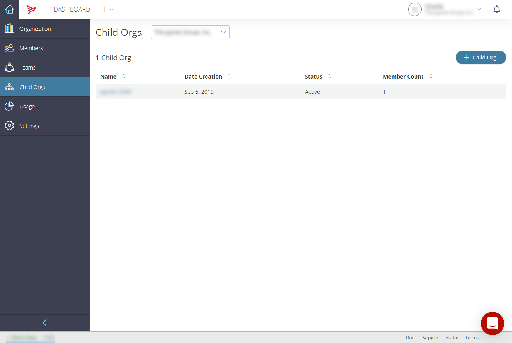
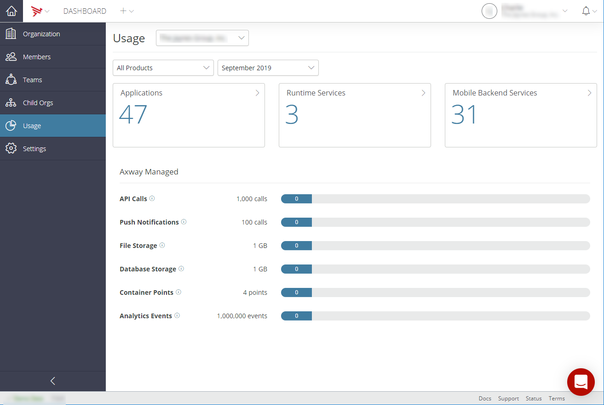
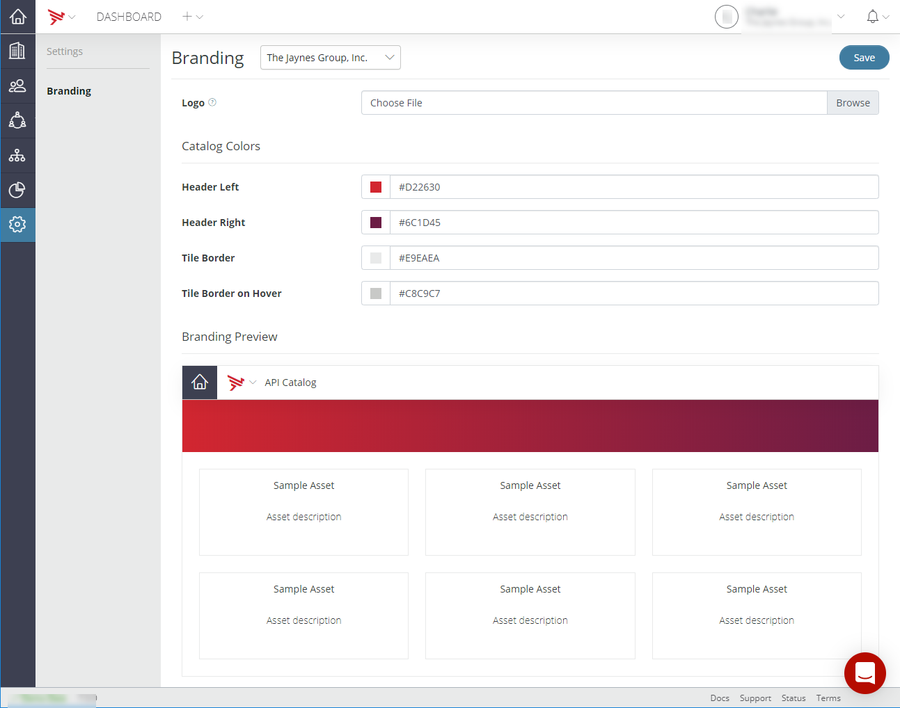

# Managing Organizations

## Introduction

As an administrator, the AMPLIFY Platform lets you view details about your organization, manage the users who have access to the AMPLIFY Appcelerator Services, and manage the applications created by members of your organization. All of these functions are available through the **Organization** tab. To access the **Organization** tab, sign in to the [AMPLIFY Platform](https://platform.axway.com) and select **Organization** from the _User_ dropdown menu.

## Concepts

Users belong to organizations. An organization is a group of people working for the same entity – typically the members of a company or some subset of a company.

* Organization _members_ can create new Titanium applications in Appcelerator Studio or register an Android or iOS application in Dashboard. These applications belong to the organization the user-designated during the app creation process.

* Organization _admins_ can create applications, invite users to join the organization, and assign organization members to _application teams_.

A user can have different administrator rights:

* _Org Admin_ gives the user access to manage the organization.

* _AMPLIFY Runtime Services Admin_ gives the user access to manage AMPLIFY Runtime Services application associated with the organization using the `appc acs` CLI, including republishing or remove applications.

A user can be a member of multiple organizations. In this case, the user will see an organization switcher in the _Profile_ dropdown located in the top-right of the Dashboard.

An application team is a group of people working on a single application. Application team members can have different roles:

* _Application admins_ can add users to the application team, change user roles, and update or modify the application's data. The user who creates an application becomes an admin for that application by default. Some ACS APIs can only be called by application admins.

* _Application members_ can access application data.

All the data generated by an application is visible to members and admins of the app and the admins of the organization to which the app belongs. Organization admins can see data for all of the organization's applications.

An organization can have child organizations. These child organizations are allocated user and device account resources from the parent organization. An administrator of the parent organization can create child organizations and manage applications and users for both the parent and child organizations.

### Roles and features

Users can be assigned different roles that grant them the rights to the Platform associated with their assigned roles and capabilities. Those roles and rights are:

* **Platform roles:**

    * Administrator

    * Developer

    * Insight

    * Consumer

* **Central roles:**

    * AMPLIFY Central Admin

* **Runtime Services roles:**

    * Runtime Services Admin

The following table provides a matrix of available roles and capabilities:

| Role | Short Description | Platform | App Dev | App Integration | Central | Catalog | ARS | MBaaS | Teams |
| --- | --- | --- | --- | --- | --- | --- | --- | --- | --- |
| Administrator | Use for platform admin tasks | X | X | X |  |  |  |  |  |
| Developer | Use for development and integration projects | X | X | X | X | X | X | X | X |
| Insight | Use for business oversight | X | X |  |  |  |  |  |  |
| Consumer | Use for the consumption of services from the catalog | X |  |  |  | X |  |  | X |
| AMPLIFY Central Admin | Use for all-encompassing access to Central |  |  |  | X | X |  |  |  |
| Runtime Services Admin | Use for all-encompassing access to Runtime Services |  |  |  |  |  | X | X |  |

::: warning ⚠️ Warning
The assignment of the AMPLIFY Central Admin and Runtime Service Admin roles is restricted to AMPLIFY Platform administrators.
:::

### View Organization details, applications, and members

**To manage organizations, applications, and members:**

1. Sign in to the [AMPLIFY Platform](https://platform.axway.com).

2. To open the **Organization** tab, select the **Organization** from the _User_ dropdown menu.

    

* * **Account** - View and manage your account information.

    * **Organization** - View and manage organizations.

    * **Members** - View organization members. Admins can also manage organization members.

    * **Usage** - View the organization's utilization of allocated resources.

    * **Billing** (Admin only) - View and manage your account billing information.

    * **Downloads** - Navigate to the Download Center.

    * **Switch Org** - Select to switch organizations.

    * **Sign out** - Select to sign out of your account.

Selecting **Organization** opens the **Organization** tab for the currently selected organization.

## Managing an organization

The **Organization** tab enables you to select and update the organization name. It also provides detailed organization and subscription information.

To update an organization name:

1. Select the organization from the _Organization_ dropdown menu.

2. Select the **Action** icon at the upper right-hand side of the _Organization_ page.

3. Select **Edit** from the **Action** menu.

4. Enter the desired organization name in the **Name** field.

5. Click **Save**.

To add a child organization, refer to [Create an Organization](/guide/Appcelerator_Dashboard/Appcelerator_Dashboard_Guide/Managing_Organizations/Create_an_Organization/).

## Managing organization members

The **Members** tab enables you to view and manage members of the selected organization.

### Add an organization member

If you are an organization admin, you can add new members to an organization. An organization admin can only add as many members as the number of available seats in the organization.

1. Sign in to the [AMPLIFY Platform](https://platform.axway.com/).

2. Click on the **User** menu and select **Organization**.

3. If you're a member of multiple organizations, select the organization you want to view from the _Members_ dropdown menu.

4. Click the **Members** tab.

5. Click the **\+ Member** button in the upper-right corner.

6. Enter the user's email address.

7. Select the user's roles (Platform Roles - Administrator, Developer, Insight, Consumer, and Service Roles - Runtime Services Admin, AMPLIFY Central Admin ) from the _Org Roles_ dropdown menu. One platform role and one service role can be selected. Administrators can manage all users and applications in the organization.

8. In the **Teams** list, select the teams, if any, to which the user should be added.

9. Select the role the new organization member will fulfill on their assigned team from the _Roles_ dropdown menu.

10. Click **Save**.

    

An email invitation is sent to the user, providing a link to confirm their membership.

### Viewing and modifying a member's role or access

After you create or add a member to your organization, you can view and modify the user's access rights or role.

1. Sign in to the [AMPLIFY Platform](https://platform.axway.com).

2. Click on the **User** menu and select **Organization**.

3. If you're a member of multiple organizations, select the organization you want to view from the _Members_ dropdown menu.

4. Click the **Members** tab.

5. To change a member's role, select a different role or additional roles from the _Role_ dropdown menu. Note that the _Role_ dropdown menu selections are sorted by product roles. Administrators can manage all users and applications in the organization. All other user roles can view only applications to which they belong.

6. To remove a selected member from the organization, select the **Actions** icon, and select **Remove Member** and then confirm the removal.

7. To view a member's team assignments, select the **Actions** icon, and select **View Teams**. Refer to [Managing teams](#managing-teams).

    

The member's last login is displayed in the _Last Login_ column, and their current multi-factor authentication status is shown in the _MFA_ column. For more information on multi-factor authentication, refer to [Manage multi-factor authentication](/guide/Appcelerator_Dashboard/Appcelerator_Dashboard_Guide/Managing_Accounts/#2FA).

## Managing teams

The **Teams** tab enables you to view and manage teams and their assigned applications.

### Add a new team

To add a team:

1. Sign in to the [AMPLIFY Platform](https://platform.axway.com).

2. Click on the **User** menu and select **Organization**.

3. If you're a member of multiple organizations, select the organization you want to view from the _Members_ dropdown menu.

4. Click the **Teams** tab.

5. Click the **\+ Teams** button.

6. Enter the team name in the **Name** field.

7. (Optional) Provide a team description in the **Description** field.

8. (Optional) Add team tags in the **Tags** field.

9. Add members to the team by selecting team members from the Add Members list by clicking the **+** icons.

10. Assign applications to the team by selecting applications from the Assign Applications list by clicking the **+** icons.

11. Click **Save**.

    

### Edit a team

To edit an existing team:

1. Sign in to the [AMPLIFY Platform](https://platform.axway.com).

2. Click on the **User** menu and select **Organization**.

3. If you're a member of multiple organizations, select the organization you want to view from the _Members_ dropdown menu.

4. Click the **Teams** tab.

5. Select the **Actions** icon associated with the team to edit.

6. Select **Edit Team**.

7. Make the necessary changes to the selected team. For additional information, refer to [Add a new team](#Addanewteam).

8. Click **Save**.

### Set a team as default

To set a team as default:

1. Sign in to the [AMPLIFY Platform](https://platform.axway.com).

2. Click on the **User** menu and select **Organization**.

3. If you're a member of multiple organizations, select the organization you want to view from the _Members_ dropdown menu.

4. Click the **Teams** tab.

5. Select the **Actions** icon associated with the team to edit.

6. Select **Set as Default**.

7. Confirm setting the selected team as the default team by clicking **Continue** in the confirmation dialog.

### Remove a team

To remove a team:

1. Sign in to the [AMPLIFY Platform](https://platform.axway.com).

2. Click on the **User** menu and select **Organization**.

3. If you're a member of multiple organizations, select the organization you want to view from the _Members_ dropdown menu.

4. Click the **Teams** tab.

5. Select the **Actions** icon associated with the team to edit.

6. Select **Remove Team**.

7. (Optional) Select a team to transfer the team's assigned apps to.

8. Confirm the removal of the deletion of the selected team, by entering the name of the team to delete permanently.

9. Click **I understand that this is a permanent and irreversible action. Continue**.

## Managing child organizations

The **Child Orgs** tab enables you to manage child organizations and to add a child organization to the selected parent organization. To add a child organization, refer to [Create an Organization](/guide/Appcelerator_Dashboard/Appcelerator_Dashboard_Guide/Managing_Organizations/Create_an_Organization/).

## Managing usage

The **Usage** tab enables you to view the usage of allocated resources for the selected organization for the selected product or all products for the selected period.

## Managing organization settings

The **Settings** tab enables you to brand the Dashboard for the selected organization.

### Branding

To brand the Dashboard per your organization's branding requirements:

1. Select your organization's logo. The logo will be displayed at a maximum height of 45 pixels, and the logo file must be less than 100KB.

    1. Click **Choose File**.

    2. Select the logo file to upload. Once the logo file is selected, the _Branding Preview_ will update to display the selected logo.

    3. To remove the selected icon file, click **Remove**.

2. Select your catalog colors. As you select your catalog colors, the _Branding Preview_ will update to display the selected colors.

    1. Select or enter the **Header Left** color.

    2. Select or enter the **Header Right** color.

    3. Select or enter the **Tile Border** color.

    4. Select or enter the **Tile Border on Hover** color.

3. Click **Save**.

## Troubleshooting

::: tip 💡 Hint
#### I was recently promoted to Administrator, but I cannot see applications from other users

1. Sign out of the AMPLIFY Platform.

2. Clear your browser's cache. You may need to restart the browser.

3. Sign back into the AMPLIFY Platform.
:::
