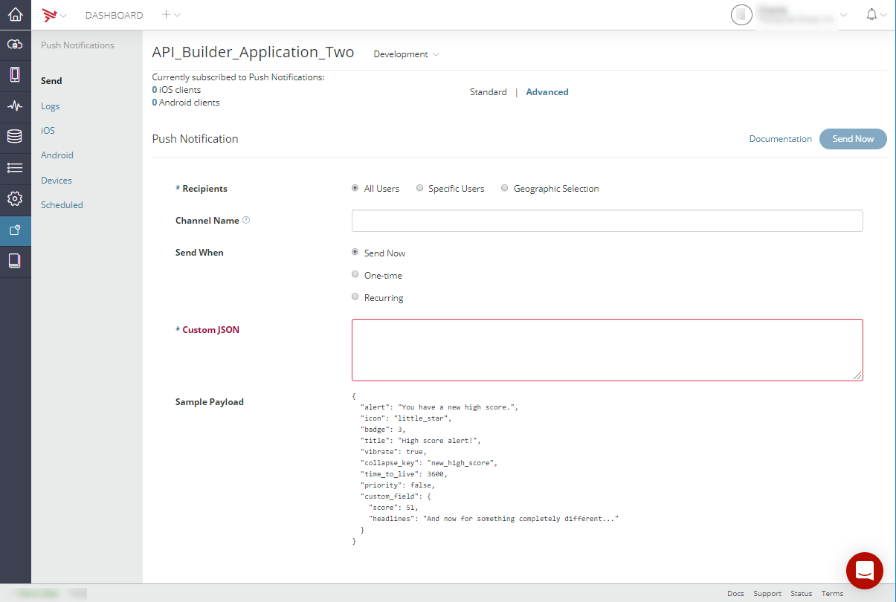
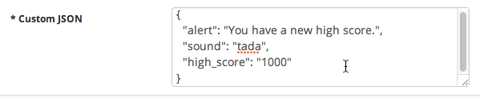
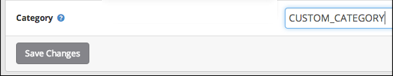
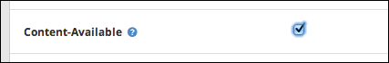
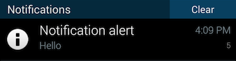
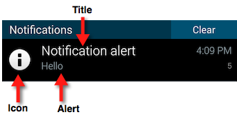
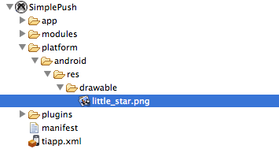

# Sending and Scheduling Push Notifications

This guide explains how to send and schedule push notifications in the Appcelerator Dashboard.

## Sending push notifications

To send a push notification, you must provide Dashboard the following information:

* **Notification recipients and channel –** If your application users are subscribed using _session-based subscriptions_, you can send a notification to specific API Builder users subscribed to a particular channel. For token-based subscriptions, you can send notifications to all users subscribed to a particular channel, or all users regardless of their channel subscriptions.

* **Notification schedule –** You can send a notification immediately, or schedule it to be sent at a future date and time. Scheduled notifications can be one-time or recurring.

* **Notification payload –** The content of the notification, which consists minimally of an alert string to display, and optionally a sound to play or badge display. See [About Notification Payloads](#about-notification-payloads).

To send a notification to users located in a geographic area, the application must have first provided their current location to API Builder. For details, see [Updating Subscriptions with Device Location](/guide/Titanium_SDK/Titanium_SDK_How-tos/Notification_Services/Push_Notifications/Subscribing_to_push_notifications/).

Appcelerator Dashboard provides two views for sending notifications, **Standard** and **Advanced.** The Standard view provides an easy way to send notifications without having to understand the payload structure. In the Advanced view, you manually create the JSON payload. The advanced form provides additional flexibility, such as including custom payload fields.

If you prefer can use the [PushNotification.notify](/arrowdb/latest/#!/api/PushNotifications-method-notify) or [PushNotification.notify\_tokens](/arrowdb/latest/#!/api/PushNotifications-method-notify_token) REST APIs to send push notifications.

::: warning ⚠️ Warning
A warning will be displayed if you attempt to perform a push with an expired or disabled iOS certificate.
:::

**To send push notifications from the Dashboard:**

1. In the Dashboard, select your application from the Dashboard home page **Projects** tab.

2. From the left-side navigation, select **Push Notifications**.

3. Select **Send** to open the Send Push Notification form**.**

4. Select either **Standard** or **Advanced**.

5. Select **Recipients** and (optionally) the notification **Channel Name**:

    1. To send a notification to all users regardless of their channel subscriptions, select **All Users**  and leave the **Channel Name** field blank.

    2. To send a notification to all users subscribed to a particular channel, select **All Users** and enter the channel name in the **Channel Name** field.

    3. To send a notification to specific users who are subscribed to a particular channel_,_ select **Specific Users**, then:

        1. Click the add **(+)** button in the **To Users** field.

        2. Select the desired recipients from the list of users. To locate a particular user, enter their username in the search field.

        3. In the **Channel Name** field, enter the name of the target channel subscription.

            ::: warning ⚠️ Warning
            You must specify a channel when sending a notification to specific users.
            :::

    4. To send a notification to all users located within a geographic selection, select **Geographic Selection,** then:

        1. Click the add (**+**) button in the **Place** field and select an existing place. This defines the center points of the geographic selection. The selected Place must have a defined latitude and longitude.

        2. In the **Radius** field, enter the distance (in Miles or Meters) from the selected Place to define the size of the geographic selection.

6. To specify when to deliver the notification, in the **Send When** field, select one of the following options:

    1. To send the notification immediately, select **Send Now.**

    2. To schedule a one-time notification, select **One-Time** and then select the delivery date and time (All times are in UTC.)

    3. To schedule a recurring notification, select **Recurring,** select the start date and time, the end date, and the recurrence interval: **Daily, Weekly,** or **Monthly.** (All times are in UTC.)

7. To define the notification payload using the **Standard** view:

    1. In the **Alert** field, enter the notification message to display on the device.

    2. In the **Channel Name** field, enter the channel name to use for notifications. A Channel is required when not sending a push to all users.

    3. In the **Badge** field, enter a badge value. See [Notification Badges](#badges) for details.

    4. In the **Sound** field, select **None, Default,** or **Custom.** See [Notification Sounds](#sounds) for details.

    5. For iOS devices:

        1. In the **Content-Available** field, check the box to indicate that new content is available. This is used to support Newsstand apps and background content downloads.

        2. In the **Category** field, enter the name of the category to use for interactive notifications. See [iOS Interactive Notifications](/guide/Titanium_SDK/Titanium_SDK_How-tos/Notification_Services/iOS_Interactive_Notifications/).

    6. For Android devices:

        1. In the **Vibrate** field, select No or Yes to have the device vibrate or not upon receipt of the notification.

        2. In the **Title** field (Android, only), select the title to display in the Alert message. See [Notification Titles](#title) for details.

        3. In the **Icon** field (Android, only), specify the name of the image file to display as the notification icon. See [Notification Icons](#icon) for details.

        4. In the **Collapse Key** field (Android, only), identify a group of messages (for example, with `collapse_key: “Updates Available”`) that can be collapsed so that only the last message gets sent when delivery can be resumed.

        5. In the **Time to Live** field (Android, only), specify how long (in seconds) the message should be kept in Firebase Cloud Messaging storage if the device is offline.

        6. In the **Priority** field (Android, only), select either **Normal** or **High**. Set to high priority if the message is time-critical and requires the user's immediate interaction.

8. To define the notification payload using the **Advanced** view:

    1. In the **Custom JSON** field, enter a valid JSON string (see [Custom JSON Payloads](#custom-json-payloads) for details).

        
9. Click **Send Now**.

## About Notification Payloads

The content, or payload, of a push notification, is a JSON-encoded object whose fields contain the payload values. The JSON object typically contains one of the "standard" notification fields. Standard fields are supported by both iOS and Android devices. Some fields are platform-specific, such as `icon` or `title`, that are only used by Android, or `category` and `content-available`, that are only used by iOS 8 devices and later.

Standard fields include the following:

* `alert` – The notification message displayed to the user.

* `badge` – The number to display in the notification. See [Notification badges](#badges).

* `sound` – The name of an audio file to play when the notification arrives, minus its extension. See [Notification sounds](#sounds).

Android devices support the following additional fields:

* `icon` – The name of the image file to display as the icon, minus its extension.

* `title` – Title displayed above the alert text. Defaults to the application name.

* `vibrate` – A Boolean that the device to vibrate momentarily upon receipt.

See Android-specific notification fields for more information about specifying these fields.

iOS 8 devices and later support the following additional fields:

* `category` – The name of the category to use for interactive notifications. See [iOS Interactive Notifications](/guide/Titanium_SDK/Titanium_SDK_How-tos/Notification_Services/iOS_Interactive_Notifications/) for more information.

* `content-available` – If set to **1**, indicates that new content is available. This is used to support Newsstand apps and background content downloads.

The payload can also include custom fields that your application can read and use as desired. See [Custom JSON Payloads](#custom-json-payloads) for an example of using custom fields.

### Custom JSON payloads

Appcelerator Dashboard provides two forms, Standard and Advanced, for you to compose the payload. In the Standard form, you use common form controls to compose the payload, without having to write JSON code. In the Advanced form, you manually enter the JSON-encoded string that's sent in the notification. The JSON object can contain any of the standard fields discussed in [About Notification Payloads](#about-notification-payloads), or custom fields specific to your application. For example, the following payload contains `alert` and `sound` fields, as well as a custom field named `high_score`.



Below is a more advanced custom JSON payload:

```
{
    "alert": "Sample alert",
    "badge": "+2",
    "category": "sampleCategory",
    "icon": "little_star",
    "sound": "door_bell",
    "title": "Example",
    "vibrate": true,
    "custom_field_1": "Arrow Push Rocks!",
    "custom_field_2": "Hi Push"
}
```

When the device receives this payload, it will do the following:

* Display the "Sample alert" message.

* Increment the current badge value by two.

* Play the "door\_bell" audio file.

* On Android devices:

    * The notification title will be set to "Example"

    * The device will vibrate

    * The "little\_star" icon will be displayed in the notification area.

* On iOS devices:

    * The user notification actions associated with the "sampleCategory" user notification category.

### About JSON Payloads Delivered to Devices

The notification payload that Mobile Backend Services delivers to either FCM or GCM or APNS is slightly modified from the original JSON payload you provide to Dashboard. Also, the payloads are slightly different for Android and iOS devices.

For Android, all Android-specific fields are contained in an **`android`** dictionary, while all other iOS-only and custom fields are top-level keys of the payload. For example, the payload shown in [Custom JSON payloads](#custom-json-payloads) will be delivered to an Android application as follows:

```
{
    "android": {
        "title": "Example",
        "alert": "Sample alert",
        "icon": "little_star",
        "badge": "+2",
        "sound": "door_bell",
        "vibrate": true,
    },
    "category": "sampleCategory",
    "custom_field_1": "Arrow Push Services Rocks!",
    "custom_field_2": "Hi Push"
}
```

For iOS devices, all iOS-specific fields are contained in an `aps` dictionary, while all Android-specific and custom fields are top-level keys of the payload. For example, the payload shown in [Custom JSON payloads](#custom-json-payloads) will be delivered to an iOS application as follows:

```
{
    "aps": {
        "alert": "Sample alert",
        "badge": "+2",
        "category": "sampleCategory",
        "sound": "door_bell"
    },
    "title": "Example",
    "icon": "little_star",
    "vibrate": true,
    "custom_field_1": "Arrow Push Rocks!",
    "custom_field_2": "Hi Push"
}
```

### Notification Features

#### Rich Notifications (iOS 10 and later)

Since Titanium SDK 7.3.0, you can create rich notifications for users running iOS 10 or later. Rich notifications can include additional meta-data like a subtitle, location-based triggers, and attachments. While most of the new properties can be configured in existing [UserNotificationAction](#!/api/Titanium.App.iOS.UserNotificationAction) instances, there is one special case to remember when working with rich notifications: If you want to display an attachment, you have to distinguish between local and remote images:

* **Local** images: Can be specified when scheduling a **local** notification from your application, for example using the `attachments` property inside the creation dictionary of the notification.

* **Remote** image: Can be specified when scheduling a **remote** notification using an `UNNotificationServiceExtension`. App extensions in Titanium can be written in both Objective-C and Swift. Learn more about them [here](/guide/Titanium_SDK/Titanium_SDK_How-tos/Platform_API_Deep_Dives/iOS_API_Deep_Dives/Creating_iOS_Extensions_-_Siri_Intents/).

Remote attachments example:

```
{
    "aps": {
        "alert": {
            "title": "Weather Update",
            "body": "The weather out here is getting serious, remember to bring an umbrella!"
        },
        "mutable-content": 1
    },
    "attachment-url": "https://api.buienradar.nl/Image/1.0/RadarMapNL",
    "attachment-name": "example.gif"
}
```

Important: Make sure to include the `mutable-content` flag in your JSON payload, which is used to trigger the notification extension. Also, the `attachement-url` is downloaded and persisted in your local filesystem using the `attachment-name` key. The developer is responsible to structure the extension and the way it deals with remote content. See our [example Swift extension](https://github.com/appcelerator-developer-relations/appc-sample-ios-push-notifications/blob/master/extensions/NotificationServiceExtension/notificationservice/NotificationService.swift) that can be used as part of the [App Extensions](/guide/Titanium_SDK/Titanium_SDK_How-tos/Platform_API_Deep_Dives/iOS_API_Deep_Dives/Creating_iOS_Extensions_-_Siri_Intents/) guide.

In addition to that, iOS 10 also introduces a NotificationCenter API that is made available in Titanium via the [`Ti.App.iOS.UserNotificationCenter`](#!/api/Titanium.App.iOS.UserNotificationCenter) API. It represents a powerful binding to manage notifications by being able to change or cancel notifications that are currently pending. While most of its API's are made for iOS 10 and later, the changes have been made in a way to be backward compatible with iOS 8, so you don't need to call multiple methods to manage your push notifications.

Some useful links to get started:

* Apple: [WWDC 2017: Rich Notifications](https://developer.apple.com/videos/play/wwdc2017/817/)

* Apple: [Local and Remote Notifications](https://developer.apple.com/library/content/documentation/NetworkingInternet/Conceptual/RemoteNotificationsPG/)

* Titanium: [iOS Push Notifications Sample App](https://github.com/appcelerator-developer-relations/appc-sample-ios-push-notifications)

* Titanium: [App Extensions Guide](/guide/Titanium_SDK/Titanium_SDK_How-tos/Platform_API_Deep_Dives/iOS_API_Deep_Dives/Creating_iOS_Extensions_-_Siri_Intents/)

#### Interactive Notifications (iOS 8 and later)

You can create interactive notifications for users running iOS 8 or later can respond to without launching the application to the foreground.


Your Titanium application defines one or more _notification categories_, each of which consists of one or more _notification actions_. When you [create a push notification](#sending-push-notifications) in the Dashboard, the **Category** form field lets you specify the category of interactive notification to display when the push notification arrives.

**To create an interactive notification:**

1. In your Titanium application:

    1. [Create and configure notification actions](/guide/Titanium_SDK/Titanium_SDK_How-tos/Notification_Services/iOS_Interactive_Notifications/).

    2. [Create notification categories](/guide/Titanium_SDK/Titanium_SDK_How-tos/Notification_Services/iOS_Interactive_Notifications/) and assign notification actions to them.

    3. [Register the application](/guide/Titanium_SDK/Titanium_SDK_How-tos/Notification_Services/iOS_Interactive_Notifications/) for the desired notification categories, and to receive push notifications.

    4. Register an event listener for the `remotenotificationaction` event, to respond to user actions when they interact with the notification.

2. In the Dashboard, send a new push notification and set the **Category** field to the desired notification category.

    

When the notification arrives, the device displays the set of actions defined by the category. The [remotenotificationaction](#!/api/Titanium.App.iOS-event-remotenotificationaction) event fires when the user interacts with the notification.

In addition, you can set the `behavior` property of the [`Ti.App.iOS.NotificationAction`](#!/api/Titanium.App.iOS.UserNotificationAction) to [`Ti.App.iOS.USER_NOTIFICATION_BEHAVIOR_TEXTINPUT`](#!/api/Titanium.App.iOS-property-USER_NOTIFICATION_BEHAVIOR_TEXTINPUT) which will show a text field that can be used to respond to actions without opening the app.

#### Silent Push Notifications

The **Content-Available** form field lets you silently notify a Titanium or native iOS/Android application, without alerting the user at all. A silent push is often used to alert the application that new content is available to download. Once the download (or another task) initiated by the silent push is complete, the application can display a notification to the user that new content is available.



For detailed steps on enabling silent push notifications in your Titanium application, see [Silent Push](/guide/Titanium_SDK/Titanium_SDK_How-tos/Platform_API_Deep_Dives/iOS_API_Deep_Dives/iOS_Background_Services/) in the Titanium SDK guides.

#### Notification Badges

A **badge** is a number displayed on the application icon (on iOS), or in the notification area (on Android). You can specify a specific badge value to display (2 or 10, for example), or a number prefixed by plus (+) or minus (-) symbol (+3 or -6, for example). When prefixed, the currently displayed badge number is incremented or decremented by the specified amount, respectively. To remove an application badge on iOS, specify a badge value of **0** (zero).




#### Notification Sounds

The `sound` field in a notification payload specifies the name (minus the extension) of a local sound file resource to play the notification arrives. When a push notification arrives, you can specify a custom sound to play, the default system sound, or no sound.

* For Android applications built with Titanium, place the file in the `/Resources/sound` directory.

* For iOS applications built with Titanium, place the file in the `/Resources` directory.

* For native Android applications, place the file in the `/assets/sound` directory.

* For native iOS applications, place the file in the main bundle.

#### Android-specific payload fields

In addition to the standard notification fields `(alert, badge,` and `sound)` Android devices support the following fields:

* `title`

* `icon`

* `vibrate`

The Titanium application may also specify any of the properties in Titanium.Android.Notification, except for `contentIntent` or `deleteIntent`. For instance, you can add a `tickerText` field to the notification payload that scrolls the specified text across the notification area.

##### Title field

**Title** – A string to display above the alert message in the notification area. If not specified in the payload, the application's name is displayed, as specified by the `<name>` element in your [project's tiapp.xml](/guide/Titanium_SDK/Titanium_SDK_Guide/Appendices/tiapp.xml_and_timodule.xml_Reference/) file.



##### Icon field

The `icon` payload field specifies an image to display with the notification on Android devices. (For image specifications, see [Icons and Splash Screens: Notification Icons](/guide/Titanium_SDK/Titanium_SDK_How-tos/User_Interface_Fundamentals/Icons_and_Splash_Screens/).) Its value is the name of a local image file, minus the extension of the icon to display. The file must be placed your project's `/res/drawable` folder for native Android applications or the `/Resources` folder for Titanium applications. By default, the application's icon is displayed with the notification.

```
{
  "alert": "You're a star!"
  "icon": "little_star"
}
```



##### Vibrate field

A Boolean that specifies whether the device should vibrate when the notification arrives.

## Troubleshooting common errors

This section lists errors that may occur when sending push notifications.

### 'Subscription not found' error

In general, this error indicates that the recipients you selected are not subscribed to the specified channel. If you're sending a notification to specific API Builder users, make sure that those users are subscribed to the specified channel. Or, if you're sending a token-based notification (not addressed to specific users), make sure that channel name you specified has at least one subscriber. See [Viewing subscribed devices](#Viewingsubscribeddevices) for more information.

When [sending](#SendingandSchedulingPushNotifications-sendSendingpushnotifications) geo-based push notifications, this error can also indicate that no devices were found in the selected geographic area. Try the following:

* Make sure your application is sending its current location to API Builder. See [Updating Subscriptions with Device Location](/guide/Titanium_SDK/Titanium_SDK_How-tos/Notification_Services/Push_Notifications/Subscribing_to_push_notifications/). Devices must report their location to API Builder to enable geo-based push.

* Try using a larger **Radius** value to encompass a larger geographic area.
