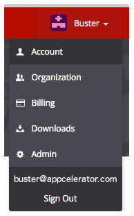

# Dashboard 4.5.0

Dashboard 4.5.0 is a minor release, which includes new feature, improvements, and several bug fixes.

## New Features

* Optional ability to restrict API access for organizations requiring client certificates

## Improvements

* Mongo call speed improvement

* In all project views, if you remove an app, your filter will be maintained

* User profile was renamed to Account. Your profile is managed on [Appcelerator DevLink](https://devlink.appcelerator.com/)

* Users should only receive one email after activation of Platform

* Users can now link their Stack Overflow profile to their [Appcelerator DevLink](https://devlink.appcelerator.com/) profile

## Fixed Issues

* User gets redirected to the no-apps page before being able to accept the EULA

* No app creation feed item is shown if key generation fails

* CSS enhances for displaying drop down lists in Firefox

* Arrow usage always shows zero CPU load
