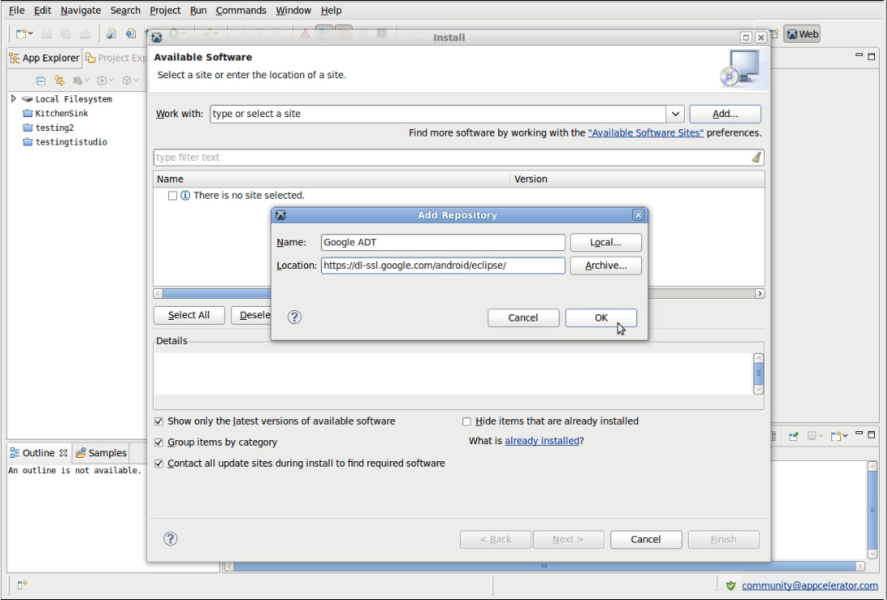
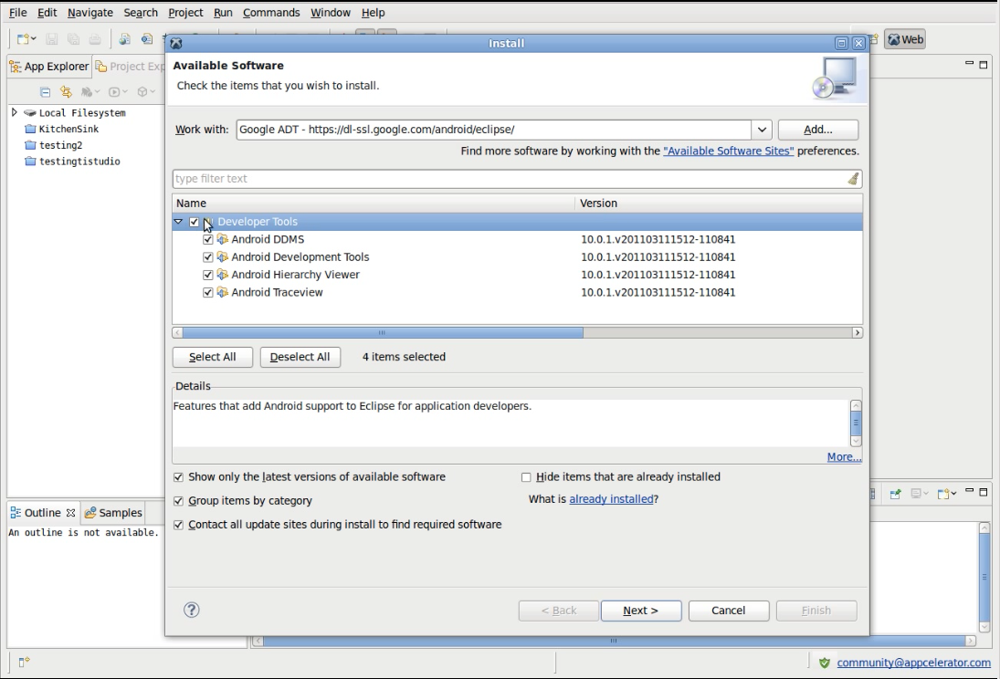
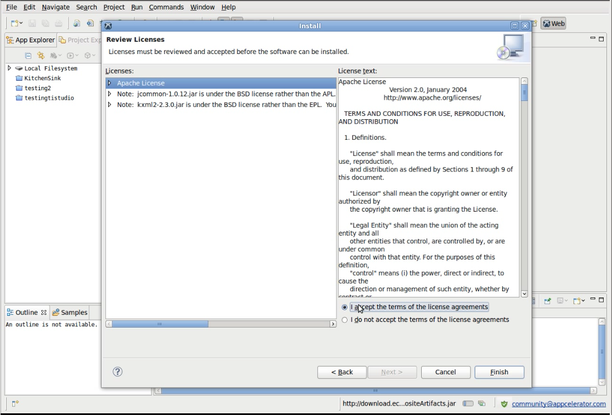
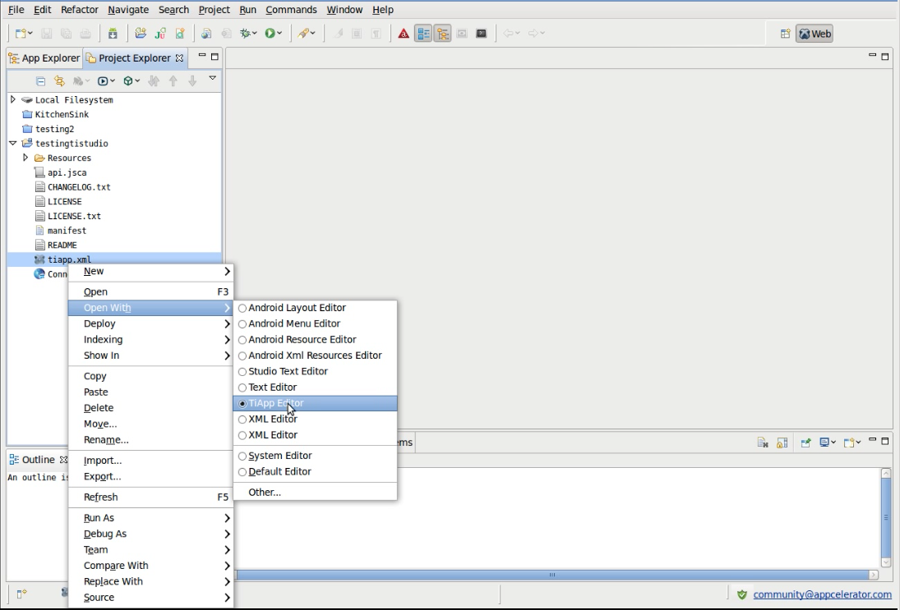
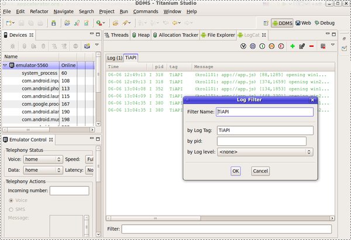
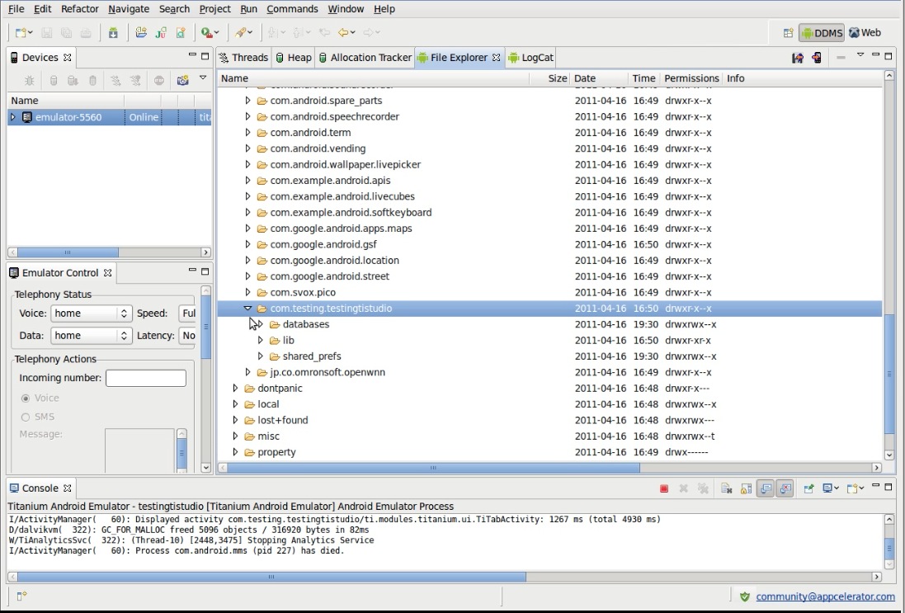
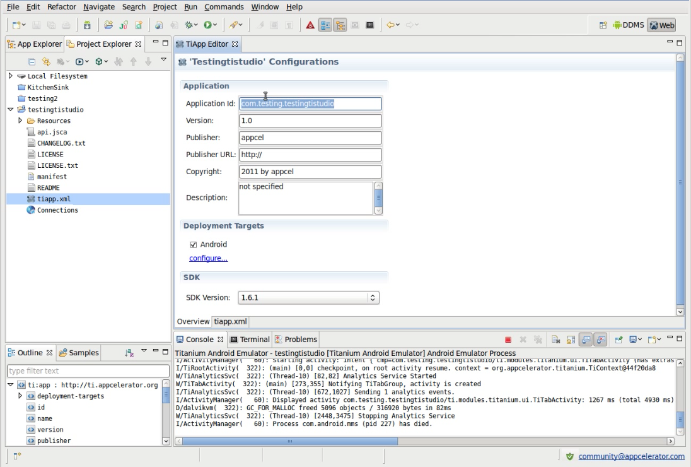

# Installing the Android Development Tools

## Overview

This guide explains how to install Android Development Tools (ADT) to Studio.

## Install the Eclipse Java Development Tools plugin

If you do not currently have Java tooling enabled, see the reference in [Installing the Java Development Tools](/guide/Axway_Appcelerator_Studio/Axway_Appcelerator_Studio_Getting_Started/Installing_the_Java_Development_Tools/) for this step.

## Install the ADT plugin

::: danger ❗️ Warning
ADT has been discontinued, and we don't recommend using it.
:::

* On Google's official Android Developers website, under the section [Downloading the ADT Plugin](http://developer.android.com/sdk/installing/installing-adt.html), copy the update URL to the clipboard.

* From the Studio menu bar, select **Help > Install New Software...**

* Click the **Add** button to add the Google ADT Plugin update site.

* In the **Name** field, enter something descriptive, such as **Google ADT.**

* Paste the Google ADT update site URL, copied to the clipboard in the previous step, into the **Location** field.

* Click the **OK** button.

* Using the **Work with** drop-down menu, select the **Google ADT** entry that you added in the previous step.

* Wait for the package list to be populated.

* Select all the resulting ADT packages.

* Click the **Next** button.

* Click the **Next** button on the **Install Details** screen that follows.

* Select each package in turn from the left-hand pane and accept the respective license agreement.

* Click the **Finish** button.

* Once the installation is complete, click the **Restart Now** button.

## Configure Studio to use the SDKs

* Using the perspective icon(s) in the top-right hand corner, select the one titled **Web.**

* Using the **Project Explorer** tab in the left-hand pane, right-click an existing project and select **Open Project.**

* Browse the resulting project file list, right-click `tiapp.xml` in the root of the project, select **Open With > TiApp Editor.**

* Choose your preferred Titanium SDK version from the **SDK Version** drop-down list.

* Check the [Android SDK / Target Android Platform](/guide/Titanium_SDK/Titanium_SDK_Getting_Started/Installation_and_Configuration/Titanium_Compatibility_Matrix/#android-sdk-/-target-android-platform) section of the Titanium Compatibility Matrix to determine which Android versions are compatible with your chosen Titanium SDK. The information found in that document will be needed for the configuration in the following steps.

* Close `tiapp.xml.`

* From the Studio menu, select **Window > Preferences** or **Studio >** **Preference** for Mac OS X  to open the **Preferences** dialog.

* Navigate to **Android.**

* Click the **Browse...** button to configure the Android **SDK Location.**

* Select a target Android SDK from the list, ensuring that its version is within the range compatible with the Titanium SDK you have chosen, as discovered in the previous step.

* Navigate to **Studio > Platforms >** **Android.**

* Click the **Browse...** button to configure the **Android** **SDK Home.**

* Select a target Android SDK from the **Default** **Android SDK** drop-down list, ensuring that its version is within the range compatible with the Titanium SDK you have chosen, as discovered in the previous step.

* Click **OK** to save preference changes.

::: warning ⚠️ Warning
As explained in the [Android SDK / Target Android Platform](/guide/Titanium_SDK/Titanium_SDK_Getting_Started/Installation_and_Configuration/Titanium_Compatibility_Matrix/#android-sdk-/-target-android-platform), if you require advanced Android features, such as Maps, remember to choose a target that includes the enhanced Google APIs, listed as **Google APIs** in the **Default Android SDK** list.
:::

## Launch the emulator and app

* Using the **Project Explorer**, select the project that was opened earlier.

* Using the **Launch** toolbar button, located between the **Project Explorer** tab and its file list, select **Android Emulator** to launch the project app.

## Add the DDMS perspective button

* While the emulator boots, open the ADT perspective. From the Studio menu bar, select the **Window > Open Perspective > Other...**

* Select **DDMS** (which stands for Dalvik Debug Monitor Server) from the list of available perspectives.

* To ensure that the perspective is in its default state, select the **Window > Reset Perspective...** menu.

* Click the **OK** button when the resulting _Do you want to reset the current DDMS perspective to its defaults?_ dialog displays.

## Use the tools

* Click the **LogCat** viewer tab above the bottom pane, to watch the console output while the emulator boots.

* If you wish, you may relocate this tab to the main pane, next to the **File Explorer** tab, using a simple drag and drop gesture.

* To show only `Ti.API` log messages, create a logcat filter using the green _plus_ icon in the logcat toolbar and set the `by Log Tag` field to "TiAPI". See [Reading and Writing Logs](http://developer.android.com/guide/developing/debugging/debugging-log.html) for more information about logcat filters.

* Once booted, unlock the emulator and wait for the app to launch.

* Now that the emulator is running, select it from the list of devices in the left-hand pane, and inspect it using the tools.

* For example, select the **File Explorer** tab, and navigate to the directory `/data/data/yourAppId.`

::: tip 💡 Hint
The `/data/data/yourAppId` directory is equivalent to [Titanium.Filesystem.applicationDataDirectory](#!/api/Titanium.Filesystem).
:::

::: tip 💡 Hint
`yourAppId` was defined when the project was created, as shown in the **TiApp Editor** (see below).
:::

