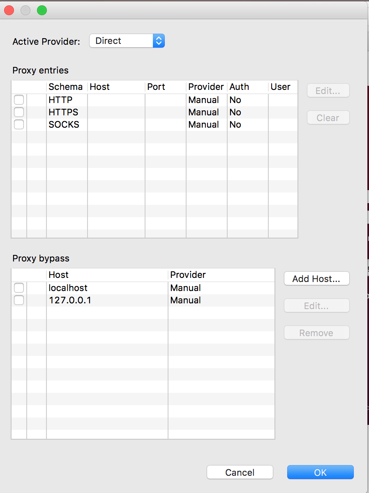

# Using Studio From Behind a Proxy

## Overview

Studio **requires** an internet connection to authenticate the user to the Appcelerator cloud on the first launch, although the credentials are cached for subsequent use. Also, internet access is used for news, documentation, and code updates. This guide explains how to configure it for use behind a proxy. For Windows systems, use the system proxy settings (see the [Windows system settings](#windows-system-settings) section below for details).

## Startup splash screen

If no user credentials are available for Studio on launch, the Studio splash screen will ask you to enter your user name and password. At the bottom of this dialog, click the **Proxy Setup...** link to open the following dialog:

The proxy schema (`HTTP`, `HTTPS`, and `SOCKS` are all supported), server name or IP address, service port number, and authentication details can be configured. After clicking **OK,** then **Login** to start, all internet traffic will be directed via this proxy.

## Preferences window

To configure your proxy settings once Studio has started, open the **Preferences** window and navigate to **Network Connections**:

1. From the menu bar,

    1. **Windows**: select **Windows** > **Preferences**.

    2. **Mac OS**:  select **Titanium Studio** > **Preferences** or **Appcelerator Studio** > **Preferences**.

2. Navigate to **General** \> **Network Connections**.

3. Select the Proxy entry that you would like to edit, for example, **HTTP,** and click **Edit...**

4. In the **Host** and **Port** fields, specify the name or IP address and port number of your proxy server.

5. If you have authentication enabled, check the **Requires Authentication** box and type in your proxy User and Password.

6. Click **OK** to apply your settings.

7. Restart Studio. All internet traffic will be directed via this proxy.

## Windows system settings

For Windows systems, Studio should use the system's proxy settings. You may need to enter the proxy settings when the splash screen appears to get to the **Preferences** window to change the settings.

1. From the menu bar, select **Windows** \> **Preferences**.

2. Navigate to **General** \> **Network Connections**.

3. Change the **Active Provider** drop-down to **Native**.

4. Click **OK** to apply your settings.

5. Restart Studio. All internet traffic will be directed via the Windows system proxy settings.

## Whitelisting URLs

You may need to whitelist several URLs in some network environments. Below are the set of URLs to whitelist. If possible, it is easiest to whitelist `*.appcelerator.com`.

**Web access**

* [www.appcelerator.com](http://www.appcelerator.com)

* [university.axway.com/](https://university.axway.com)

* [developer.appcelerator.com](https://developer.appcelerator.com)

**Software**

* [registry.npmjs.org](http://registry.npmjs.org)

* [admin.cloudapp-enterprise.appcelerator.com](http://admin.cloudapp-enterprise.appcelerator.com)

* [appc-studio.appcelerator.com](http://appc-studio.appcelerator.com)

* [appcelerator.com](https://www.appcelerator.com/)

* [go.appcelerator.com](http://go.appcelerator.com)

* [preview.appcelerator.com](http://preview.appcelerator.com) (only for beta software downloads)

* [https://platform.axway.com/](https://platform.axway.com/)

* [security.appcelerator.com](http://security.appcelerator.com)

* [secure-identity.cloud.appcelerator.com](http://secure-identity.cloud.appcelerator.com)

* [marketplace.axway.com](https://marketplace.axway.com/home#!category/31050) (Connectors)

* [downloads.platform.axway.com](http://downloads.platform.axway.com)

The port numbers used for the URLs are 80 and 443.

For debugger and profiler, Studio will find a free port for the specific IP address, and if it does not locate one, it will use 8999 as the default. For LiveView, it requires ports 8323 and 8324.

For the local web server that Studio creates, the range of the port Studio looks for is controlled by the preference defined in Preferences > Studio > Web Servers > Built-in. By default, the range is 8020-8079.

## Network connections

This section describes the preferences available on the General > Network Connections preference page.

| Option | Description | Default |
| --- | --- | --- |
| Active Provider | Specifies the settings profile to be used when opening connections. Choosing the **Direct** provider causes all the connections to be opened without the use of a proxy server. Selecting **Manual** causes settings defined in Eclipse to be used. On some platforms, there is also a **Native** provider available, selecting this one causes settings that were discovered in the OS to be used. | Native (if present)   Manual (otherwise) |
| Proxy entries | The table displays entries that are available for all providers. Checkboxes in the first column of the table indicate entries to be used for the currently selected provider. |  |
| Proxy bypass | Use this table to specify, either by name or pattern, which hosts should not use any proxy. A direct connection will always be used for matching hosts. Checkboxes in the first column of the table indicate entries to be used for the currently selected provider. |  |

### Proxy entries

When using **Manual** proxy provider, there are three predefined schemas to set settings for: HTTP, HTTPS, and SOCKS. Configuration for each schema is displayed in the **Proxy entries** table. To edit settings for a particular schema, double-click the entry or select the entry and click **Edit...** button. If the **Port** field is left blank, the default port number will be used. Following table lists default port numbers for each of the predefined schemas.

| Schema | Default Port |
| --- | --- |
| HTTP | 80 |
| SSL | 443 |
| SOCKS | 1080 |

This section was adapted from [Eclipse's Network Connections](https://help.eclipse.org/mars/index.jsp?topic=%2Forg.eclipse.platform.doc.user%2Freference%2Fref-net-preferences.htm) document.
