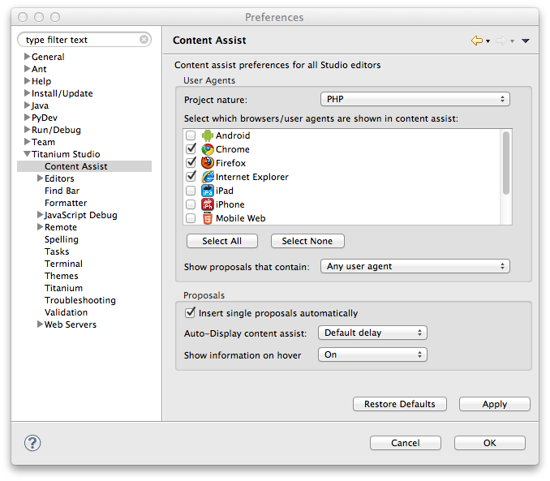

# Displaying Content Assist

As you code, Content Assist provides tips on available properties and methods and the parameters that a method takes. See [About Content Assist](/guide/Axway_Appcelerator_Studio/Axway_Appcelerator_Studio_Guide/Basic_Concepts/Content_Assist/About_Content_Assist/) for a detailed explanation.

## Instructions

To display the tips provided by content assist:

* Content Assist automatically pops up a context menu or yellow tip box as you type the name of an object or function to which Content Assist applies.

::: tip
To display a longer Tool Tip, press **F2** while your cursor is on the function or object. (You can also select **ShowToolTip** from the **Edit** menu while your cursor is on the function or object.)
:::

## Understanding what browser/user agents enable which features

By default, content assist will show a list of "user agents" with each proposal. This is to help you determine which items can be safely used with which browser. The icon state will change depending on the information available to the user:

* Full-color: the property is available

* Greyed-out: the property is not available

If no information is available, the property is assumed to be **available**. In the image below, you can see some items apply only to Chrome, some to Firefox, and some to IE.

## Setting content assist preferences

Content assist has several options which may be adjusted.

### Changing the user agents shown with content assist

1. Open **Preferences > Studio > Content Assist**

2. User-agent preferences are set per project type.

3. Select a project type, for example, "PHP" and choose the agents to show by default.

4. Press **OK**

### Filter the proposal list by supported items

You can choose to show proposals in content assist only if they match certain conditions. This option is set for all project types.

Show proposals that contain:

* Any user-agent: a proposal will appear in the list regardless if it is supported or not by the selected user agents.

* One or more selected user agents: a proposal will appear if one of more of the selected user agents support this feature.

* All selected user agents: a proposal will only appear if _all_ user agents support this feature.

### Single proposal options

By default, if there is only one possible proposal in the content assist list, it will be automatically inserted. Uncheck **Insert single proposals automatically** to turn off this behavior.

### Content display options

Content assist will display after a default delay of 200ms, i.e., once you type a trigger character, it will take a short while to pop up the dialog box. Tweak this setting if you wish to shorten or lengthen this delay.

### Hover options

When hovering over a function, property, or method, if documentation is available, a box will pop up with additional information. Tweak this setting if you wish to modify this behavior.

## Related Topics

* [About Content Assist](/guide/Axway_Appcelerator_Studio/Axway_Appcelerator_Studio_Guide/Basic_Concepts/Content_Assist/About_Content_Assist/)

* [Documenting Your Code Using ScriptDoc](/guide/Axway_Appcelerator_Studio/Axway_Appcelerator_Studio_Guide/Web_Development/JavaScript_Development/Documenting_Code/Documenting_Your_Code_Using_ScriptDoc/)

* [ScriptDoc tag quick reference](/guide/Axway_Appcelerator_Studio/Axway_Appcelerator_Studio_Guide/Web_Development/JavaScript_Development/ScriptDoc_tag_quick_reference/)
