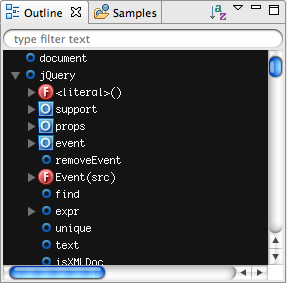

# Outline View

This page describes what the Outline View is and how to display it.

## Introduction

The Outline View displays a hierarchical grouping of the elements of your code, such as variables and functions. Use this view to get a high-level overview of your code. You can double-click an element in the Outline View to jump to that spot in your code.

## Instructions

Studio displays the Outline View in Web Perspective by default, and it is located in the lower-left corner of the window. To open the view manually:

::: tip
* From the **Window** menu, select **Show View > Outline**.

* To close the **Outline View**, click the Close button (**X**) in the upper right of the tab.
:::

## Related Topics

* [Bookmarks View](/guide/Axway_Appcelerator_Studio/Axway_Appcelerator_Studio_Guide/Basic_Concepts/Views/Bookmarks_View/)

* [Tasks View](/guide/Axway_Appcelerator_Studio/Axway_Appcelerator_Studio_Guide/Basic_Concepts/Views/Tasks_View/)
