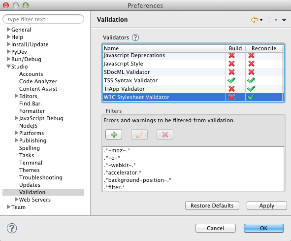

# Adding custom error message filters to the Problems View

This page explains how to create custom error message filters for your Problems View.

## Introduction

If you want to hide certain error or warning messages (for example, an error message for a particular browser-specific CSS attribute), you can create a custom filter for the Validation View. The Validation View will not display an error and warning messages that match the regular expression which you specified in the filters. These filters are located in your Studio preferences.

## Instructions

To create a custom error message filter:

1. From the **Window** menu (on Windows) or **Studio** menu (on Mac OS X), select **Preferences...** to open a **Preferences** window.

    1. Navigate to **Studio >** **Validation**.

    2. Select the language that you are interested in editing.
        Studio displays the error message filters for the Editor that you selected (shown below).

        
2. Add your new filter.

    1. On the **Validation** preferences screen, click the **Add** button  to open an **Ignore Warning/Error** pop-up window.

    2. In the **Message** field on the **Ignore Warning/Error** pop-up window, type either the exact error or warning message that you want the Validation to ignore. You can also use an asterisk (\*) as a wildcard to create a regular expression.

    3. Click **OK** to add your error message to the list of filters.

3. Click **OK** to save the changes to your preferences and to close the **Preferences** window.
