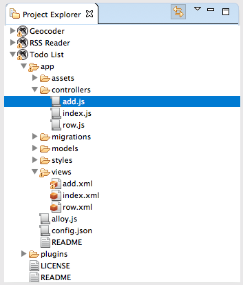

# Project Explorer View

The Project Explorer view allows you to navigate through projects and resources in the same workspace.

## Using the Project Explorer View

In the Project Explorer view:

1. **Double-click on files** to open them in their default Editor.

2. **Right-click on a project, folder, or file** to open a right-context menu, where you can perform an action, such as copying or moving.

3. **Select a project** in the Project Explorer view, then select a Launch mode in the Workbench toolbar to build and run the project.

## Toolbar

The toolbar of the Project Explorer view contains the following buttons:

### Link with Editor

If the **Link with Editor** button is toggled on, the active editor changes to the selected file if it is open.

### View Menu

Click the **View Menu** button, then select **Customize View...** to sort or filter items in the Project Explorer.

### LiveView

**Appcelerator Studio Feature Only**

If the **LiveView** button is toggled on before running the project, the [LiveView tool](/guide/Axway_Appcelerator_Studio/Axway_Appcelerator_Studio_Guide/Titanium_Development/LiveView/) will be enabled for the project.
