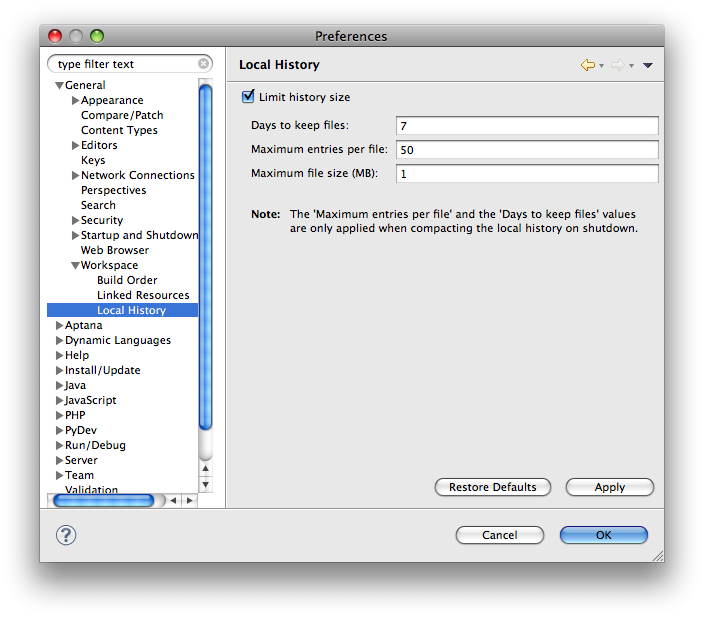

# Comparing Different Versions of a File

This page describes how to compare different versions of a file using the Local History feature.

## Introduction

You can view the history of a file from one saved version to another to find what has changed each time you saved the file using the **History** view with **Compare Mode** turned on.

You can even use Local History to help you troubleshoot your Studio projects. For example, if you are editing a JavaScript file in the late afternoon, and find that your code is broken, you can compare back to a version earlier in the day when your code was working on trying to track down what change(s) caused the problem.

## Instructions

To view the history of a file:

1. In the **Project Explorer** view, right-click on the file whose history you want to display, or right-click the file currently open in the editor.

2. From the pop-up context menu, select **Compare With > Local History...** to open the **History** view.

3. The **History** view displays the dates and times of each time that the file was saved with changes.

4. To view the changes from one version to the next, double click the date/time entry in the view. An editor should open that highlights the changes that were made between the two versions.

## Setting Local History Preferences

By default, Studio saves previous versions of a file for up to seven days or 50 versions of a file, with a maximum file size of 1 MB. You can modify these preferences to fit your editing needs best.

To change your Local History preferences:

1. Select **Preferences... > General > Workspace > Local History**.

