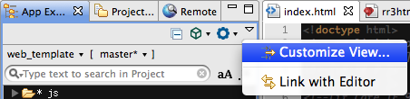
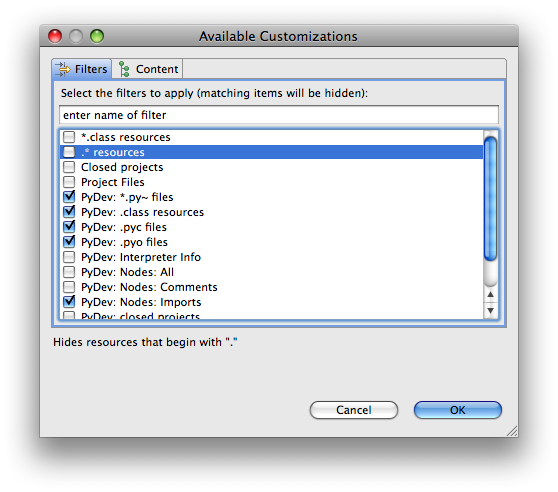

# Displaying Dot Files and Folders

## Overview

The dot files and folders are hidden by default in App Explorer and Project Explorer views. This page explains how to show them in those views.

## Instructions

In the **App Explorer** or **Project Explorer** view, click on the drop-down arrow in the view's local toolbar and select **Customize View...**

In the Available Customizations dialog, uncheck the **.\* resources** entry.

Click **OK**. The dot files and folders will now appear.
