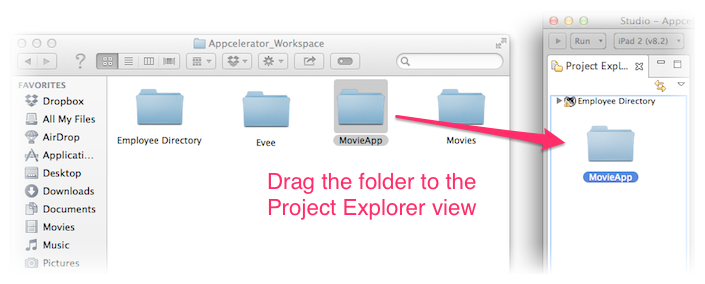

# Importing an Existing Project

This page describes how to import a project into Studio.

## Introduction

You can import an existing set of files into Studio by creating a new project and pointing Studio to the home directory for your existing project.

## Using the import wizard

To import an existing project into Studio, from the menu bar, select **File** > **Import** to open the Import Wizard.

**For a Titanium Classic or Alloy application:**

1. Select **Axway Appcelerator** > **Existing Mobile Project**, then click **Next**.

2. In the **Project directory** text field, browse to the directory that contains your project.

3. You can optionally change the name of the project or copy the files to your current workspace. If you do not copy the files, the project will remain in its directory but linked to the current workspace.

4. Click **Finish**.

::: warning ⚠️ Warning
If you are importing an older Alloy or Titanium application that was not created on the AMPLIFY Appcelerator Services, the import process will generate a new app GUID for the application and attempt to activate AMPLIFY Appcelerator Services.
:::

**For a Github project:**

1. Select **Git** and either select:

    1. **Fork Github Repository** to fork and clone a Github repo.

    2. **Git Repository as New Project** to clone a Github repo.

2. Enter your Github credentials, then click **Validate**.

3. If you are forking a repo, enter the owner's name and repo name in the **Owner** and **Repository** **Name** fields, respectively.

4. If you are not forking a repo, select the Github repo or enter the Git URI to the repo.

5. In the **Destination** text field, enter a path to an empty directory to clone the repo.

6. Click **Finish**.

**For a Native Module, API Builder, AMPLIFY Runtime Services or other Web projects:**

1. Select **General** > **Existing Folder as New Project**, then click **Next**.

2. In the **Select folder** text field, browse to the directory that contains your project.

3. In the **Project Name** text field, enter the name of your project.

4. Choose the natures/Project Type for your project.

5. Click **Finish**.

## Using drag and drop

Starting with Studio 4.1.0, you can drag a project directory, previously created with either Eclipse or Studio, and drop it to the **Project Explorer** view to import the project to Studio and add it to your current workspace.

Once you drag and drop your project directory, you can choose to either **Copy Projects** or **Link Projects**. The dialog to choose these options is shown if you have not previously chosen one of these options to be the default.

With Copy Projects options, the project directory and all its files are copied to the current workspace.

When the Link Projects option is selected, the files are not copied to the workspace directory. Studio only links to the project directory.

::: warning ⚠️ Import Error
If you receive the error, "Invalid project, could not find .project file in the selected directory," the project was not created in Studio or Eclipse and did not contain a `.project` file, which tells Studio the nature of the project. Currently, only projects created in Studio or Eclipse support the drag-and-drop import process ([TISTUD-7233](https://jira.appcelerator.org/browse/TISTUD-7233)). Projects created with the CLI cannot be imported using the drag-and-drop mechanism. Use the Import Wizard instead.
:::

## Using promote to project

Promoting a directory to a project allows you to take any directory on disk and convert it into a project. You will see the project in your workspace, but the files live on disk in the former spot.

1. Open the Project Explorer view.

2. Expand the local filesystem node to the directory in question.

3. Choose **Promote to Project**.

4. Name your project appropriately and click **OK**.

5. Depending on the type of project, you may need to change the "natures" associated with the project. See below.

## Changing project type

You may also want to change the "type" of your project.
