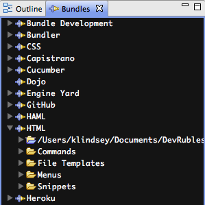
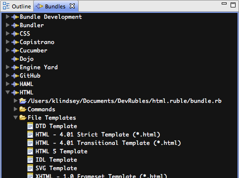
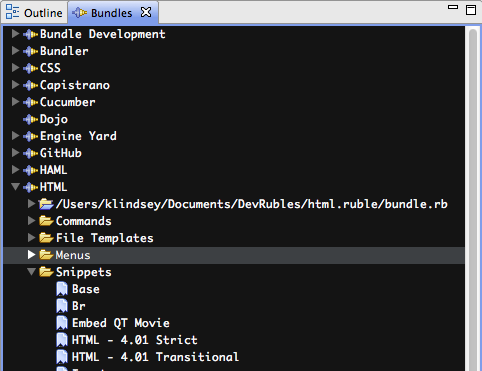
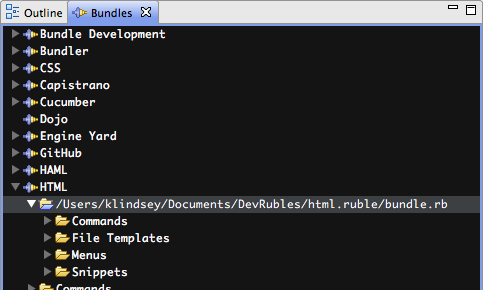

# Bundles View

## Overview

The Bundles View contains detailed information on all bundle folders and scripts that contribute to a given bundle. Bundles utilize inheritance and override mechanisms that may be challenging to troubleshoot. The Bundles View gives you insight into these mechanisms, serving as a tool for troubleshooting Rubles.

## Top-level items

When you first open the Bundles View, you are presented with a collapsed tree view. You will see an alphabetized list of bundle entries, one node for each bundle entry that has been loaded into the Studio environment. The term "bundle entry" refers to the collection of bundle directories that define the bundle and its element that you see within Studio. For more details, see [Redefining, Overriding, and Extending Bundles](/guide/Axway_Appcelerator_Studio/Axway_Appcelerator_Studio_Guide/Customizing_Studio/Rubles/Ruble_Specification/#Redefining,Overriding,andExtendingBundles) in the Ruble Specification guide.

## Bundle entry items

A bundle entry is composed of one or more bundle directories. If you expand a bundle entry in the Bundles View, you will reveal a collection of children associated with that bundle entry. Those entries are divided into two broad categories: bundle directories represented with blue folder icons and active bundle elements represented with yellow folder icons.

### Bundle directories

The children represented with blue folders are the bundle folders that contribute to this bundle entry. The remaining children using yellow folders contain lists of the commands, snippets, etc. that are active for this bundle entry taking bundle precedence and bundle overrides into account. For example, in the following image, the HTML bundle entry has been expanded. From this view, we see that the HTML bundle entry is defined by a single bundle folder located at "/User/klindsey/Documents/DevRubles/...". We also see that the bundle entry includes Commands, File Templates, Menus, and Snippets.

### Commands

The Commands folder contains a list of all active commands for the bundle entry.

### File templates

The File Templates folder contains a list of all active file templates for the bundle entry.

### Menus

The Menus folder contains a list of all active menus for the bundle entry. Menus are hierarchical, so it is possible that menu items themselves will contain child menus.

### Snippets

The Commands folder contains a list of all active commands for the bundle entry.

## Bundle directory items

A mentioned earlier; a bundle entry is composed of one or more bundle directories. If you expand a bundle directory, represented with blue folders, you will see the same Commands, File Templates, Menus, and Snippets folders; however, the items in those folders represent items that the bundle directory defines. Due to bundle precedence and override functionality, it is possible that even though an item is defined in a bundle directory, it may not contribute to the active items in the bundle entry. For more details, see [Redefining, Overriding, and Extending Bundles](/guide/Axway_Appcelerator_Studio/Axway_Appcelerator_Studio_Guide/Customizing_Studio/Rubles/Ruble_Specification/#Redefining,Overriding,andExtendingBundles) in the Ruble Specification guide.

## Properties view

Many of the items in the Bundles View show more information in the Properties View. Be sure to have that view open, then select an item in the Bundles View to see more detail about that item. This is particularly helpful when you need to determine which file has contributed a particular item.

