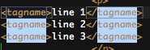

# A Command Which Outputs a Snippet

## Overview

In this recipe, we show how a Ruble command can output a snippet into the editor for further manipulation. Note that this sample already exists in the HTML bundle--we illustrate it here as it is a useful pattern.

## The Code

In the snippet below, we manipulate the currently selected text to split it across lines and then wrap each line in a template using mirrored variables (the $1s in the template).

```
require 'ruble'

command 'Wrap Each Selected Line' do |cmd|
  #cmd.key_binding = 'SHIFT+CTRL+A' # uncomment for a key binding
  #cmd.scope = 'text.html' # uncomment to limit the scope in which this appears
  cmd.output = :insert_as_snippet
  cmd.input = :selection, :line
  cmd.invoke do |context|
    input = STDIN.read
    input.gsub(/[\$`\\]/, '\\1').gsub(/([ \t]*)(.+)/, '\1<${1:li}>\2</${1:li}>')
  end
end
```

## Adding it to a Menu

::: warning ⚠️ Warning
If you do not choose a key binding, you should place the command in a menu. Otherwise, it will be difficult or impossible to access.
:::

```
bundle do |bundle|
  # ...
  bundle.menu 'My Ruble' do |menu|
    menu.command 'Wrap Each Selected Line'
  end
  # ...
end
```

## Result

Once created and activated, you will get something similar to this:


