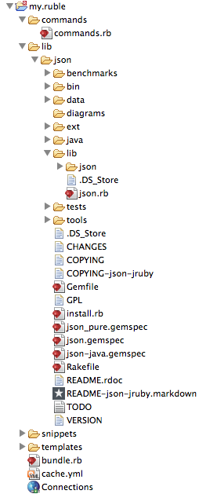
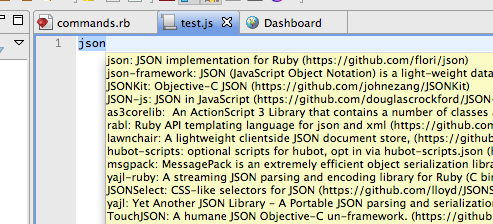

# Using a Custom Gem

## Overview

Rubles run using the internal JRuby interpreter. While it is theoretically possible to add gems to that installation, it's not recommended, as that would be wiped the next time the Studio JRuby version is updated. Instead, it is suggested that the gem be unpacked into the Ruble and referenced there. Below, we show how to use a JSON gem, and interpret a JSON url response from a Github API call.

## Setup

First, unpack the gem. Here we use the JSON gem from [http://flori.github.com/json/](http://flori.github.com/json/).

### Using 'gem unpack'

1. Install the desired gem to your ruby installation if not already installed (**\`gem install json\`**).

2. Change directories to the ruble's **/lib** folder.

3. Run \`gem unpack json\`, and then optionally rename the resulting subdirectory to be **'json'**.

### Manually unzipping

1. Download the source version of the gem as a .zip file.

2. Unzip the archive and rename it to **'json'**.

3. Place it underneath the **/lib** folder in the ruble. You will see a structure like:



Now, we need to reference the gem. To this properly, we need to manipulate the load path. There are two options:

### Manipulate the path in each place the gem is referenced

Assuming we are creating a command in commands/commands.rb, we reference the JSON gem as:

```
$: << File.dirname(__FILE__) + '/../lib/json/lib'
require 'json'
```

### Manipulate the path globally for all commands

Here, we take advantage of the fact that items in the **"lib"** directory are automatically loaded.

1. Create **/lib/json.rb**

2. Add the following code://

    ```
    $: << File.dirname(__FILE__) + 'json/lib'
    require 'json'
    ```

3. Now, we can require "json" as normal in other commands

## The Code

In the snippet below, we manipulate the currently selected text to split it across lines and then wrap each line in a template using mirrored variables (the $1s in the template)

```
require 'ruble'
require 'net/http'
require 'json'

command 'Find Related Git Repos' do |cmd|
  cmd.scope = 'source'
  cmd.output = :show_as_tooltip
  cmd.input = :selection, :word
  cmd.invoke do |context|
     # call Github to find all repos that reference the selected text
     url = "http://github.com/api/v2/json/repos/search/#{URI.encode($stdin.gets)}"
     resp = Net::HTTP.get_response(URI.parse(url))
     data = resp.body

     result = JSON.parse(data)

     # Create tooltip text
     tooltip = ""
     for k in 0...result["repositories"].length
       repo = result['repositories'][k]
       tooltip << "#{repo['name']}: #{repo['description']} (#{repo['url']})\n"
     end
     puts tooltip

  end
end
```

## Result

Once created and activated, you will get something similar to this:


