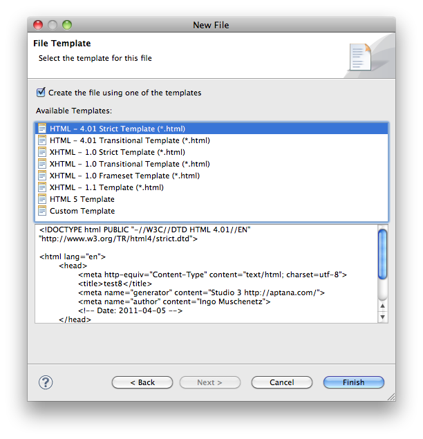
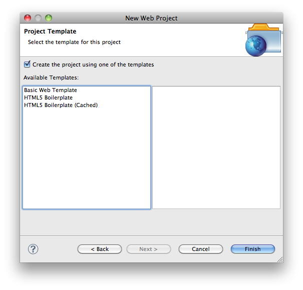

# Creating a new template

## Overview

Users can create new templates or modify existing templates to allow easy creation of default content.

::: tip 💡 Hint
We assume you've [created a new Ruble](#undefined) as a placeholder for the following content.
:::

## Creating a new file template

New file templates are templates that show up after a user has entered a file name and has clicked the **Next** button:



1. Open the existing bundle.rb file

2. Add the following content to the bottom of the file:

    ```
    template "Sample File Template" do |t|
      t.filetype = "*.txt"
      t.location = "templates/sample.txt"
    end
    ```

3. Replace the "sample" and "txt" values with values appropriate to your filetype.

4. Create a templates folder underneath the _rublename_.ruble folder.

5. Drop-in file sample.txt (or the specific file you have created).

6. Save and close bundle.rb.

If you now go to **File > New > File...** and create a file name of the appropriate extension above, you should see your template in the list.

## Creating a new project template

New project templates are templates that show up after a user has entered a project name and has clicked the **Next** button:



You can create project templates that reference a local .zip file or retrieve content from the web.

### Project types

Project templates can be added to existing project wizards by the specification of the "type" element:

<table class="confluenceTable"><thead class=" "></thead><tfoot class=" "></tfoot><tbody class=" "><tr><td class="confluenceTh" rowspan="1" colspan="1"><p>Type</p></td><td class="confluenceTd" rowspan="1" colspan="1"><p>Project</p></td></tr><tr><td class="confluenceTd" rowspan="1" colspan="1"><p>all</p></td><td class="confluenceTd" rowspan="1" colspan="1"><p>All project types</p></td></tr><tr><td class="confluenceTd" rowspan="1" colspan="1"><p>ruby</p></td><td class="confluenceTd" rowspan="1" colspan="1"><p>Ruby projects</p></td></tr><tr><td class="confluenceTd" rowspan="1" colspan="1"><p>php</p></td><td class="confluenceTd" rowspan="1" colspan="1"><p>PHP projects</p></td></tr><tr><td class="confluenceTd" rowspan="1" colspan="1"><p>web</p></td><td class="confluenceTd" rowspan="1" colspan="1"><p>Web projects</p></td></tr><tr><td class="confluenceTd" rowspan="1" colspan="1"><p>python</p></td><td class="confluenceTd" rowspan="1" colspan="1"><p>Python projects</p></td></tr><tr><td class="confluenceTd" rowspan="1" colspan="1"><p>titanium_desktop</p></td><td class="confluenceTd" rowspan="1" colspan="1"><p>Titanium Desktop projects</p></td></tr><tr><td class="confluenceTd" rowspan="1" colspan="1"><p>titanium_mobile</p></td><td class="confluenceTd" rowspan="1" colspan="1"><p>Titanium Mobile projects</p></td></tr></tbody></table>

### Local content

If your content is hosted locally, you can reference a .zip file containing the files in question.

1. Create a templates directory in the bundle and add a project\_templates.rb file in the templates directory.

2. Add the following content to the project\_templates.rb file:

    ```
    require 'ruble'

    project_template "Sample Project Template" do |t|
      t.type = :web
      t.location = "templates/sample_project.zip"
      t.description = "A sample project template"
      t.icon = "template.png" // Ideally a ruble-relative path to a 48x48px icon. Could also be a URL to a remote file
      t.tags = ['Titanium Classic']
    end
    ```

3. Replace the template name, "web", and "sample\_project.zip" values with values appropriate to your project.

4. Drop the file sample\_project.zip in the templates folder.

5. Save and close project\_templates.rb.

**File > New > Project...** and create a project of the appropriate type above; you should see your template in the list.

### Remote content

::: warning ⚠️ Warning
Note that this does not yet work for Titanium projects. See bug [http://jira.appcelerator.org/browse/TISTUD-640](http://jira.appcelerator.org/browse/TISTUD-640) for status on that feature.
:::

If you instead have a project template hosted on a Git repo, you can reference that as well:

1. Create a templates directory in the bundle and add a project\_templates.rb file in the templates directory.

2. Add the following content to the project\_templates.rb file:

    ```
    require 'ruble'

    project_template "Sample Remote Project Template" do |t|
      t.type = :web
      t.location = "git://github.com/repo.git"
      t.description = "Remote template. Requires network access."
      t.icon = "template.png" // Ideally a ruble-relative path to a 48x48px icon. Could also be a URL to a remote file
      t.tags = ['Titanium Classic']
    end
    ```

3. Replace the template name, "web", and "location" values with values appropriate to your project.

4. Save and close project\_templates.rb.

**File > New > Project...** and create a project of the appropriate type above; you should see your template in the list.

The [Ruble Specification](#undefined) gives a complete discussion on the new Ruble scripting system in Studio.

### Template variables

It's possible to add template-variables in the project's template files. Those variables will be substituted with the appropriate content as the project is created.

::: warning ⚠️ Warning
By default, variables are not replaced. If you need to turn this on, use "t.replace\_parameters = true" in the project template definition to enable substitution
:::

The following variables are supported:

<table class="confluenceTable"><thead class=" "></thead><tfoot class=" "></tfoot><tbody class=" "><tr><td class="confluenceTd" rowspan="1" colspan="1"><p>TM_NEW_FILE_BASENAME</p></td><td class="confluenceTd" rowspan="1" colspan="1"><p>The file name, without the file extension.</p></td></tr><tr><td class="confluenceTd" rowspan="1" colspan="1"><p>TM_NEW_FILE</p></td><td class="confluenceTd" rowspan="1" colspan="1"><p>The absolute path to the current file.</p></td></tr><tr><td class="confluenceTd" rowspan="1" colspan="1"><p>TM_NEW_FILE_DIRECTORY</p></td><td class="confluenceTd" rowspan="1" colspan="1"><p>The directory path for the current file.</p></td></tr><tr><td class="confluenceTd" rowspan="1" colspan="1"><p>TM_PROJECTNAME</p></td><td class="confluenceTd" rowspan="1" colspan="1"><p>The name of the created project.</p></td></tr><tr><td class="confluenceTd" rowspan="1" colspan="1"><p>TIME</p></td><td class="confluenceTd" rowspan="1" colspan="1"><p>The current time (in words).</p></td></tr><tr><td class="confluenceTd" rowspan="1" colspan="1"><p>YEAR</p></td><td class="confluenceTd" rowspan="1" colspan="1"><p>The current year.</p></td></tr></tbody></table>

Variables should be inserted inside a ${} blocks into your code. For example:

```
Project name is ${TM_PROJECTNAME}.
```
