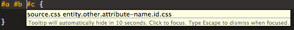

# Creating a New Theme

## Overview

A brief introduction to creating a new theme.

## Updating an Existing Theme

One of the easiest ways to create a new theme is by modifying an existing one. Using the Theme preference page (**Preferences > Studio > Themes**), you can pick an existing theme and tweak the colors as you like.

If you'd like to color something, which does not currently appear to be colored correctly, you'll first need to figure out what scope to modify. See [Themes#Scopes](/guide/Axway_Appcelerator_Studio/Axway_Appcelerator_Studio_Guide/Customizing_Studio/Themes/#scopes) to understand a bit more about how scopes work.

1. Check the list of scopes at [Current Theme Scopes](/guide/Axway_Appcelerator_Studio/Axway_Appcelerator_Studio_Guide/Customizing_Studio/Themes/Current_Theme_Scopes/). It may well be that the current theme already has a rule defined for the scope in question. As an example:

    ```
    #a #b #c {

    }
    ```

    already had a rule in most themes named **CSS: Selectors #ID**, which references the list of IDs. Changing the color of that rule changes the colors in your document.

2. If you can't find a rule already defined for what you want, place the cursor at a particular location, and choose **Commands > Bundle Development > Show Scope**. You will see each of the pieces of text above has a space-delimited list of scopes, i.e.

    
    1. Open up **Preferences > Studio > Themes.**

    2. Press the + button at the bottom. Type a descriptive name for your rule in the first field.

    3. Click on the "FG" table area next to the field. Select a color. Do the same with BG and font attributes.

    4. In the combo-box drop down, paste in the scope you selected above. Generally, you just need to paste in the _last_ scope in the list, for example, from "source.css entity.other.attribute-name.id.css" you would paste in "entity.other.attribute-name.id.css".

    5. Press **OK**.

::: warning ⚠️ Warning
If it doesn't seem like your rule addition made a difference, it's likely that you are duplicating an existing rule. Look through the other rules to see if there is a matching item with an identical scope.
:::

## Importing/Modifying an Existing TextMate theme

You can also reuse and modify an existing TextMate theme. Two good resoures are:

* [http://blog.macromates.com/2006/creating-themes/](http://blog.macromates.com/2006/creating-themes/)

* [http://wiki.macromates.com/Themes/UserSubmittedThemes](http://wiki.macromates.com/Themes/UserSubmittedThemes)

For the user-submitted themes. you can download those, modify as needed, and import them into Studio.
