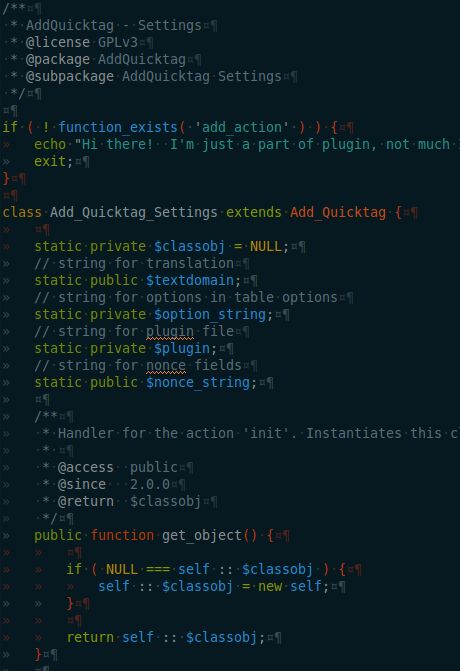
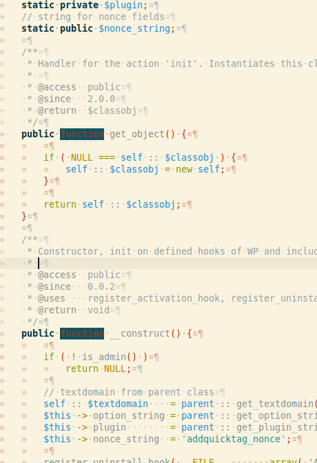

# User Themes

## Overview

This page is a place for users to share their custom themes compatible with Studio. Please note that we also support Textmate themes, and a large number of user themes for it are found here: [TextMate for macOS](https://macromates.com/).

## Solarized (Dark)

**Homepage:** [Solarized color scheme for Aptana](https://github.com/bueltge/Aptana-Solarized)

**Download:** [https://raw.github.com/bueltge/Aptana-Solarized/master/Aptana-Solarized%20(dark).tmTheme](https://raw.github.com/bueltge/Aptana-Solarized/master/Aptana-Solarized%20(dark).tmTheme) (right-click and select Save Link As...)

## Solarized (Light)

**Homepage:** [Solarized color scheme for Aptana](https://github.com/bueltge/Aptana-Solarized)

**Download:** [https://raw.github.com/bueltge/Aptana-Solarized/master/Aptana-Solarized%20(light).tmTheme](https://raw.github.com/bueltge/Aptana-Solarized/master/Aptana-Solarized%20(light).tmTheme) (right-click and select Save Link As...)

